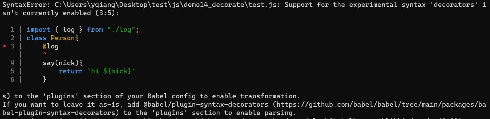
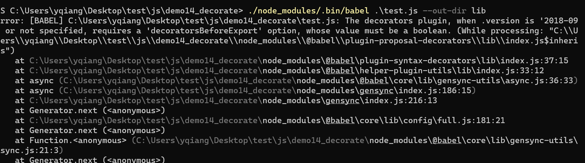
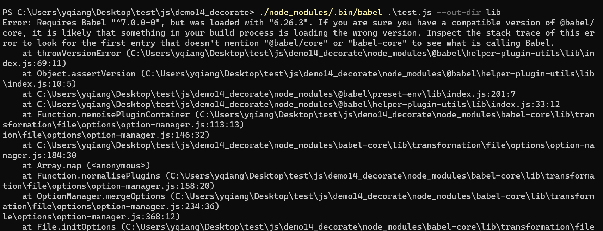
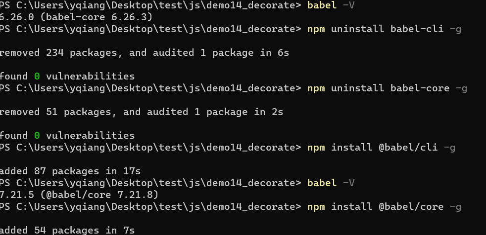
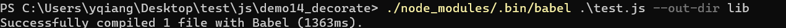
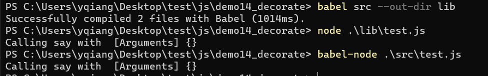
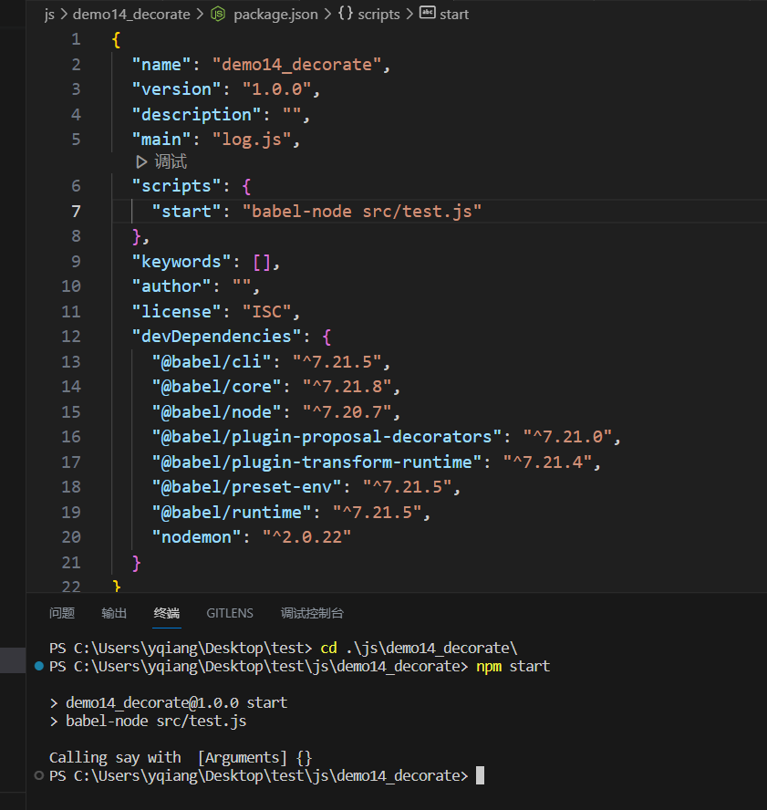

## 关于babel配置

一直想用一下js的装饰器也就是`@`符号, 因为这看起来和java和python比较像, 显得比较高端.
但是发现 `@` 符合是无法被识别的, 让我头疼了半天, 一度以为是不是这个符合是只能在 `ts` 中使用  
但是看了看多方教程, 发现似乎大家都是讲在`js`环境下怎么使用的.  
那我估计是, 这一定是一个新功能, 那必然是我的babel配置的不怎么正确. 趁此机会重新学习一遍babel, 因为之前基本上都是拿过来用就是了

首先是找到了2个比较好的教程, 阮一峰关于babel的教程并不好
> https://github.com/zyl1314/blog/issues/16
> https://www.pengfeixc.com/blogs/javascript/babel-tutorial

核心库:`@babel/core` 用来做语法转换的  
`@babel/cli` 能让你在命令行中使用babel命令的, 不然就只能在js中像其他的代码那样用babel了

其他的依赖就是一堆插件或者是插件的集合, 相当于告诉babel, 我是要用哪个插件(这些个插件基本上可以转换一些个特地的ES6+语法). 而配置这些插件, 也基本上相当于配置我要转换的新语法. 而这个配置文件就是 `.babelrc` 或者是 `babel.config.json`  
配置文件中就2个属性: `presets`, `plugins`.  
`plugins` 这个属性就是我刚刚说的插件, 即你要转换哪些内容, 而 `presets` 则是插件的集合, 因为一个个插件写起来毕竟麻烦.

这是一个常规的使用babel的安装依赖
```bash
 npm install --save-dev @babel/core @babel/cli @babel/node @babel/plugin-transform-runtime @babel/preset-env  @babel/plugin-proposal-decorators @babel/runtime nodemon
 ```
这些依赖所对应的配置文件:
```json
{
    "presets": ["@babel/preset-env"],
    "plugins": [
        ["@babel/plugin-proposal-decorators", { "legacy": true }],
        ["@babel/plugin-transform-runtime"]
    ]
}
```

其中 `"presets": ["@babel/preset-env"]` 基本上覆盖了常规的ES6+的新语法, 但是 `@` 不在其中   

这里稍微说一下, 各种插件, 比如最常举例的`@babel/plugin-transform-arrow-functions`, `@babel/plugin-transform-destructuring` 你可以理解成是对语法的转换, 而 `@babel/polyfill` 可以理解成是对一些方法的转换, 比如`Promise()`, `Object.Assign()`, `String.prototype.replaceAl`等等

这里的 `@babel/plugin-proposal-decorators` 就是用来解释装饰符号 `@` 的, 如果不告诉`babel` 的话, 会报错




 但是光光把这个插件声明放到`plugins`属性中还不对. 会报错
   
 需要把属性变成这样: (注意这里如果对一个plugin项有额外属性设置的话, 那就会从单数组变成嵌套数组)
 ```json
 [["@babel/plugin-proposal-decorators", { "legacy": true }]]
 ```
 参考这个帖子:
 > https://stackoverflow.com/questions/71942479/
 问题解决

 在实际使用过程种, 首先是发现了版本不正确的问题
使用的babel编译命令是:
```bash
> ./node_modules/.bin/babel .\test.js --out-dir lib
```
这里的`test.js`文件是需要被babel编译的对象文件
 
 可以通过重新安装的方式来更新版本
 
其实我这里的命令不是很好 `babel-cli`和`@babel/cli`不应该混用, 安装一个就可以了

基本上就可以编译成功了


那我们要运行代码的话, 就得先编译, 再运行. 而且一有改动还得去编译, 就很麻烦
可以使用`babel-node`来解决这个问题
```bash
 npm install @babel/node -g
```
就可以了
.
最后也可以把这个命令写到`package.json`文件中, 就可以用npm命令运行了


当然也可以加上nodemon命令:
```json
"start": "nodemon --exec babel-node src/test.js  -e js,json"
```
`-e js json`是指有js或者json文件变动的时候就重启, 这里没有加上`--watch` 所以默认就是监听整个工作目录

## 关于JavaScript中的装饰器
