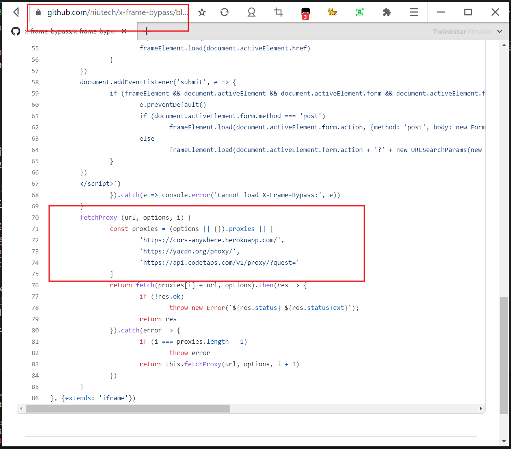
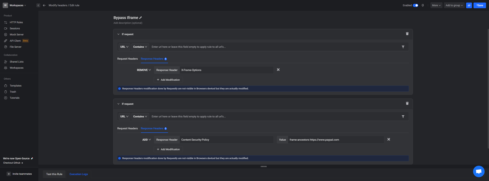
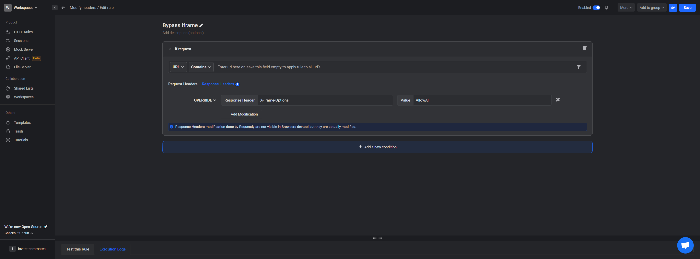

目前遇到了一个要在iframe中渲染Paypal账单的问题, 他们本来是渲染自己的账单的, 那必然没有什么跨域问题. 而iframe中src换成了其他网站的话, 就会出现 `Display forbidden by X-Frame-Options` 或者 `Refused to display ‘url’ in a frame because it set 'X-Frame-Options' to 'sameorigin' ` 的问题.  

在StackoverFlow上参照这个帖子研究了半天, 似乎也没有什么很好的解决方案.
> https://stackoverflow.com/questions/6666423/overcoming-display-forbidden-by-x-frame-options

1. 第一个方案, 正如我们有时候会嵌入B站的视频一样, 那B站的地址不也是跨域了? 这种情况下, 有时候我们在原来会跨域的地址比如 `https://xxxx.aaa` 的后面加上一些东西, 比如 `https://xxxx.aaa&embed` 或者 `https://xxxx.aaa&target=popup` 之类的来告诉请求源, 我这个网站是要在iframe中使用的, 请服务器在response头里允许我在iframe中展示, `X-Frame-Options:ALLOW`, 这是最好的办法, 但是需要服务器的后台支持

2. 重写iframe, 参照这个方案, 这个方案是使用了 `html` 的 `is` 属性, 事实上我们是使用了重写过的iframe. 在这个iframe中, 其实是请求了一个不会跨域的地址. 但是那些个免费的跨域代理服务器都不怎么稳定, 如果要使用这个方案还是代理到自己的服务器上,  
> https://github.com/niutech/x-frame-bypass  

3. 使用插件修改HTTP头. 参考这个方法： 
> https://requestly.io/blog/bypass-iframe-busting-header
但是这几个办法我试了都不行

4. 使用代理服务器