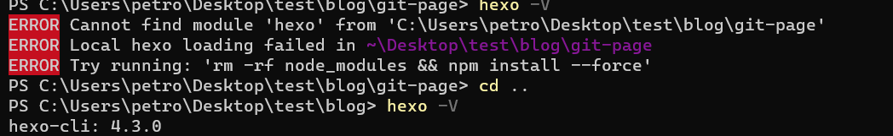
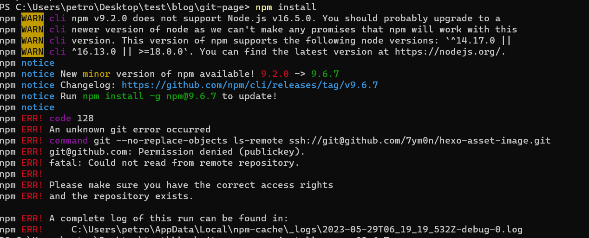
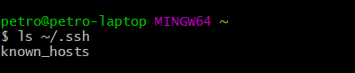
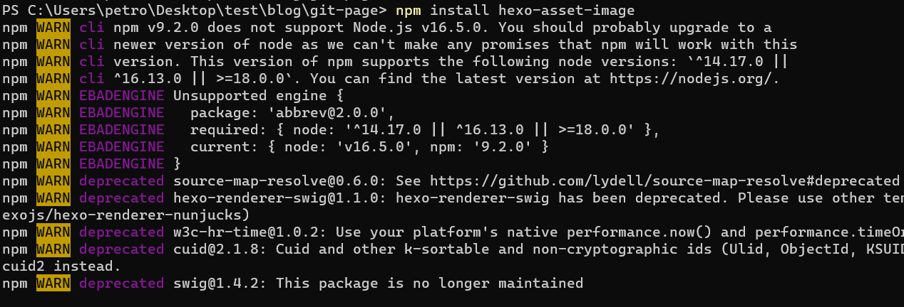
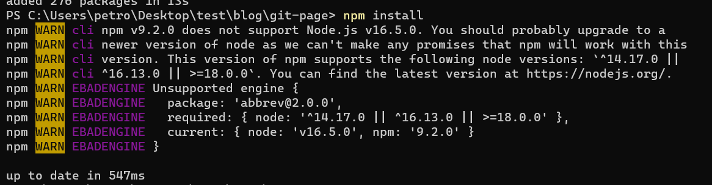
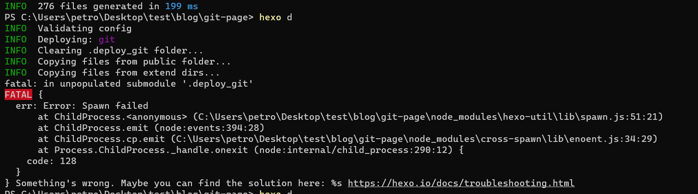
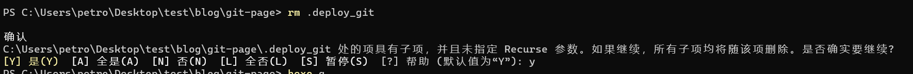
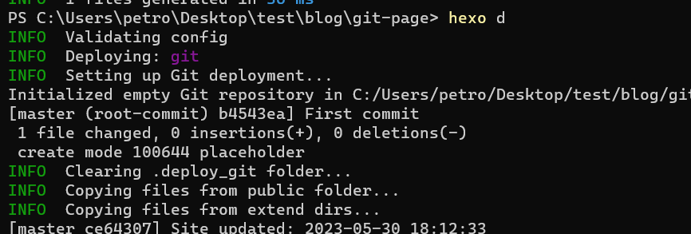

第一个问题: 在hexo目录中`hexo`命令识别不到, 但是在其他地方是可以的. 也就是说, global中是有的


解决办法是在hexo项目中安装依赖
```bash
npm install
```

但是在安装的时候, 发现了这个错误:
```bash
npm ERR! code 128
npm ERR! An unknown git error occurred
npm ERR! command git --no-replace-objects ls-remote ssh://git@github.com/7ym0n/hexo-asset-image.git
npm ERR! git@github.com: Permission denied (publickey).
npm ERR! fatal: Could not read from remote repository.
```

有的帖子说, 是需要本地有ssh证书, 在`git bash`中使用
```
ls ~/.ssh
```
可以看到我有ssh证书


后来发现问题所在是这个`hexo-asset-image`的库很蛋疼. 需要单独安装
```bash
npm install hexo-asset-image
```
先单独安装它

再安装其他的库, 就没有问题了


然后是无法使用`deploy`命令的错误:

解决方法是把`.deploy`文件删了

可以参考这个帖子:
> https://blog.csdn.net/NoMasp/article/details/79504699
然后重新生成和上传就可以
