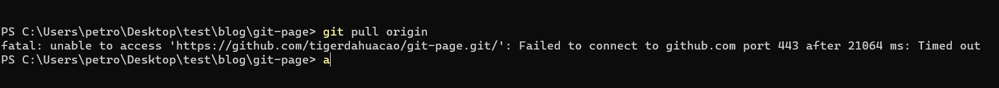
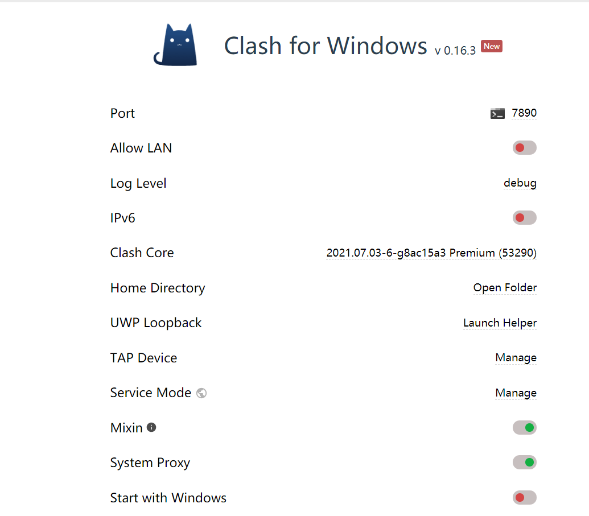
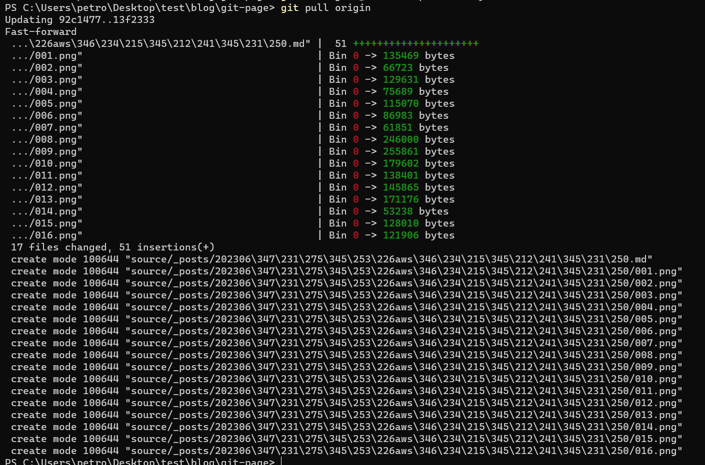

我的电脑有时候使用`git pull origin`命令会发生网络问题

有的时候不会发生  
打算彻底解决一下  
这是我的clash的端口:

```git
git config --global http.proxy http://127.0.0.1:7890
git config --global http.proxy https://127.0.0.1:7890
```
设置完后发现了其他错误, 说明配置的不正确

先复原
```git
git config --global --unset http.proxy
git config --global --unset https.proxy
git config --global http.sslBackend "openssl"
git config --global http.sslVerify false
```
此时我pull突然就可以了:


如果要用梯子的话, 参考这个帖子:
> https://blog.csdn.net/xingxincsdn/article/details/125320830
```git
git config --global -e

[http]
        proxy = socks5://127.0.0.1:7890
[https]
        proxy = socks5://127.0.0.1:7890
```