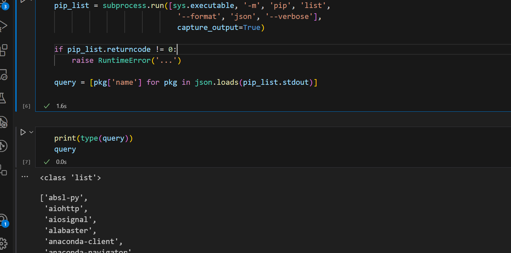
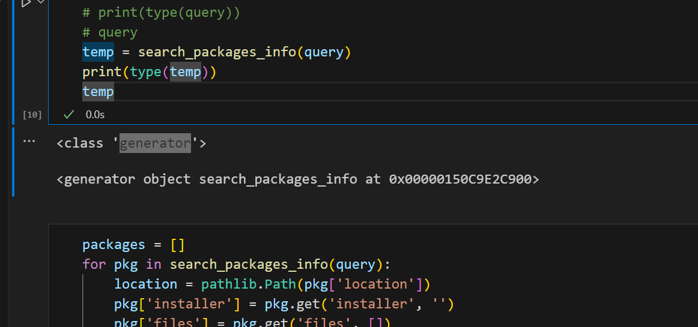
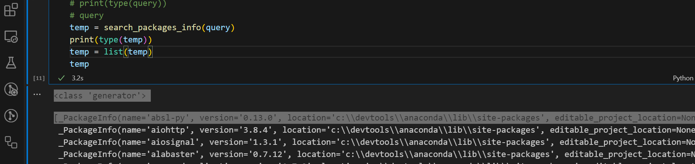
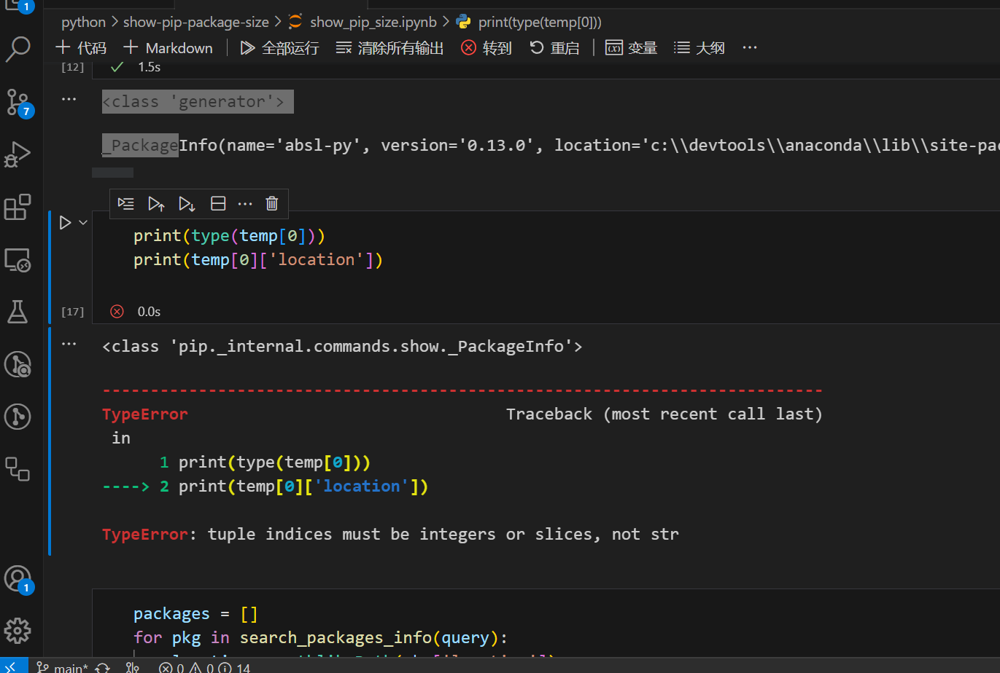
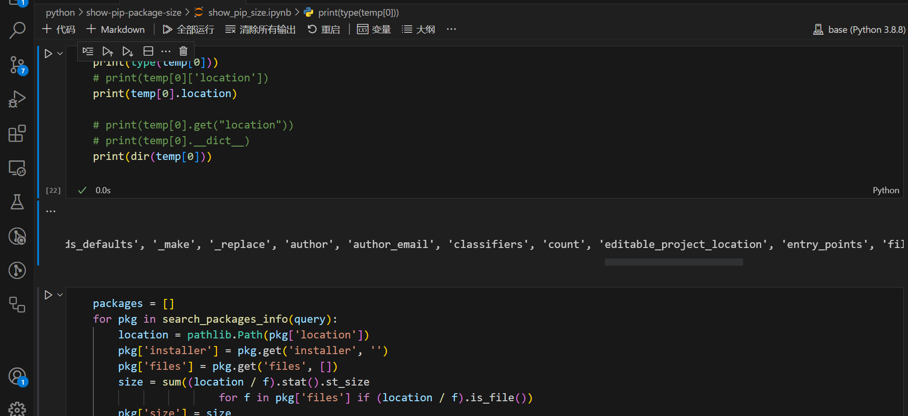
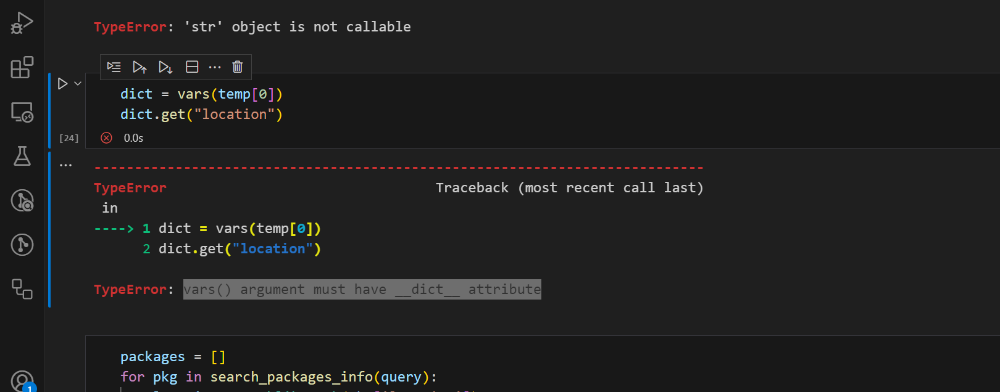

这个代码是用来查看本地安装的包的, 但是运行会发生错误

```python
from pip._internal.commands.show import search_packages_info
import subprocess
import sys
import json
import pathlib
import math
import operator

TMPL = '{:<30} {:<30} {:<10} {:>9}'

# 把单位为位转换成K,M这样的
def humanize(size):
    """Convert size in bytes to human readable output."""
    try:
        units = ['B', 'KB', 'MB', 'GB']
        i = math.floor(math.log(size) / math.log(1024))
        hsize = f"{round(size / 1024**i)}{units[i]}"
    except ValueError:
        hsize = '0B'
    return hsize


def pip_list_ext():
    """List installed packages with additional information."""
    # python -m pip list --format --json --verbose
    pip_list = subprocess.run([sys.executable, '-m', 'pip', 'list',
                               '--format', 'json', '--verbose'],
                              capture_output=True)

    if pip_list.returncode != 0:
        raise RuntimeError('...')

    query = [pkg['name'] for pkg in json.loads(pip_list.stdout)]
    
    packages = []
    for pkg in search_packages_info(query):
        location = pathlib.Path(pkg['location'])
        pkg['installer'] = pkg.get('installer', '')
        pkg['files'] = pkg.get('files', [])
        size = sum((location / f).stat().st_size
                       for f in pkg['files'] if (location / f).is_file())
        pkg['size'] = size
        packages.append(pkg)

    return packages

if __name__ == '__main__':
    packages = pip_list_ext()

    print(TMPL.format('Package', 'Version', 'Installer', 'Size'))
    print(TMPL.format('-'*30, '-'*30, '-'*10, '-'*9))
    for pkg in packages:
        print(TMPL.format(pkg['name'], pkg['version'],
                          pkg['installer'], humanize(pkg['size'])))

    # TOP 10
    N = 10
    pkgs = sorted(packages, key=operator.itemgetter('size'), reverse=True)
    print(f"\nTOP {N}:")
    for i, pkg in enumerate(pkgs[:N], 1):
        print(f"{i:>2}. {pkg['name']} ({humanize(pkg['size'])})")
```
运行会报这个错:
```bash
Traceback (most recent call last):
  File "c:\Users\petro\Desktop\test\python\show-pip-package-size\main.py", line 47, in <module>
    packages = pip_list_ext()
  File "c:\Users\petro\Desktop\test\python\show-pip-package-size\main.py", line 36, in pip_list_ext
    location = pathlib.Path(pkg['location'])
TypeError: tuple indices must be integers or slices, not str
```
这里应该是这句话错了
```python
for pkg in search_packages_info(query):
    location = pathlib.Path(pkg['location'])
```
从这里可以看出来, 这个query对象是一个存了各种包名的list

再看一下这里, 这个返回值是个生成器对象.  
什么是生成器对象: 
> https://www.jianshu.com/p/9185ccbe9cd7


生成器对象不大好看里面有什么东西

转成list对象发现, 里面的内容果然很多

查看一项具体里面有什么

发现了错误

看了一下这个`_PackageInfo`对象, 也没有get方法, 查看`__dict__`属性也报错

用`dir()`查看后, 各个参数也没有给到获取的方法, 而下面的代码中可以发现, 它是以列表的形式来处理的, 所以转换成字典

结果转换还失败了
