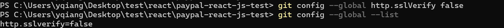
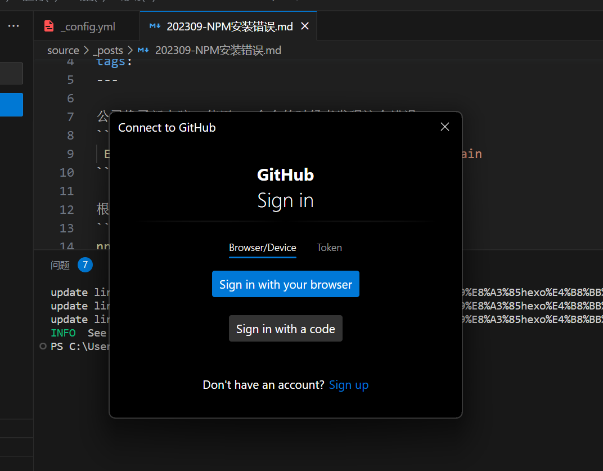
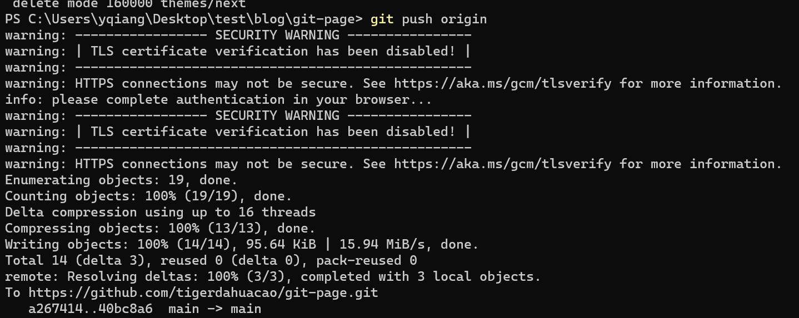
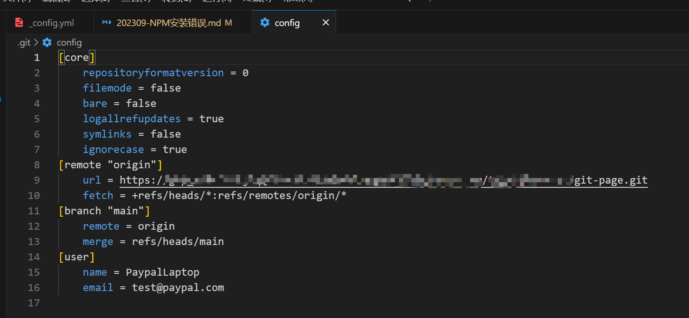

公司换了新电脑, 使用npm命令的时候老发现这个错误
```bash
 Error: self-signed certificate in certificate chain
```

根据网上的办法
```bash
npm config set strict-ssl false
npm config set registry http://registry.cnpmjs.org
npm config set registry http://registry.npm.taobao.org
```
的方法操作后, 问题依然存在

解决办法:  
不要慌,重启就好了

---
然后发现git也有问题, 估计依然是公司Https的问题
```bash
 git config --global http.sslVerify false

 git config --global --list
```

因为是第一次用, 提交代码等待验证的出现

提交成功


不过突然觉得很奇怪, 因为是第一次怎么不要我输用户名, 邮箱什么的, 估计是config里已经有了(我不是从git repo克隆下来的, 是从原电脑复制过来的, .git配置也一起过来了), 所以就不适用global配置了
