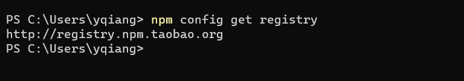
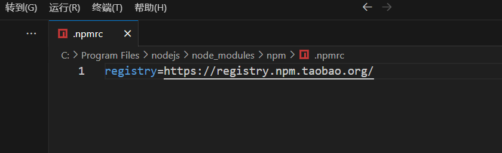
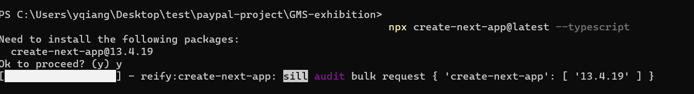
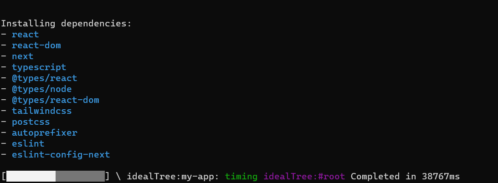
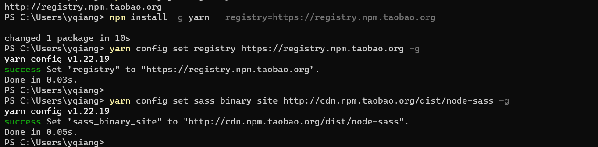
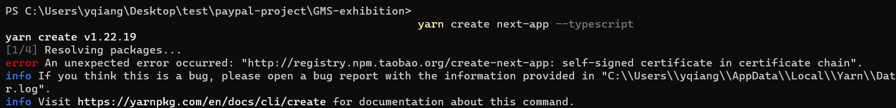
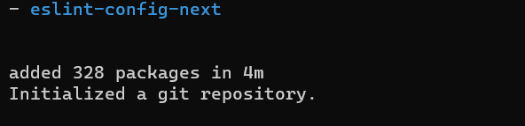
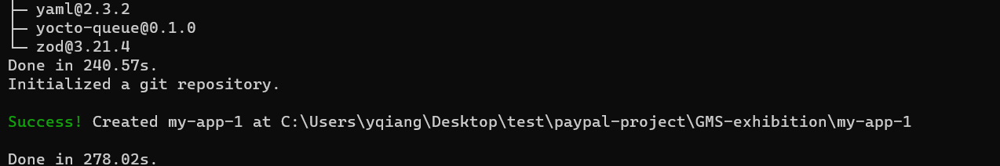

最近在学习next和ts的过程中, 经常要新建工程. 而npx命令太慢了, 修改了npm的源也没有什么用, 因为网上查到到:   
例如```npx create-react-app my-app```使用的registry还是原始的 ```https://registry.npmjs.org/``` 这个源
就很麻烦, 太慢了.  
修改npm的源和npx是没有关系的



我尝试了修改`.npmrc`文件或者干脆使用`yarn`命令


试了一下, 这2步依然很慢

  
感觉使用nrm工具切换源也没什么用了

 试试使用 `yarn`
 ```bash
 npm install -g yarn --registry=https://registry.npm.taobao.org

yarn config set registry https://registry.npm.taobao.org -g

yarn config set sass_binary_site http://cdn.npm.taobao.org/dist/node-sass -g
 ```
  

 在公司电脑上不出意外地发生了ssl错误
  

修改ssl策略
```bash
yarn config set strict-ssl false
```
可以看到, yarn比npx命令要快不少, 安装过程的UI也更好看
  
 

 >https://zhuanlan.zhihu.com/p/36391490
 >https://zhuanlan.zhihu.com/p/27449990
 在看了这2个帖子后, 我觉得, npm也不是不好, 毕竟依赖混淆的问题已经完全解决, 但是因为npx命令的源问题, 目前这个节点 `2023年` 在init react项目时, 还是yarn比较好