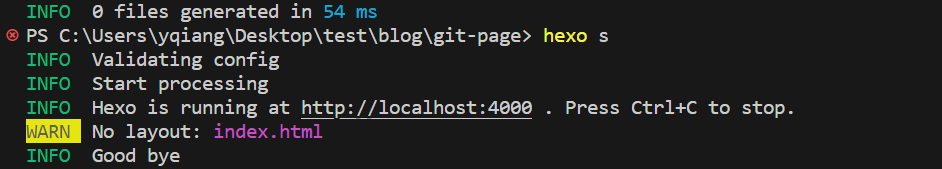
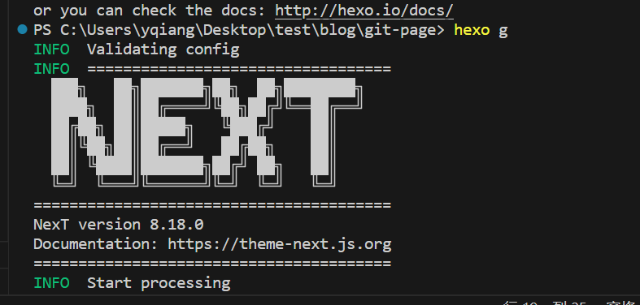
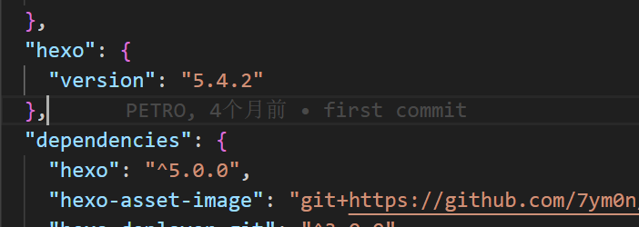

因为换电脑后, hexo的主题会丢失, 一打开`hexo s`一看发现页面是白的, 

要么每次都要手动克隆安装主题文件很麻烦`git clone https://gitlab.com/hexo-theme-next/hexo-theme-next themes/next`

记得next的官网上说, 可以通过npm来安装
```bash
$ npm install hexo-theme-next@latest
```

试了一下没有效果  
查询了一下, 需要把原来的themes目录删掉 `themes`, 就是原来放主题文件的那个目录, 估计第一优先顺序是本地的themes文件夹, 其次才是node_modules中的文件夹

另外一个主题使用成功的关键就是看编译的时候有没有这个大大的logo出现


之后就可以正常使用了

当然, 根据官方的说明, hexo的版本是要高于5.0.0的, 这个hexo的版本和hexo-cli的版本不一样, 如果全局安装了hexo的话, 使用`hexo -V` 命令会跳出来一个 `hexo-cli`的版本, 还是4.2.X的, 这个没有关系

hexo的版本是5以上就可以.