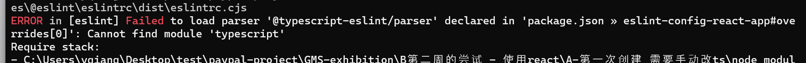
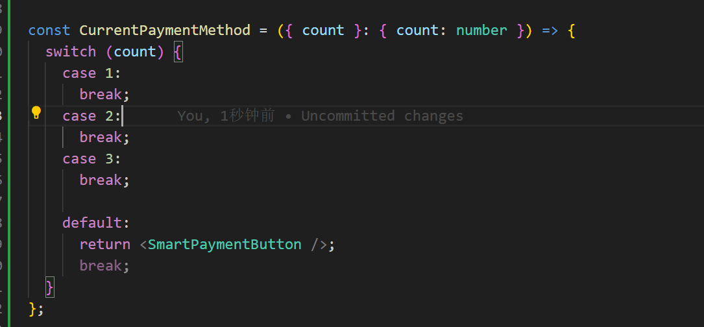
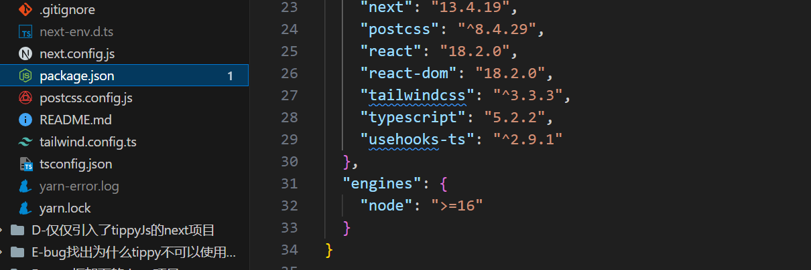

之前的 next 项目打包一直出现问题, 找了找资料也没办法解决这个问题, 无奈之下只好用 react 重新构建

新建项目

```bash
yarn create react-app my-app --template typescript
```

安装依赖

```bash
yarn add tailwindcss@latest @mui/material @emotion/react @emotion/styled
```

发现如下错误

解决办法:

```bash
yarn add -D typescript @typescript-eslint/parser  @typescript-eslint/eslint-plugin
```

在 `.eslintrc` 文件中添加以下内容：

```json
{
  "parser": "@typescript-eslint/parser",
  "plugins": ["@typescript-eslint"]
}
```

---

进过测试发现, 使用 npm 命令创建的 react 项目, 就是直接把 ts 的依赖和配置文件安装好的

```bash
npx create-react-app use-npx-create-react-app --template typescript
```

```bash
npm i -D  tailwindcss@latest @mui/material @emotion/react @emotion/styled classnames usehooks-ts react-router-dom
```

---

在本次开发中发现下面的坑:

1. TypeScript 在传形参的时候, 解构赋值要这么写:
   

2. 部署服务器的时候有时候要指明 node 版本  
   这里是因为 next 要求 node 的版本必须大于 16
  

3. 有时候安装的包有指定的node版本
> https://blog.csdn.net/surfirst/article/details/126461584