创建repo, 选私有库, 之后要放到PayPal内部Git上的, 先声明一下叠甲避免安全性问题
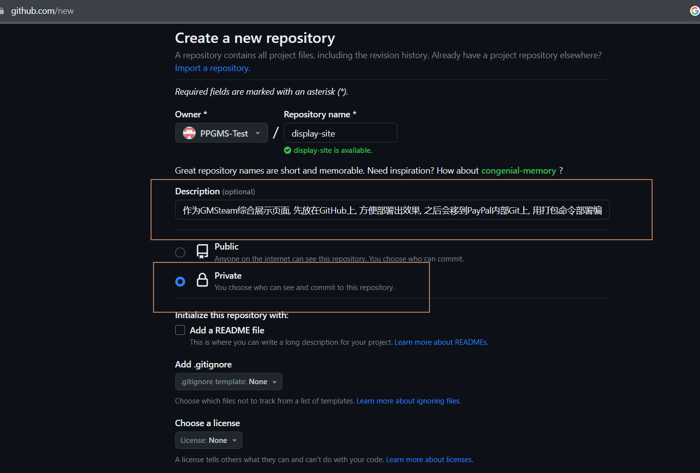

创建ts的create项目
```bash
npx create-react-app display-site --template typescript
```
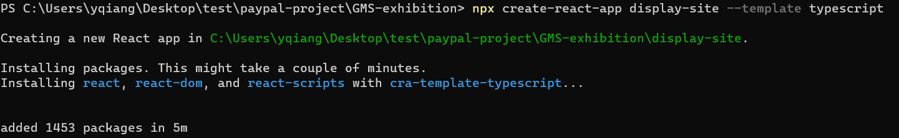
发现无法push代码
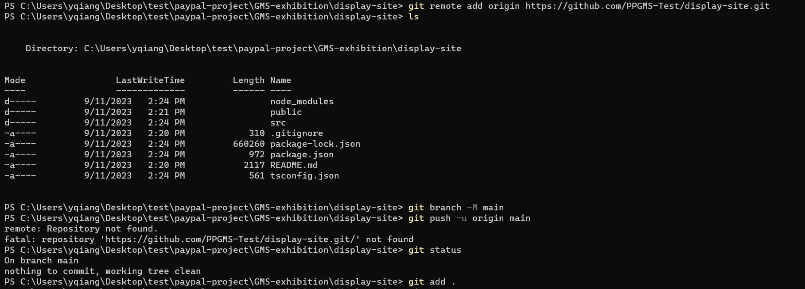
想到可能是没有权限的问题, invite自己的GitHub账号
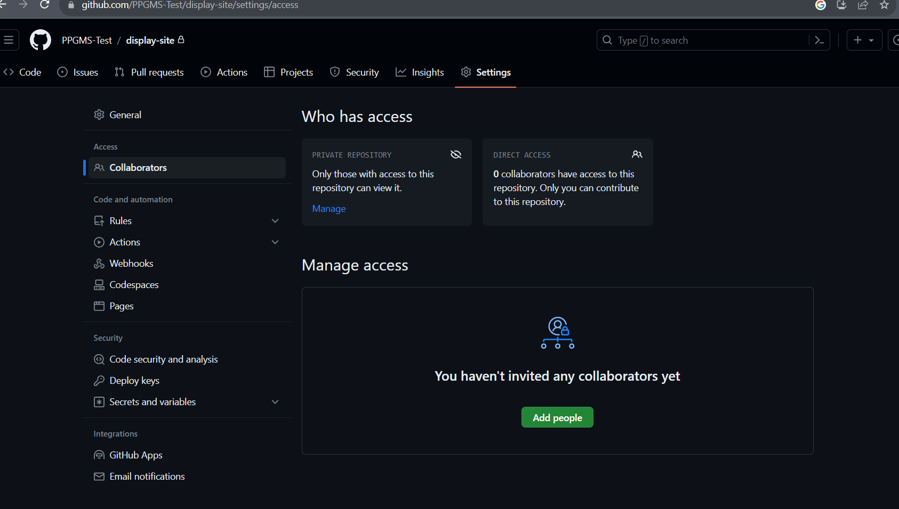
就可以成功了
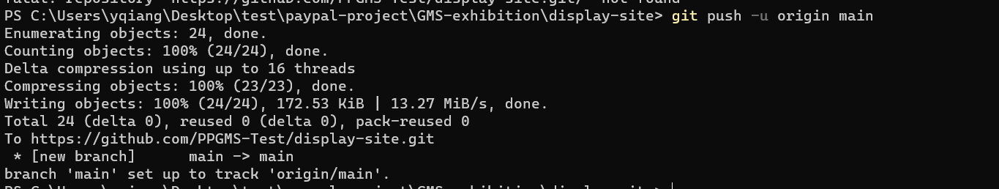
删掉创建工程时的一些默认项
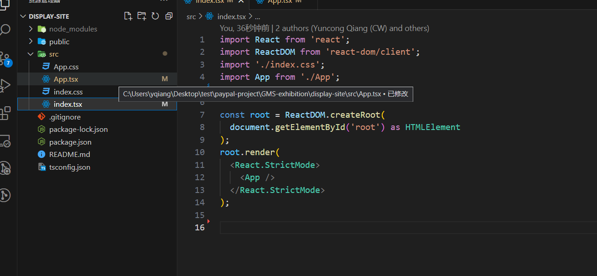
参考开发文档
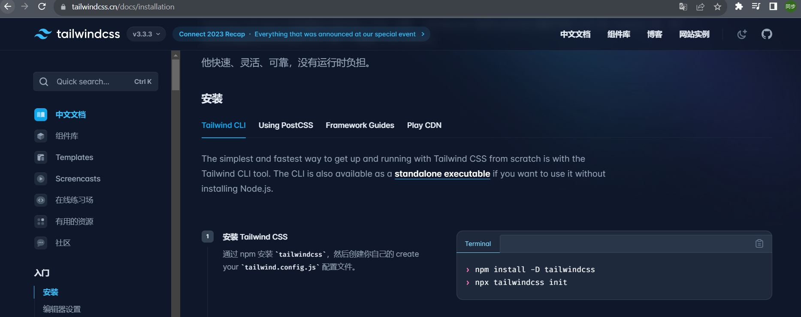
安装tailwind
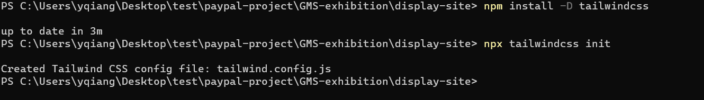
在主 CSS 文件中通过 @tailwind 指令加载 Tailwind 功能模块
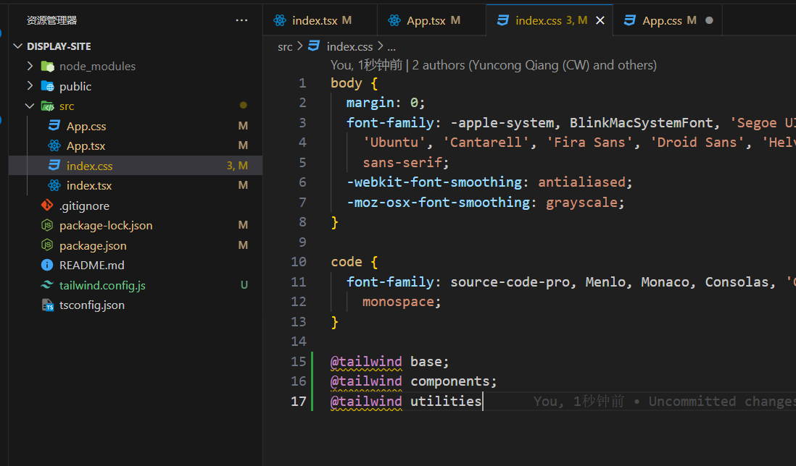
添加tailwind的插件, 不然没有自动提示, 包括颜色什么的
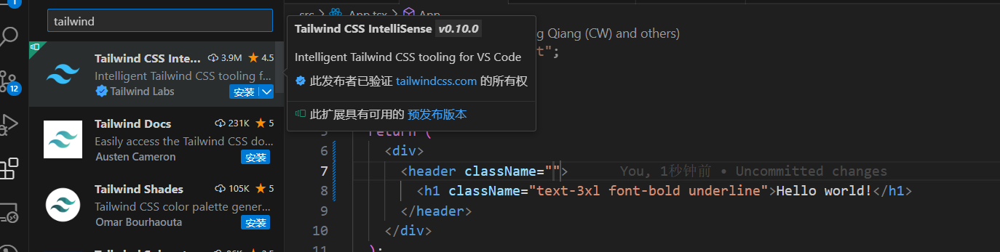
发现没有效果
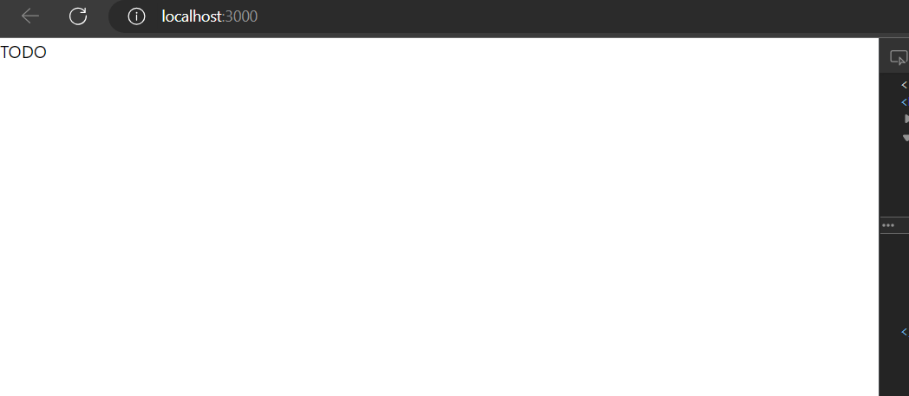
原因是官网的示例代码不正确, 可能是我参考的入口不对, 但是这里配置文件需要自己把 `ts,tsx` 添加上去
```json
 content: ["./src/**/*.{html,js,ts,tsx,jsx}",'./src/pages/**/*.{js,ts,jsx,tsx}', './src/components/**/*.{js,ts,jsx,tsx}']
```
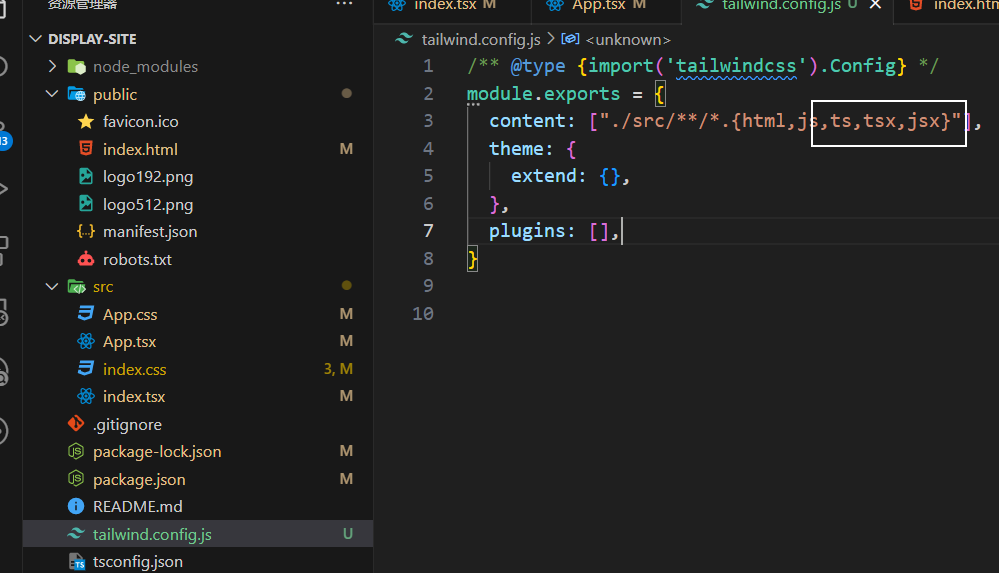
有效果了
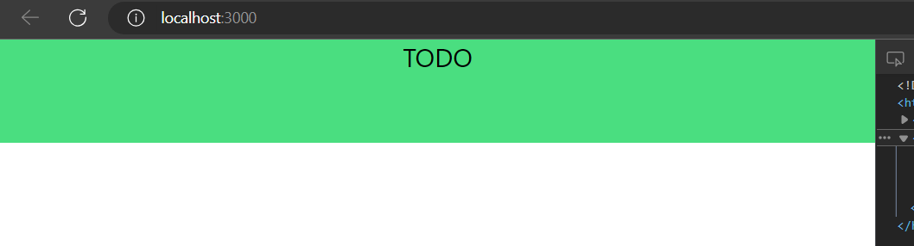

在搜索侧边栏的样式过程中, 我发现了一个文章, 可能这样安装`tailwind`更好
```bash
npm install -D tailwindcss@latest postcss@latest autoprefixer@latest
```
> https://devpress.csdn.net/react/62ed61bbc6770329307f245c.html
> https://codepen.io/junchow/pen/GRoJPeo?editors=1000

---
为了使用next框架, 只能重建项目了, 因为next虽然是基于react的, 但是使用了SSR服务端渲染, 没有什么比较好的办法可以直接从react项目转过来, 所以重新建一个项目了.

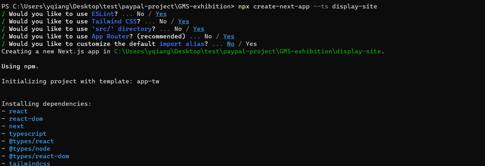

---
nextjs的使用办法, 我这里就不说了, 毕竟很多, 看文档比较好  
但是在我使用 `create-next-app` 的这个时间节点 (2023-09-13), next版本已经从12变成了13, 这里有一个天坑的地方, nextjs是一个以规范为导向的框架, 也就是说你的文件名, 文件夹名字是要符合规范的, 比如在老的12以前的版本中, 路由不需要自己配置, 放在 `pages\文件夹名\页面名[url参数名].js`下就可以了, 这个`文件夹名\页面名` 就是最终的访问路径.   
但是这么关键的东西, 在`13`版本里改了但是文档里说的却不清楚  
这就很要命了, 现在的结构是, 每一个页面, 都是一套组合拳, 比如`test`这个页面, 会有自己的`layout` 和 `page`, 并且命名规范变成了文件夹导向, 文件夹下的默认文件也从 `index.jsx` 变成了 `page.tsx`, 这谁扛得住啊? 看看现在的目录是这样的
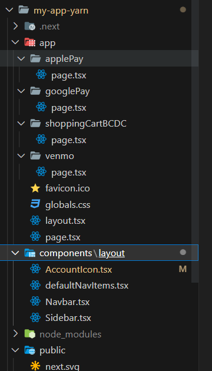  

原来的`pages` 变成了现在的 `app`, 而且官方文档还没说! 而且这个功能还必须要修改配置文件, 不然还不会生效, 
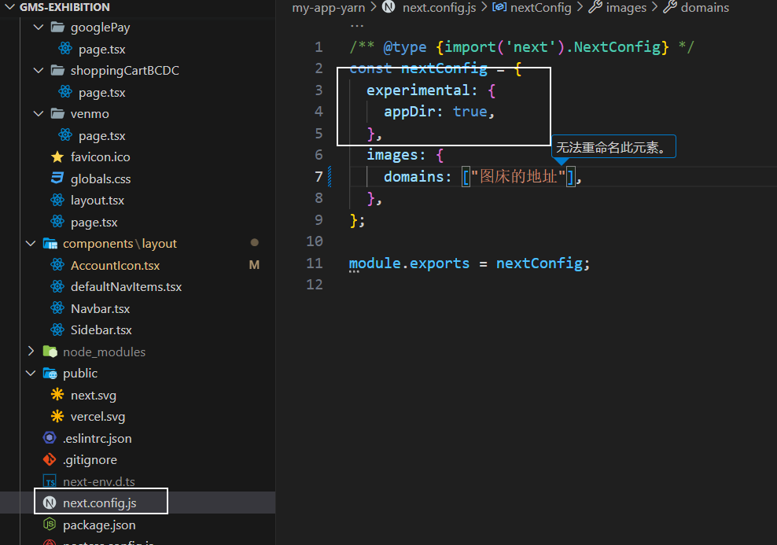 

但是令人困惑的是, 既然写了是`experimental`功能, 那在使用`cli`的时候让人选一下是不是要启用这点吧. 它也没有, 默认都是有的.

---
反正, 就这么先用着吧, 毕竟next也算是react下一个很火的框架

然后是第一次使用了`heroicons`, 这个库的确很方便, 直接把icon变成了`ReactNode`类型, 直接用就可以, 但是里面的图标还不是很多, 不比直接从svg比如iconfont上多, 但是svg还需要转一下, 我现在也没啥好的转的方法找到.
