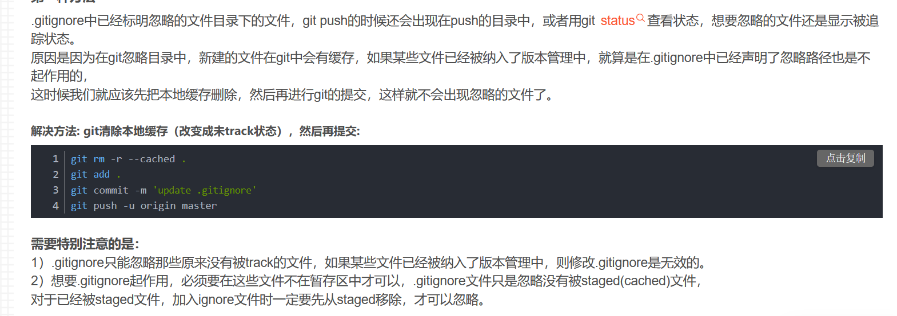

经常会遇到学习一个新框架的时候, 我们只需要保留源码文件, 但是框架给我们生成了一堆工程文件的情况, 而这些文件夹在一开始的时候又没有添加到`gitignore`规则中去, 之前嫌麻烦一直没整, 不提交那几个文件夹就可以了, 但是发生冲突的时候实在太麻烦了, 学习了一下.
```bash
git rm -r --cached .
git add .
git commit -m 'update .gitignore'
```
参考这个帖子
> https://developer.aliyun.com/article/634481

原理如下:
