首先使用管理员权限打开powershell, 不然会报错
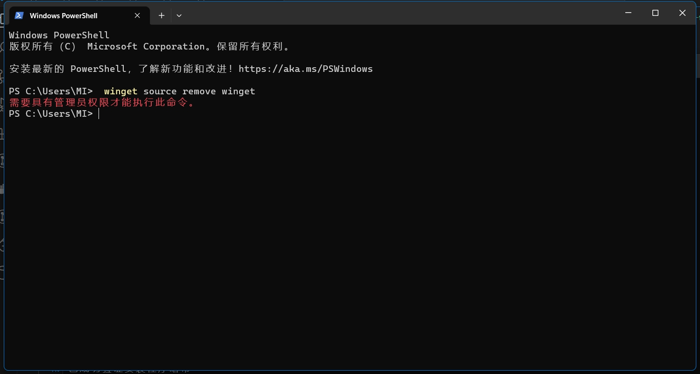
安装github cli, 我指找到了这个使用winget的安装方法, 似乎没用msi版本的安装包 (应该是有的, 我在下载的过程中看到了url)
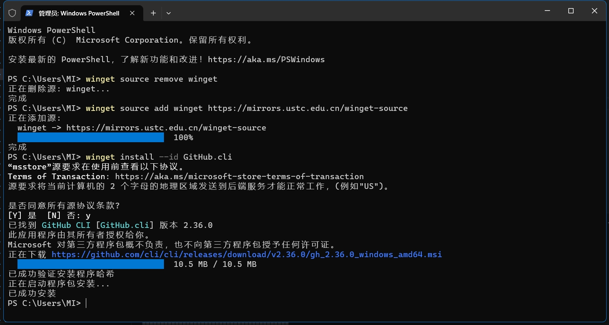
windows 11是自带winget的, 老版本的windows可能要下载, 这里忽略
```bash
winget source remove winget
winget source add winget https://mirrors.ustc.edu.cn/winget-source
winget install --id GitHub.cli
```
安装成功后, 发现命令行无法识别, 检查安装位置和path, 发现都正常
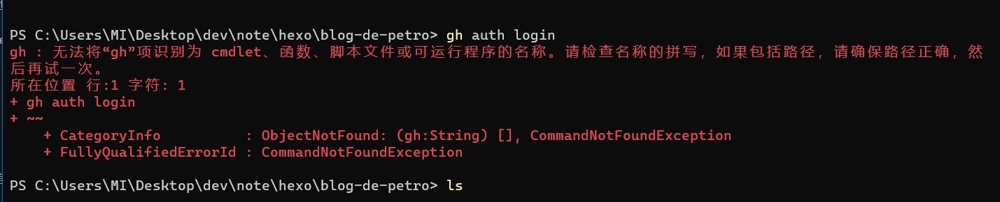
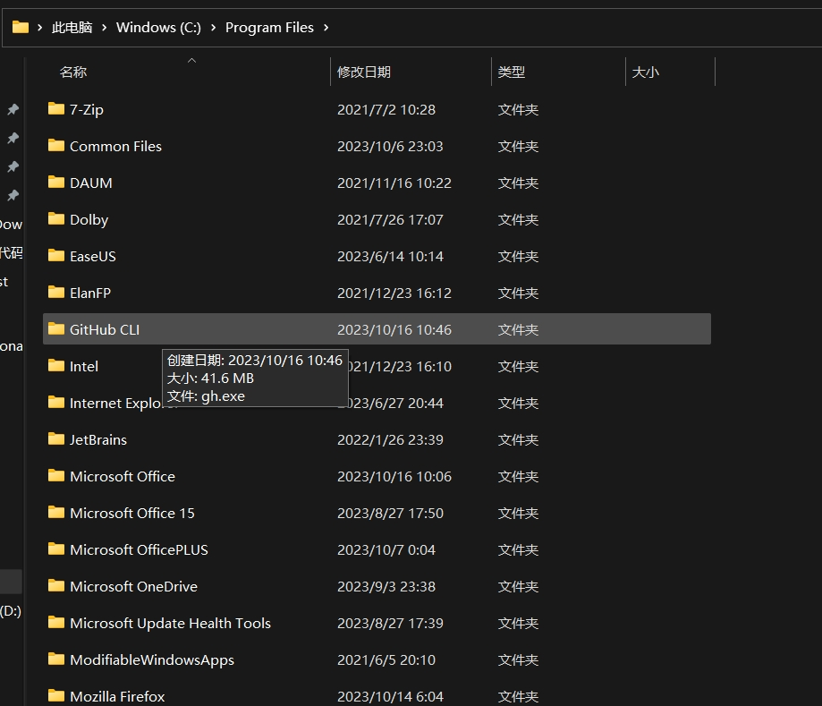
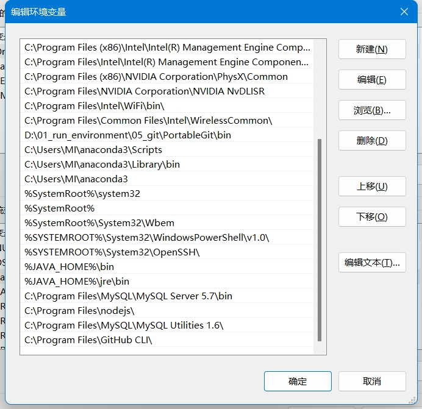
需要重启电脑就好了
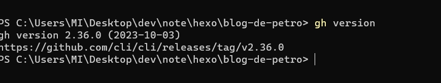

首先, 必须要把代理关掉, 即使你的git config中设置了代理的socket, 但是git和GitHub其实还不是同一个东西, 所以git中的代理设置在这里没用
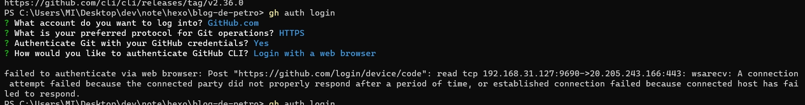
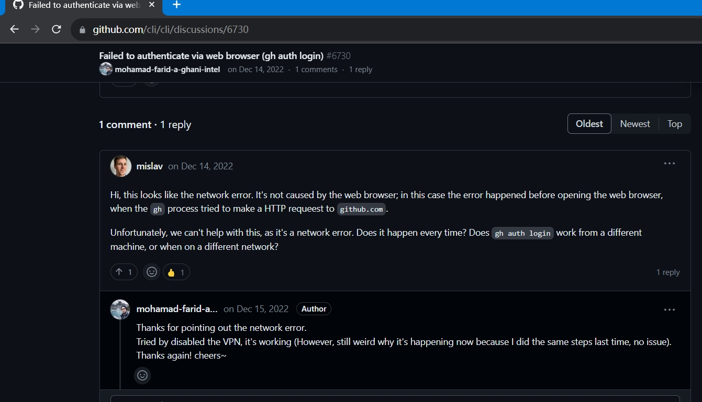
关掉代理后的步骤
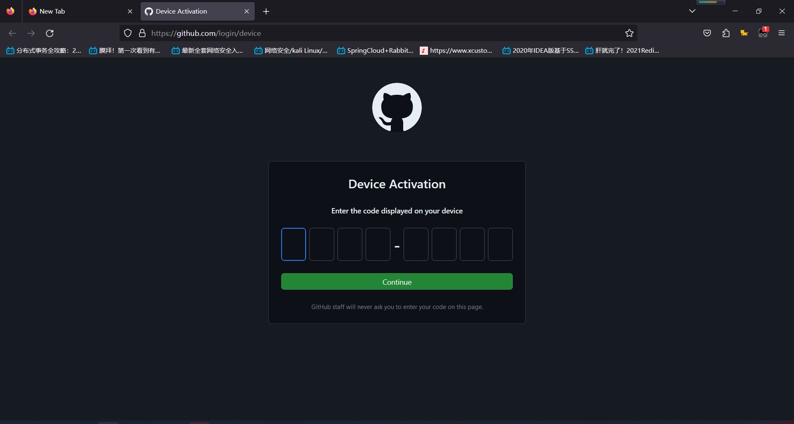
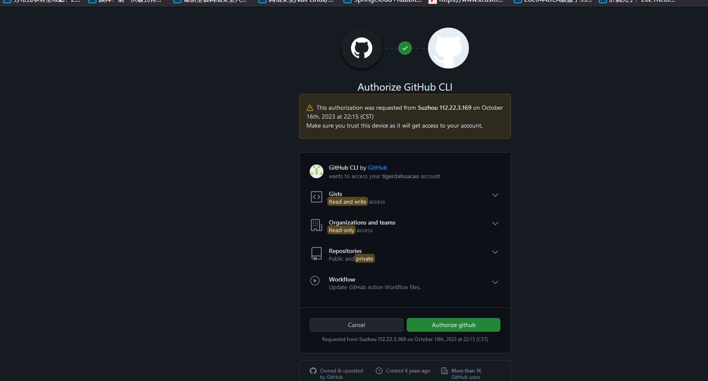

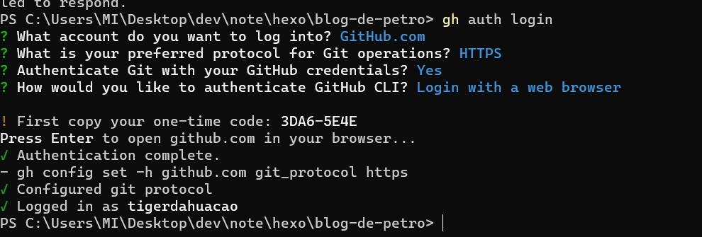

但是GitHub Cli基本上都是帮助你完成一些仓库的操作, 新建仓库什么的.  
其依然不能解决我突然不能push代码的问题.

后来发现了问题所在, 是之前的person access token过期被自动删掉了. (虽然我创建的是永不过期, 但是Github还是时不时经常会删这些没用expiration date的token)
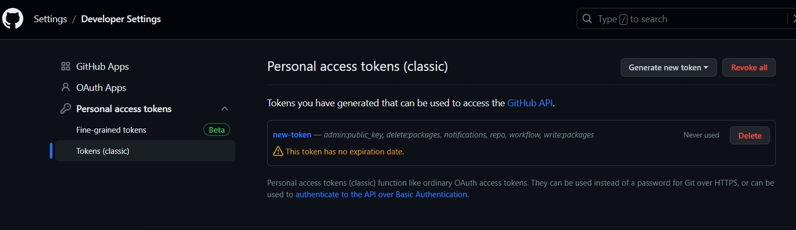
可以看见之前的token已经不见了

