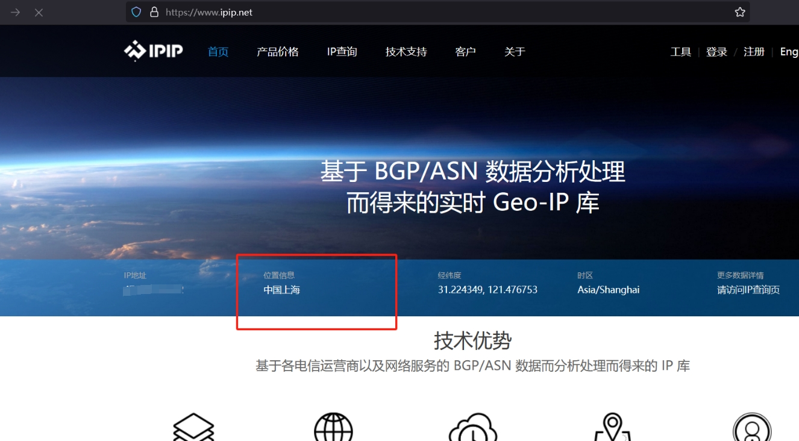
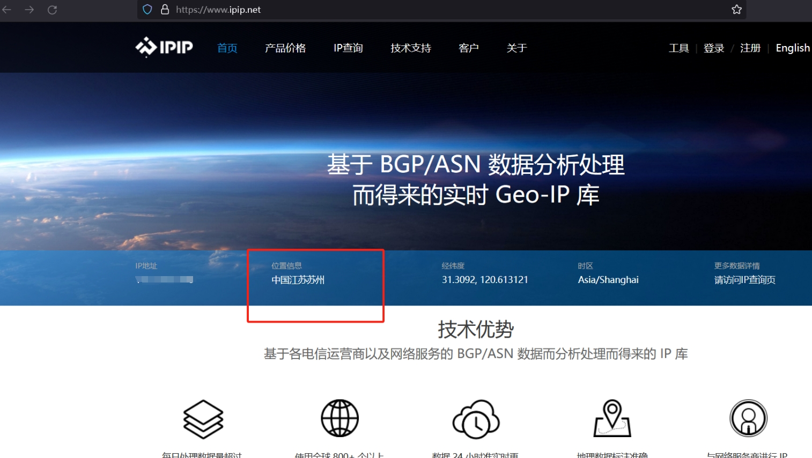

贴上一些使用的使用link:

逗逼大神的关于SSR机场一键搭建的帖子.
这里要注意, SSR和SS不是同一个东西, v2rayN的客服段不一定能使用SSR的链接, SSR的加密方式大多在v2rayN中不支持, 也有一两个支持的, 所以SSR的客户端还是建议下SSR自己的
> https://github.com/ToyoDAdoubiBackup/shadowsocksr
> https://ssr.tools/803
> https://github.com/ToyoDAdoubi/doubi?tab=readme-ov-file#ssrsh

233boy一键搭建v2ray机场的帖子, 但是这个只能用来翻墙, 因为它要访问外网来获取ip地址
> https://233boy.com/v2ray/v2ray-script/
> https://github.com/233boy/v2ray/wiki/V2Ray%E6%90%AD%E5%BB%BA%E8%AF%A6%E7%BB%86%E5%9B%BE%E6%96%87%E6%95%99%E7%A8%8B
> https://github.com/233boy/v2ray/wiki/V2Ray%E4%B8%80%E9%94%AE%E5%AE%89%E8%A3%85%E8%84%9A%E6%9C%AC
> https://233boy.com/

如果给linux服务器使用clash,命令行 & dashboard
> https://parrotsec-cn.org/t/linux-clash-dashboard/5169
> https://luckyfuture.top/config-clash-on-linux#%E5%AE%89%E8%A3%85clash
> https://github.com/ghostxu97/clash-for-linux?tab=readme-ov-file

最终成功图:

