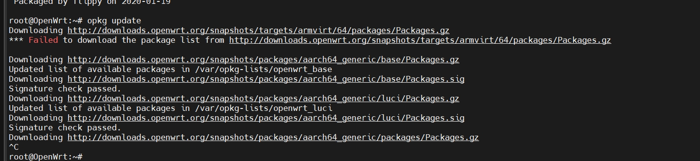
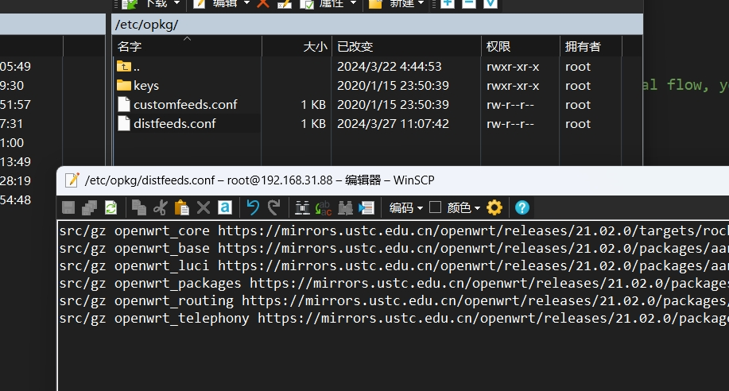
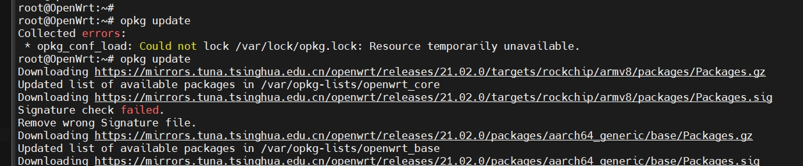
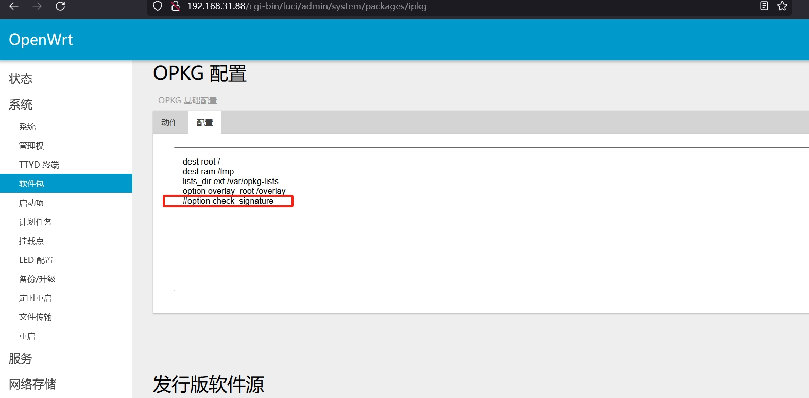
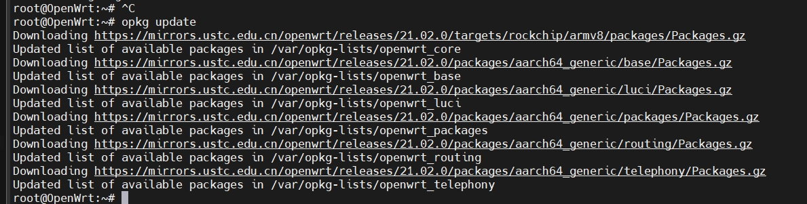
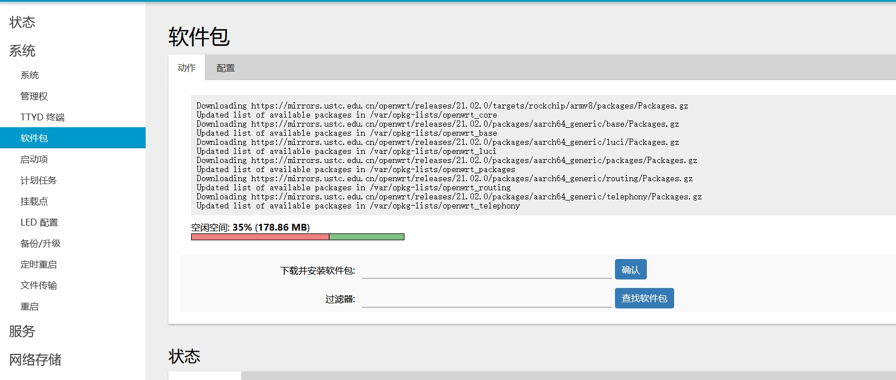

想给openwrt在SSR以外添加clash用于科学上网, 因为ssr节点是用来翻国内的.

但是发现`opkg update`总是出错

换了源之后依然没用


在这个帖子中找到了答案
> https://www.right.com.cn/forum/thread-199942-1-1.html

就可以正常更新了




另外, 网上一直说, 安装openclash的话, 要把这个卸载了:  
```opkg remove dnsmasq```