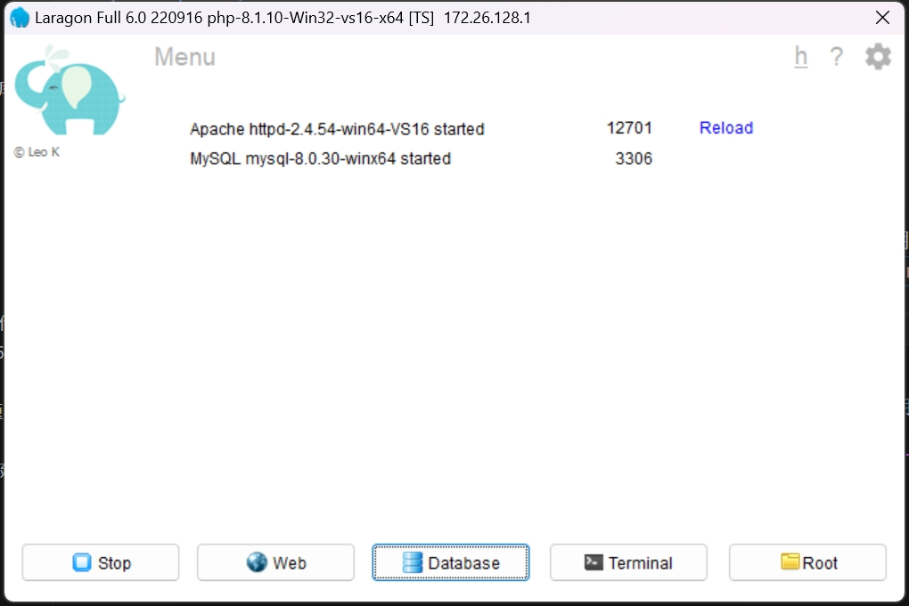
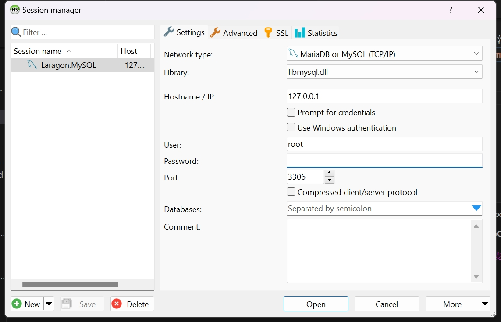
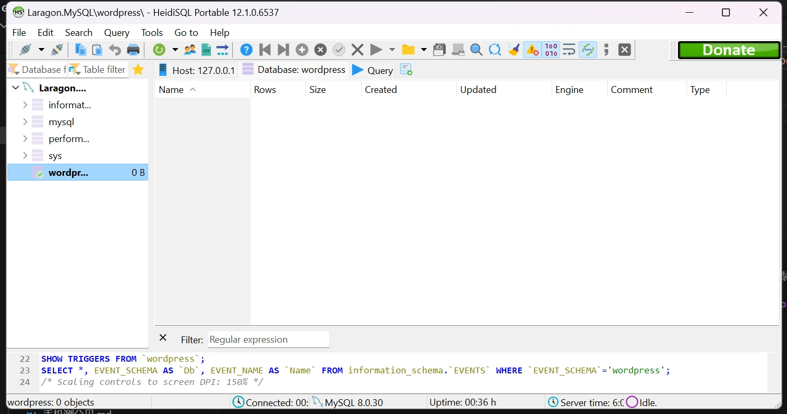
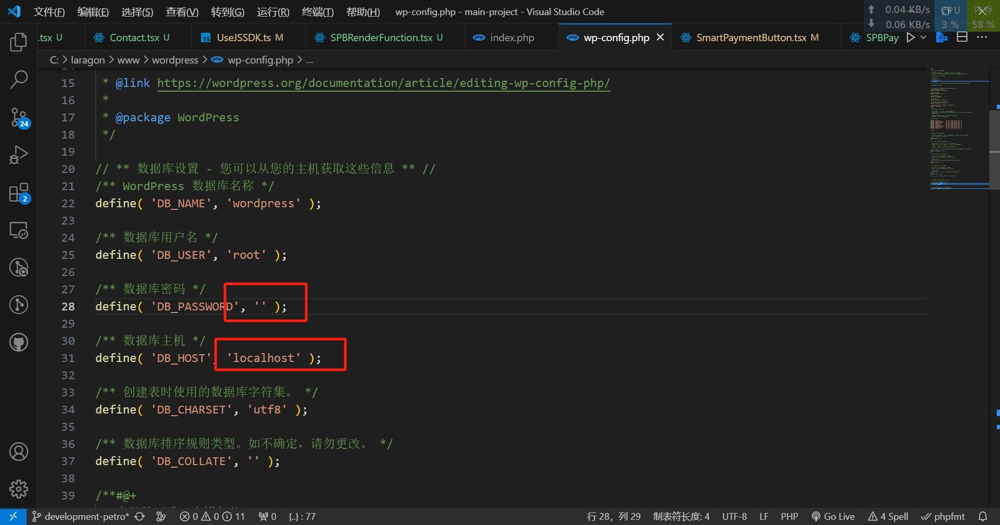
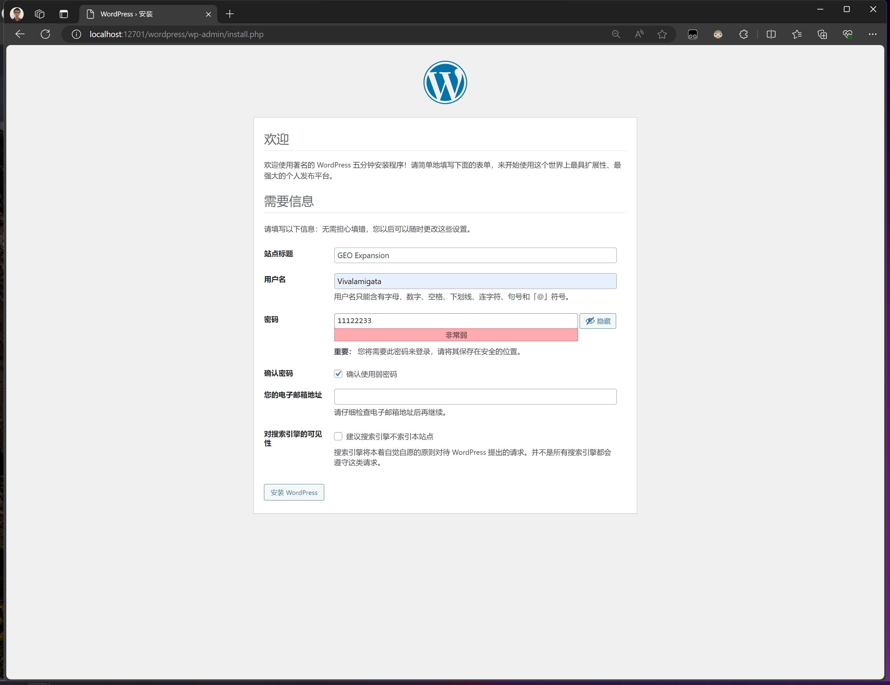
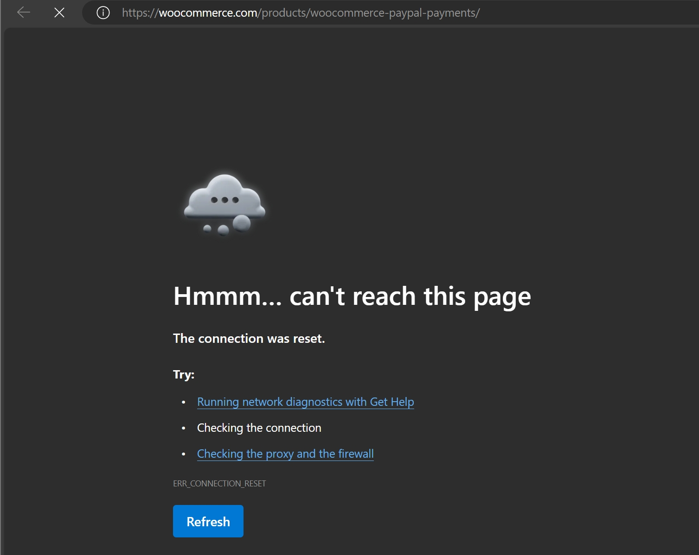
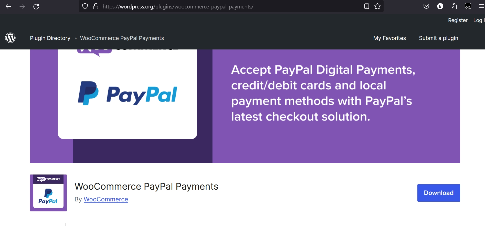
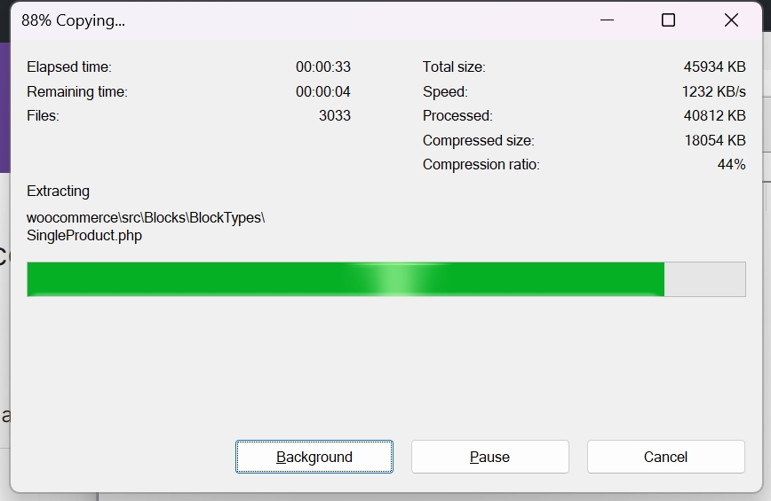
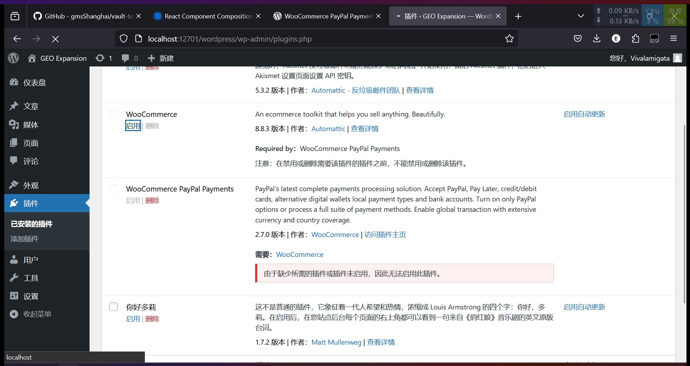

因为小皮面板或者说`phpstudy_pro`被公司网络禁用了, 公式网页也打不开, 服务也连不上, 没有办法更新插件, php版本也无法更新, 很麻烦, 投入`laragon`怀抱试试重新部署`wordpress`+`wooCommerce`

laragon的控制面板:  
  
数据库默认就是没有密码的  
  
创建一个叫`wordpress`的数据库 

`wp-config` 文件这样写. 数据库没有密码就填`''`,主机的配置选项, 因为我这次这个电脑上没有安装mysql, 不会出现本地服务端口冲突的问题, 不用指定端口(也就是说是默认的3306), 直接留一个`localhost`就可以

指定host的文件夹路径后, 就可以进入`wordpress`了. 会看见这里的引导页面

下载`woocommerce`
> https://wordpress.org/plugins/woocommerce  
(附wordpress安装网站):  
> 中文版wp: https://cn.wordpress.org/download/  
> 国际版wp: https://wordpress.org/download/   

公司的网络在`woocommerce`的域名里搜插件会网络不好:
> https://woocommerce.com/products/woocommerce-paypal-payments/

  
还是直接在wordpross的插件市场里搜索吧: 
> https://wordpress.org/plugins/woocommerce-paypal-payments/ 
>  
> 
解压缩到`wp-content/plugin`文件夹下  
 

插件成功识别, php的语言特性让其不需要部署就可以直接使用
 