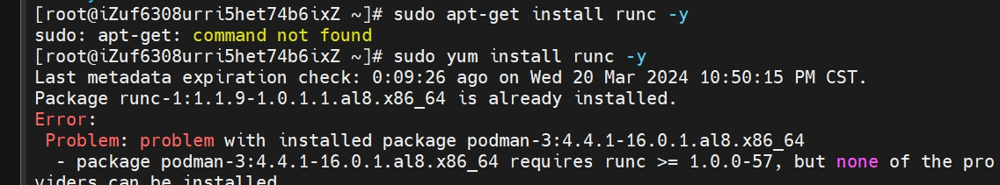
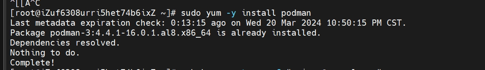
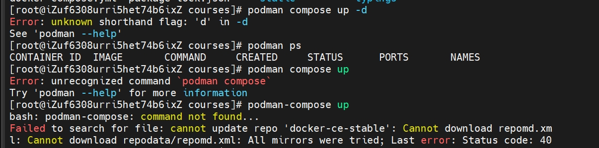
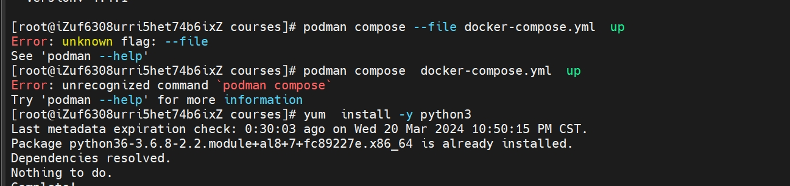
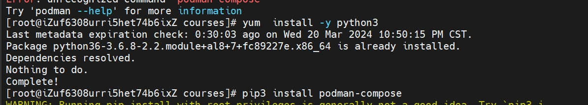
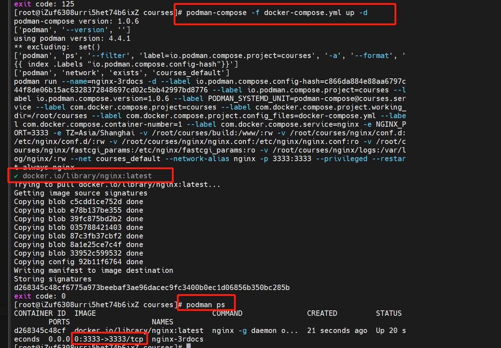

在阿里云定制的linux系统上想安装docker会报错
  
只能安装podman(已经自带了)

使用podman来运行docker的docker-compose文件发现报错

查了一下, 要用一个 podman compose命令, 其实是`podman-compose`  

这其实是一个python的命令, 安装python, 再用pip安装

用`podman-compose` 把docker工程启动成功

不要忘了去防火墙开放端口哦, 图中可以看到都是`3333`