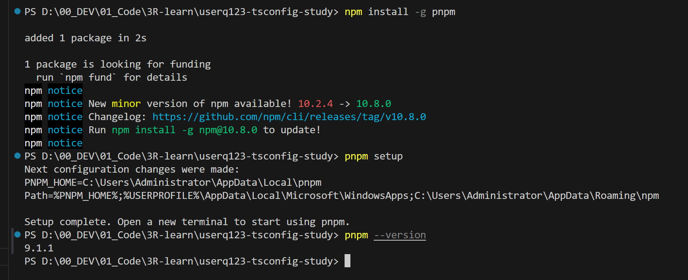

> http://47.101.53.212:3333/

首先发现一个好用的VSCODE插件, `error lens`


yarn、npm、cnpm和pnpm的区别
> https://blog.csdn.net/ztc213421/article/details/134638220  

nnrm是什么
> https://juejin.cn/post/7121365595588657160  
 
我自己搭建的文档
> http://47.101.53.212:3333/ (这个不一定实时更新)  

在线文档
> https://docs.3rcd.com，密码765678765678  

代码仓库:
> https://github.com/tigerdahuacao/node-js-learn-again  

## 安装pnpm

```
npm install -g pnpm
pnpm setup 

```
安装源管理工具, 这里需要配置环境变量`PNPM_HOME`
  
可能需要重启以生效
  
`nnrm use taobao`   
  
  
  


tsconfig.json此处并非作为真正的ts -> js的编译过程的配置文件，而仅仅作为vscode的ts-server的代码编辑和检测功能以及eslint的ts解析器的配置使用
  
生成`tsconfig.build.json`
  
不得不说, `pnpm` 安装包的命令行界面是否优雅好看
  
  
发现如果用`pnpm`安装'bun`报错的话, 如此处理  
> https://juejin.cn/post/7211116982513762364
  

编译并启动
  
当然也可以用类似`nodemom`的方法实现热更新`bun --watch`
  

这里有一个, 用pnpm安装的`bun`包是无法给windows使用的. 
需要在官网上安装给windows用的bun (我写这个文章的时候是1.1)
> https://bun.sh/blog/bun-v1.1
   
   
`bun`也有debug功能, 但是不是在vscode里debug而是在浏览器种, 作用不是很大
   

## 安装ESlint
```bash
pnpm add eslint@8.57.0   prettier   @typescript-eslint/parser   @typescript-eslint/eslint-plugin   eslint-config-airbnb-base   eslint-config-airbnb-typescript   eslint-config-prettier   eslint-plugin-import   eslint-plugin-prettier   eslint-plugin-unused-imports   eslint-plugin-jest  jest -D
```
ESlint的9以上版本有大改, 所以要指定9一下的版本, 同时为了优化掉其他的`unmet peer`版本, 那我们修改`package.json`文件, 让eslint不被更新, 更新其他的包
  
添加`.eslintrc.js`,`.prettierrc.js`文件 