今年2月份换了新显卡, 拖了4个月还没有折腾SD. 16G显存必须安排上  
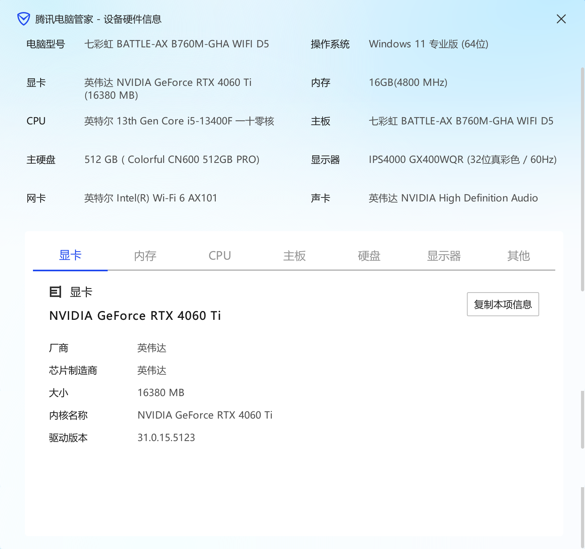  

参照这2个视频:
> https://www.bilibili.com/video/BV1iM4y1y7oA/
> https://www.bilibili.com/video/BV1x8411m76H/
下载地址:
> https://pan.quark.cn/s/2c832199b09b#/list/share

下载文件: 
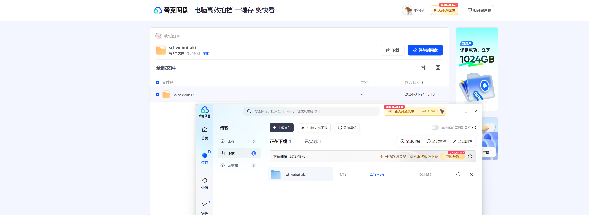   
解压密码: `bilibili@秋葉aaaki`
解压
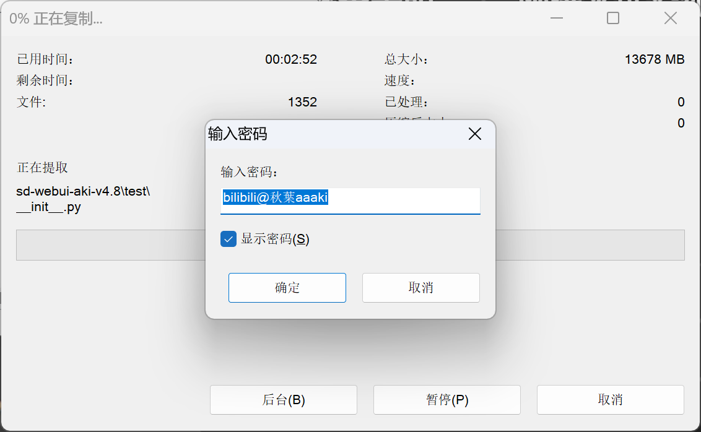   
安装`.net`依赖
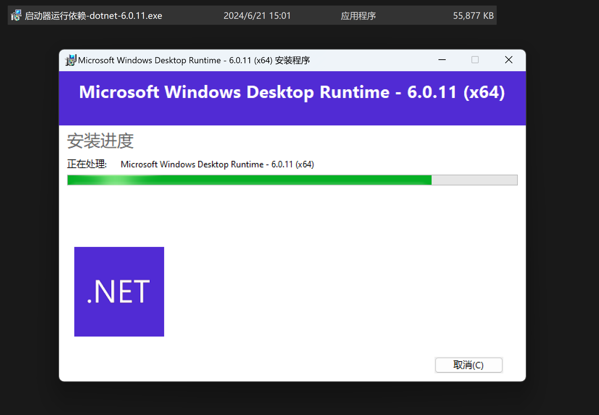   
启动
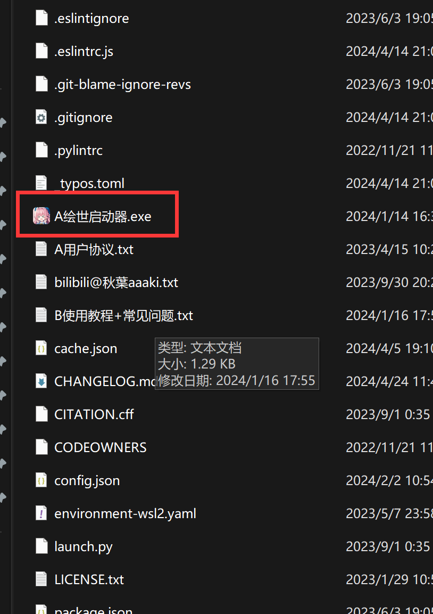   
打开界面, 点击`一键启动`
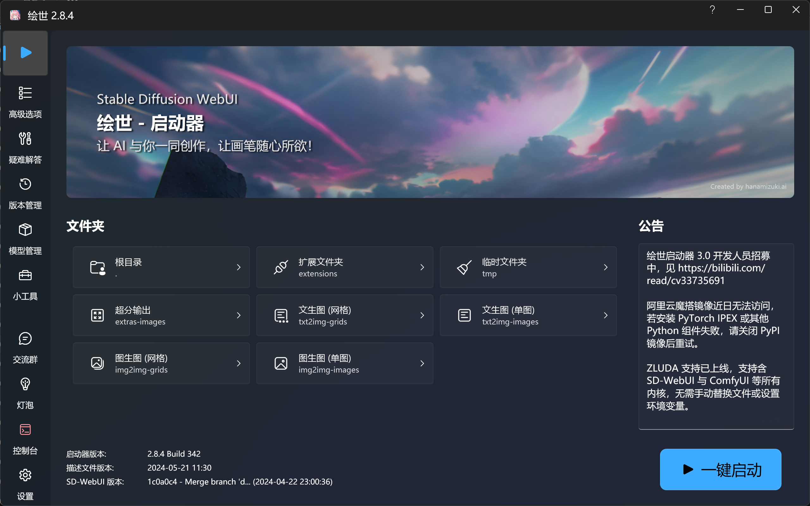   
自动下载各种python,git依赖
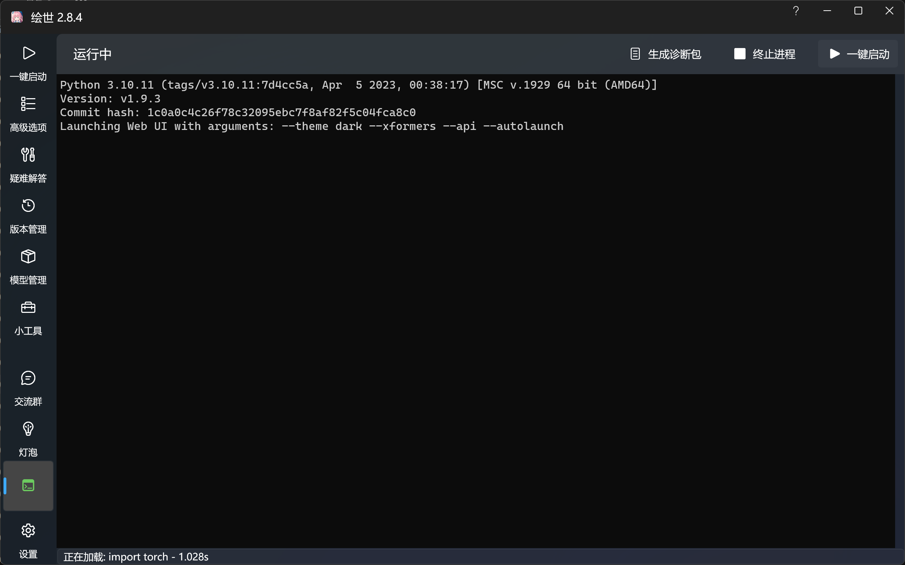   
启动UI界面
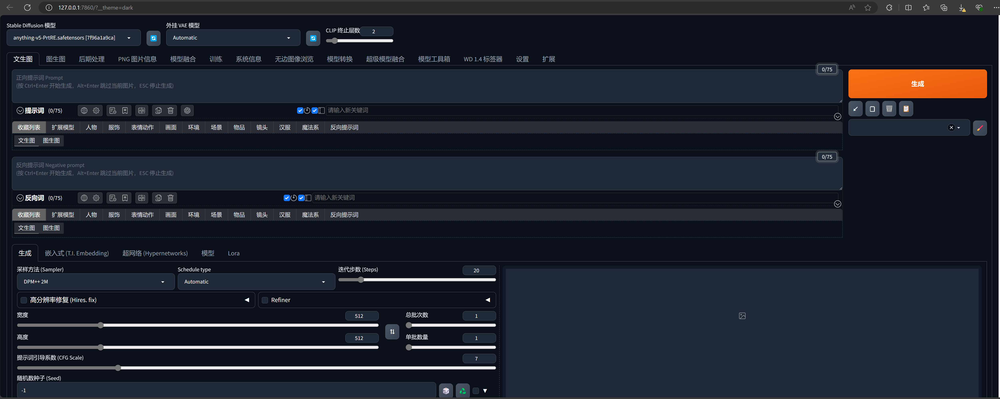   

因为太久没用这个UI界面了, 所以重新看一下大佬的教程:  
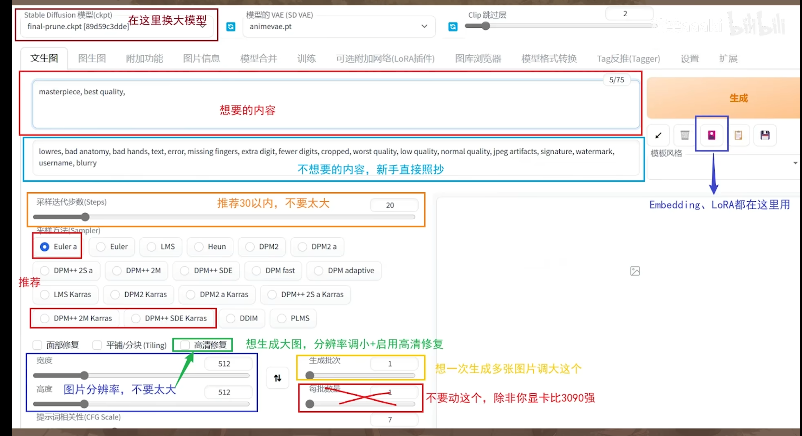
最基础教程: 
> https://www.bilibili.com/read/cv22661198/

提示词sample: 
```bash
masterpiece, best quality
#####
lowres, bad anatomy, bad hands, text, error, missing fingers, extra digit, fewer digits, cropped, worst quality, low quality, normal quality, jpeg artifacts, signature, watermark, username, blurry
```
Tag网站:  
> https://tags.novelai.dev/

生成一张图试试, 我们现在显卡内存大了, 可以生成更大分辨率的图
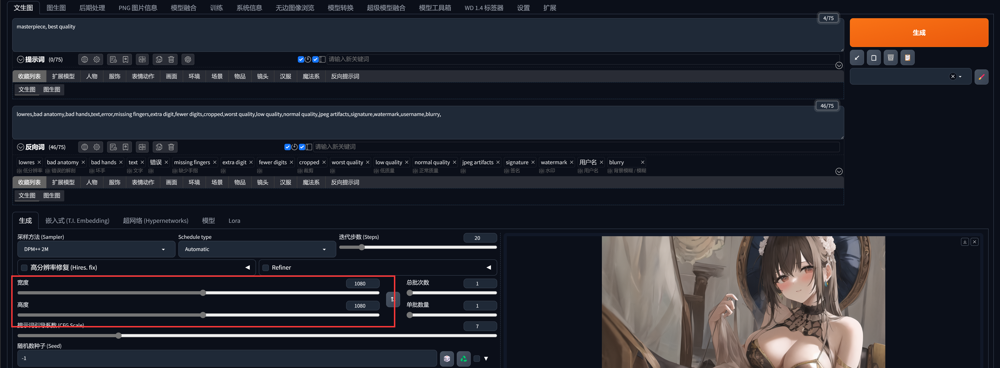
可以感受到显卡的工作强度了
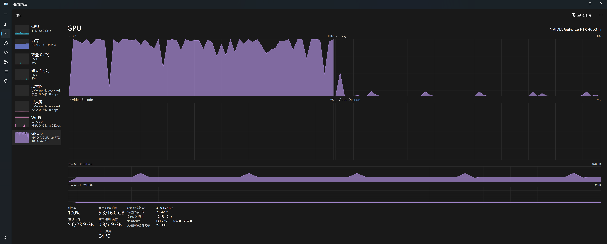

然后在看这个教程:
> https://www.bilibili.com/read/cv22159609/

看起来我前面说的调整分辨率的做法是不正确的, 按照教程调整了一下参数, 生成图的时间明显变长了很多
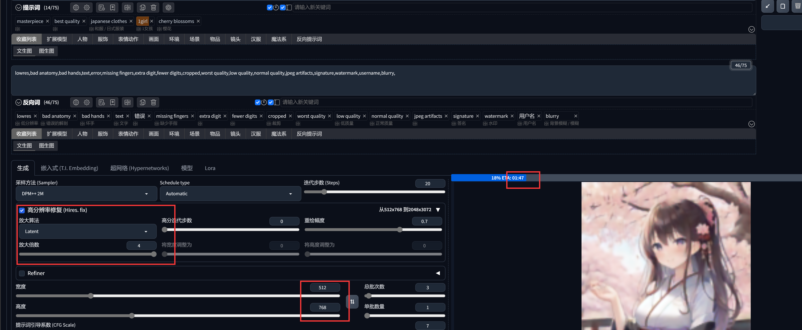
(4倍太大了, 直接给显存干爆了, 图片到后面就没有生成成功)  

可能是重绘幅度系数太大了, 第二张直接给我变成接头霸王了 
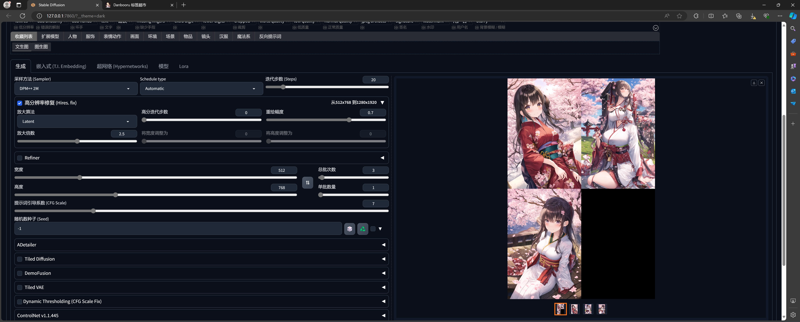
但是生成的图的质量还是可以的, 有3M
图片信息也可以通过这个方式来查看, 正如教程中所说的, 只有SD生成的图片, 才能被SD解析tag  
解析的速度很快
> https://spell.novelai.dev/
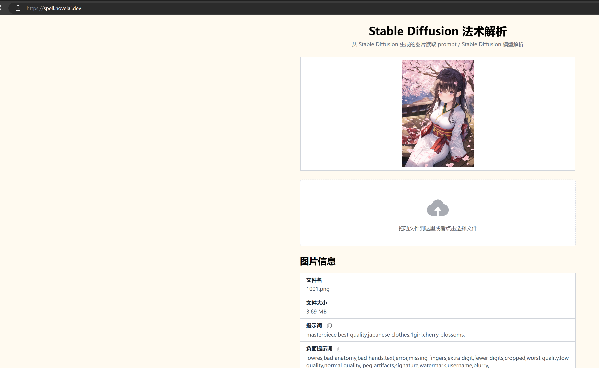