下载`prestashop`, 解压, 放到网站服务器目录下, 然后访问. (这里注意,`prestashop.zip`这个文件, 它必须要通过安装`php zip extansion`插件安装, 自行解压没有作用)
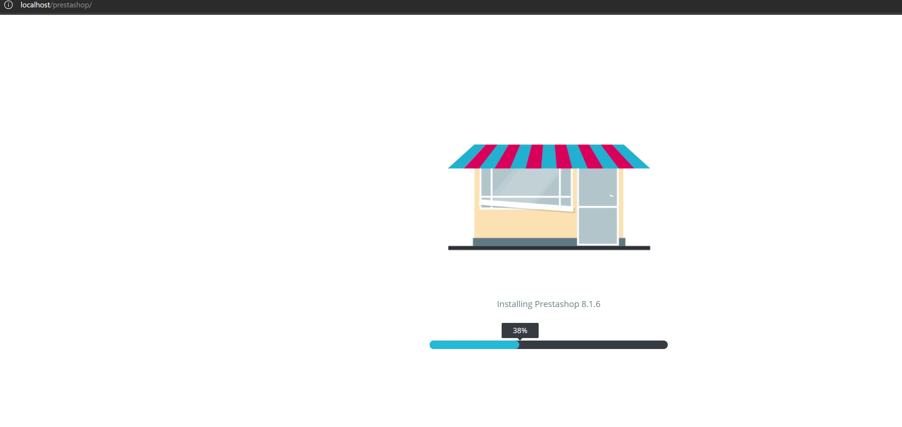  
这里在windows下用`laragon`作为host环境没有作用, 我试过好几个, 包括`win server`, 都没有成功, 可能`prestashop`对于windows的支持不是很好, 我最终在linux(centos)上终于成功  
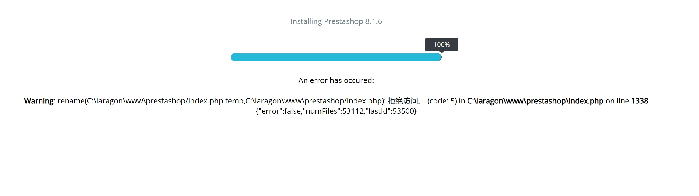
开始安装流程  
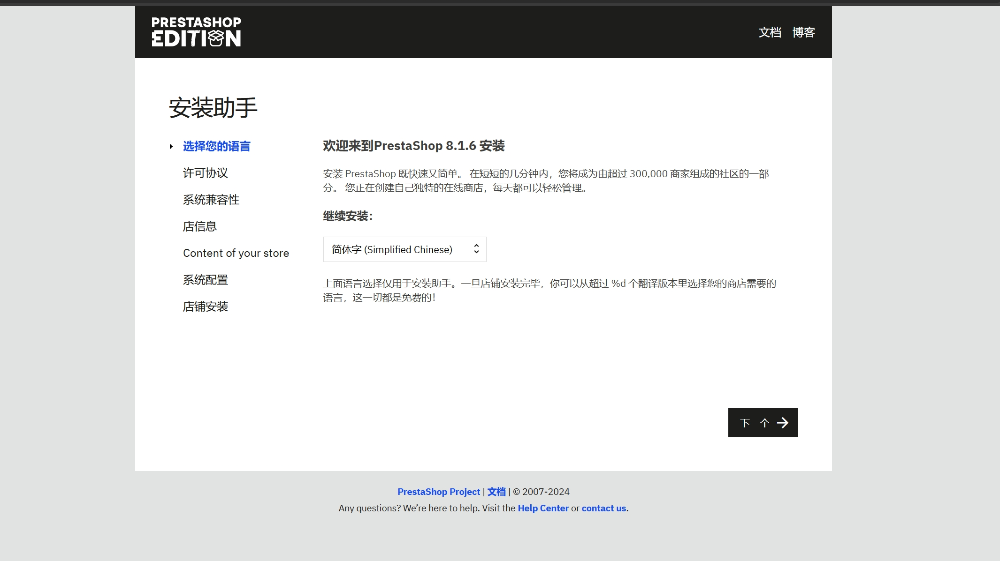  
会检查各种依赖  
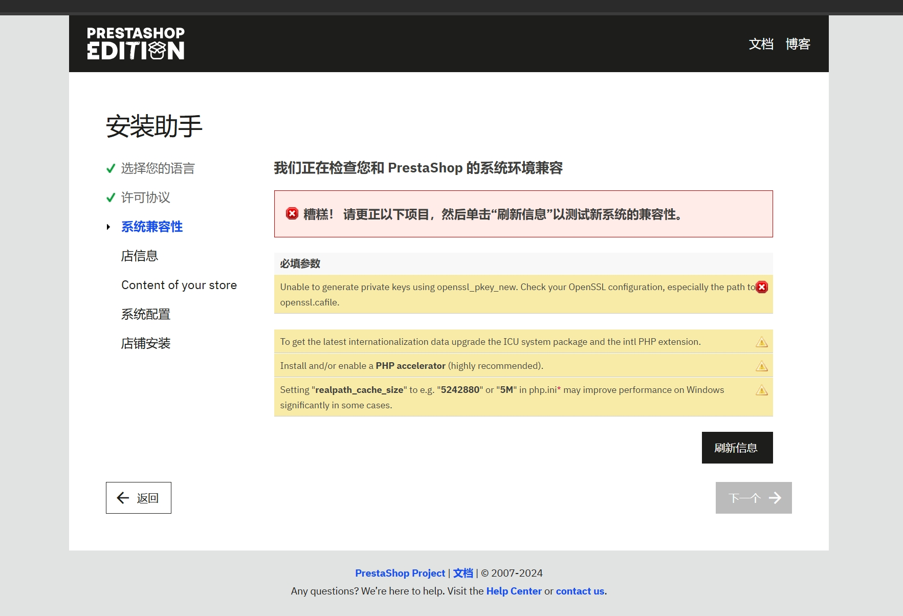
安装缺失依赖  
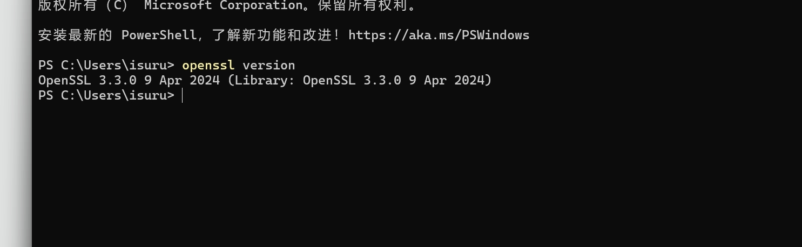  
如果依赖都安装好了, 可以进入下一步
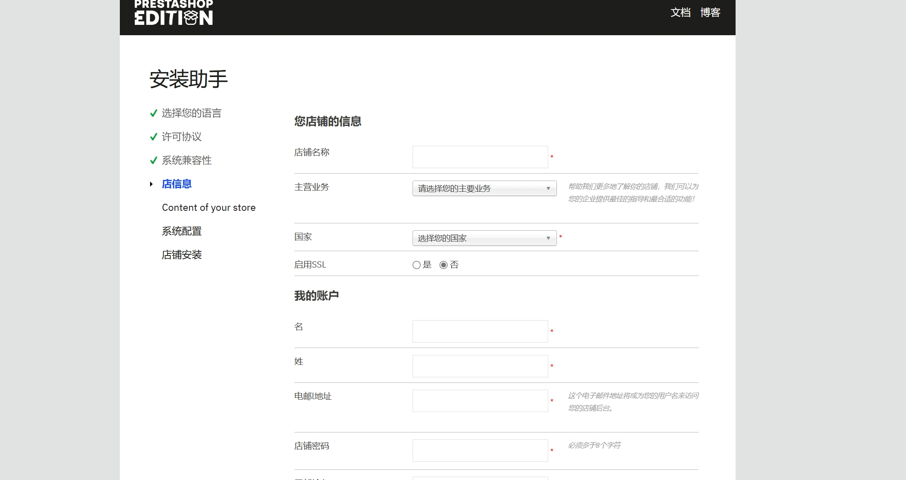
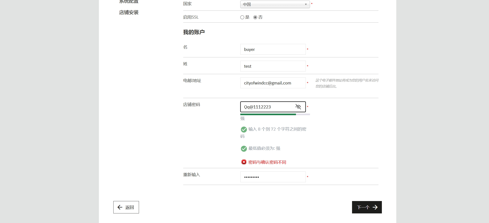  
配置数据库(这里是在windows上的, laragon里)
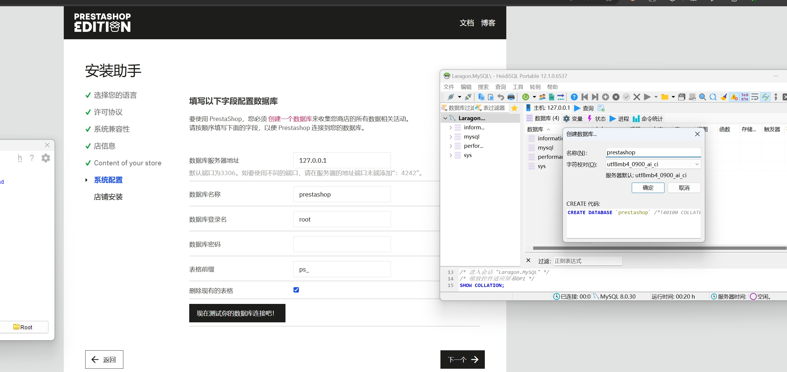
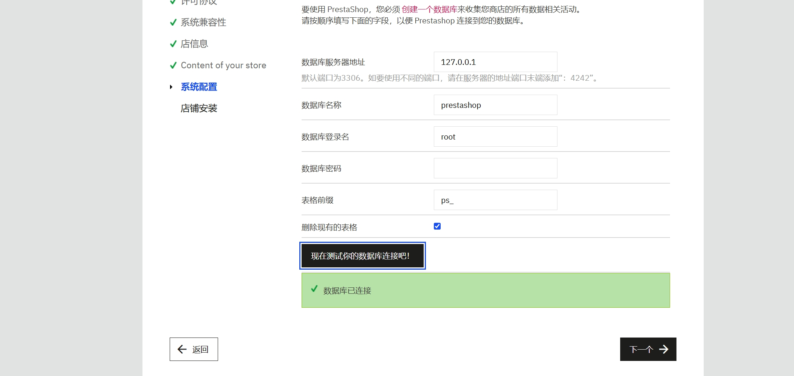
这里windows系统都会报一个很迷的错误
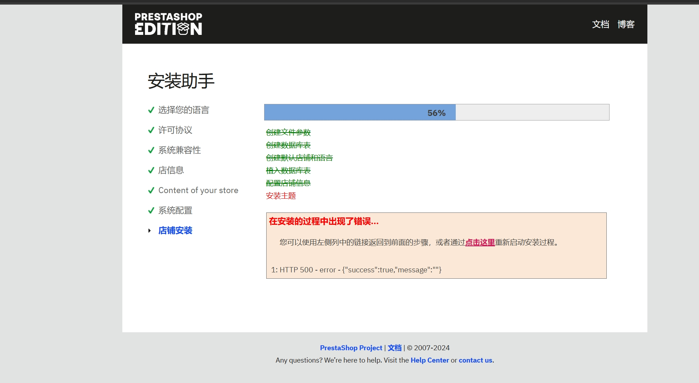  
Linux不会  
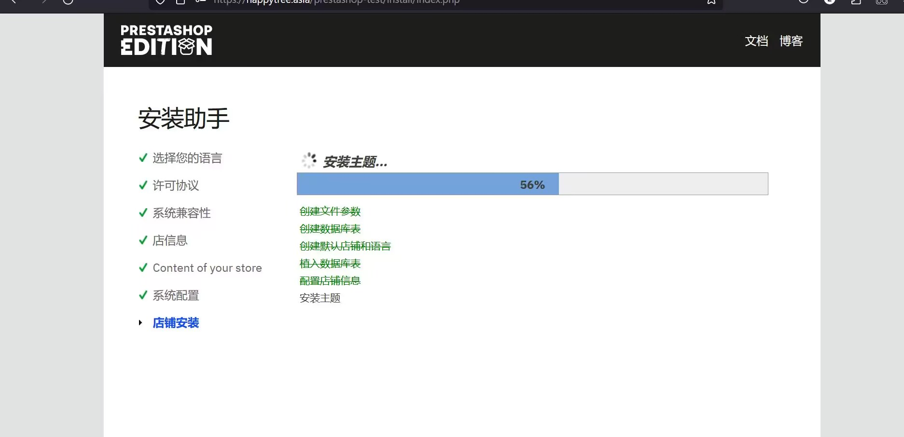
安装成功      
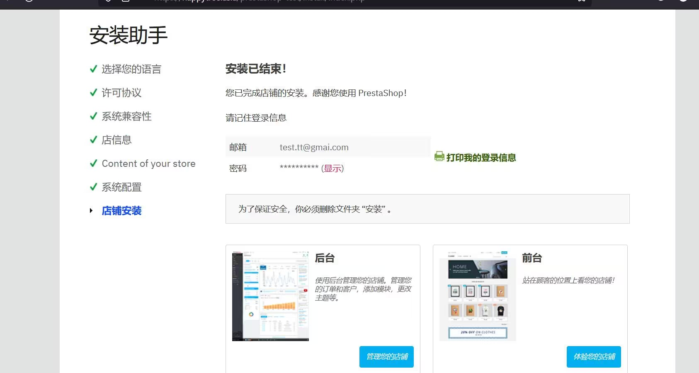  
访问后台会告诉你为了安全考虑, 需要删除`/Install`文件夹
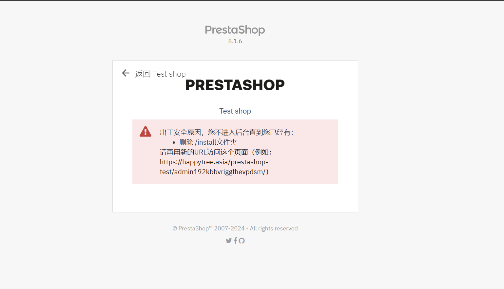
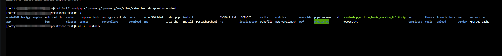  
删除后可以进入
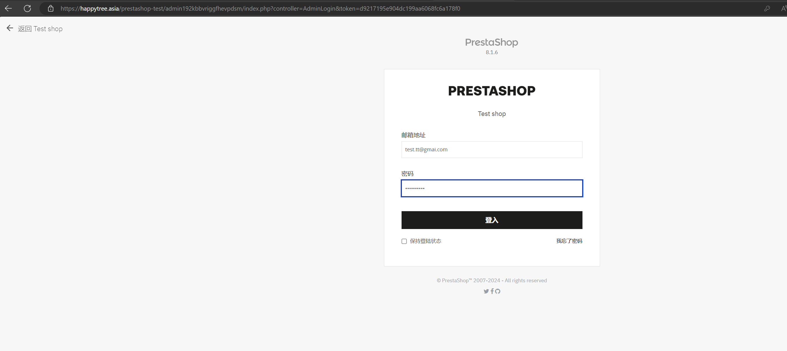

这里有一点, 一定要启用SSL, 或者在店铺的后台管理设置中也启用SSL, 否则会导致访问店铺时出现一直重定向的问题.
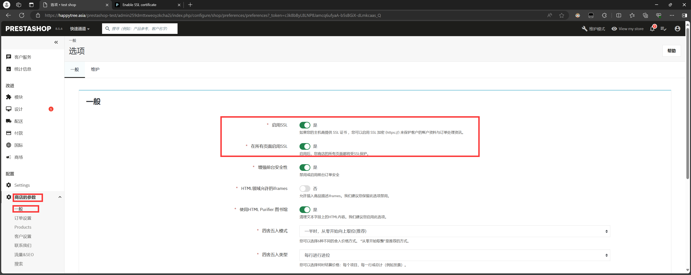

添加`PayPal Offical`插件 
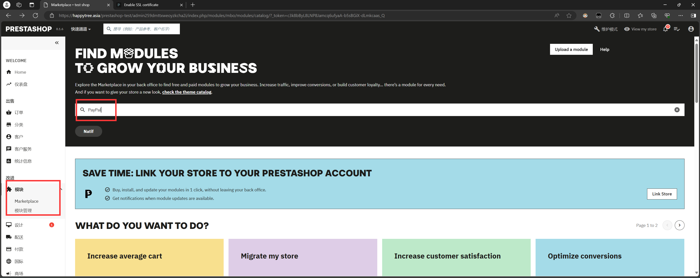
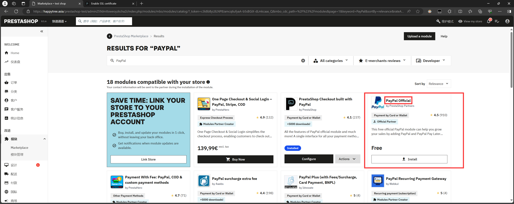  
当然也可以通过从插件市场下载, 然后通过上传的方式安装
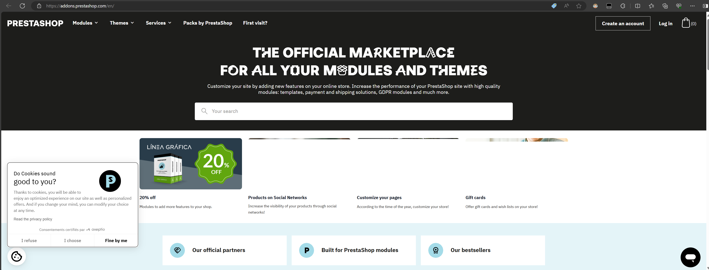
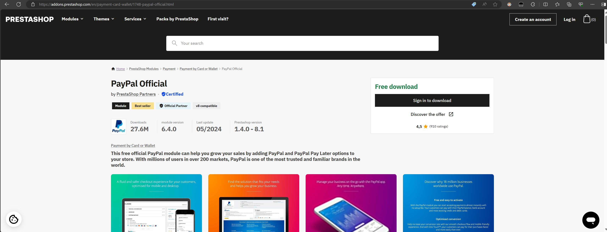
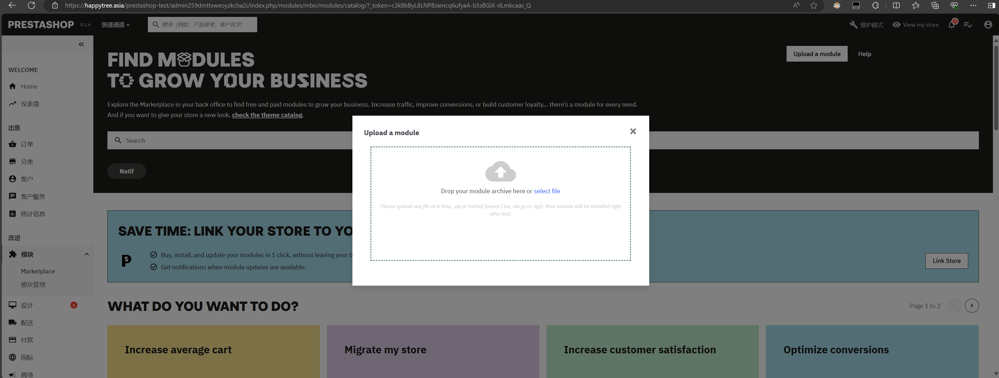  
安装完毕
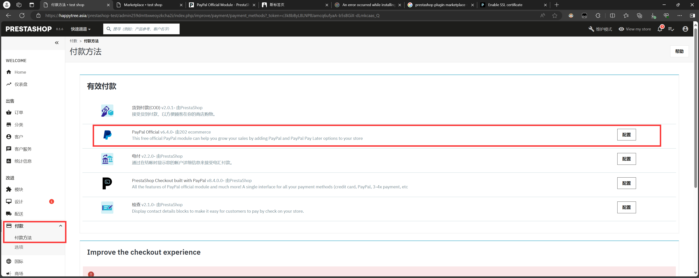  
配置界面
