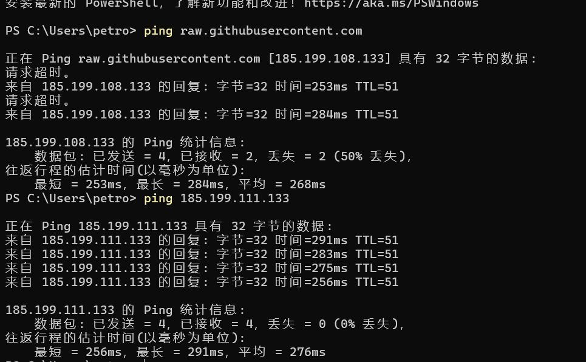
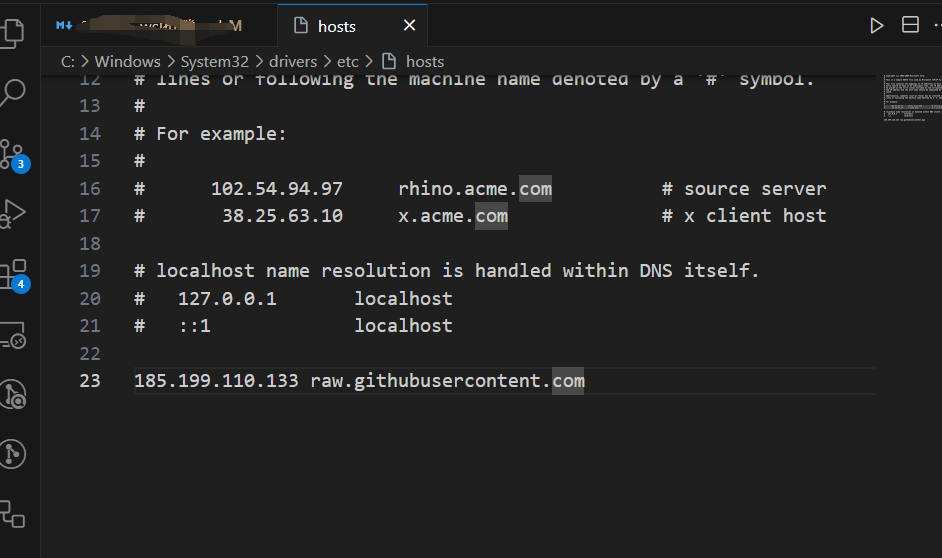
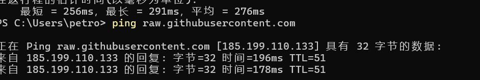
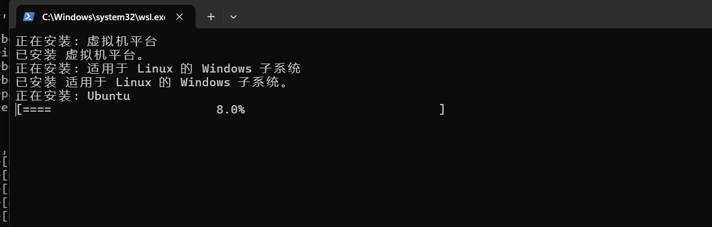

安装wsl, 没有centos的镜像, 装个默认的ubuntu吧  

[更新]  
如果网络不好,会发现没有办法安装. 参照这个文档 (比如我用手机网络就不行, 但是公司网络自带翻墙了就没事)
 
修改host  
 
重新ping  
 
```bash
ping raw.githubusercontent.com
```
> https://blog.csdn.net/WQearl/article/details/137348303

正常的话这样就可以
  

---

  
然后发现报错:
```
wsl: 检测到 localhost 代理配置，但未镜像到 WSL。NAT 模式下的 WSL 不支持 localhost 代理。
```
参考:
>https://www.bilibili.com/video/BV1rw411Y7M1/
>https://blog.csdn.net/weixin_50925658/article/details/135111897
```conf
[experimental]
autoMemoryReclaim=gradual    # gradual  | dropcache | disabled
networkingMode=mirrored
dnsTunneling=true
firewall=true
autoProxy=true
```
安装`1panel`
```bash
curl -sSL https://resource.fit2cloud.com/1panel/package/quick_start.sh -o quick_start.sh && sudo bash quick_start.sh
```
  
其中可能会碰到没有`su`权限的问题, 使用以下命令初始化`root`的密码
```bash
sudo passwd
```
然后会告诉你, 在wsl中, 用`Docker for desktop`. 这应该是wsl和docker都是基于`hyper-V`的原因  
  
安装`Docker`并重启
  

---
提一嘴, 如何删除`Ubuntu`镜像  
可以参考这个link:
> https://www.cnblogs.com/ministep/p/18223491
但是事实上我发现, 执行了`wsl --unregister ubuntu`之后, 这个镜像文件就已经被删掉了(文章中应该指的仅仅是缩容而不是把镜像都删了)

