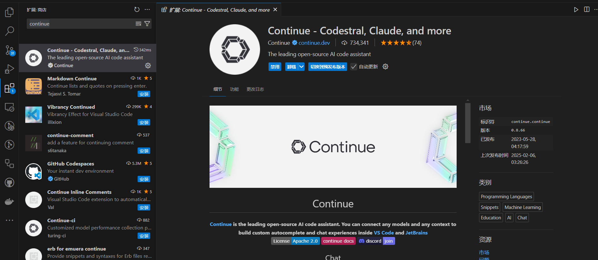
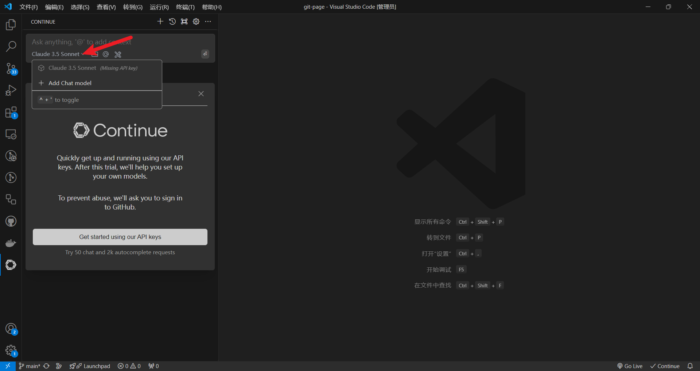
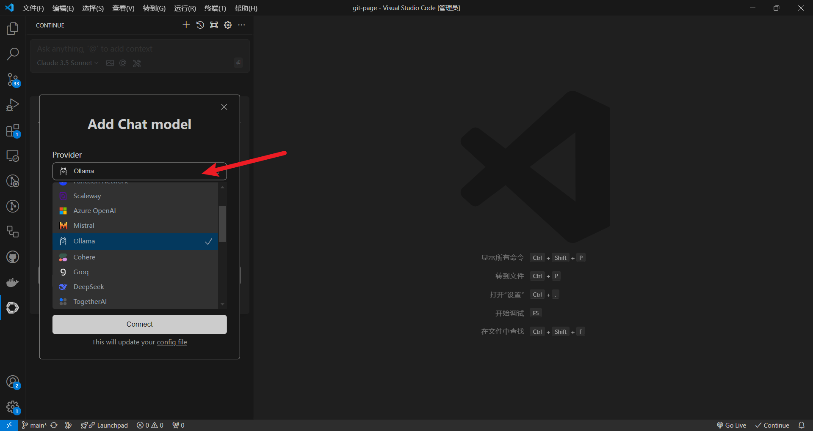
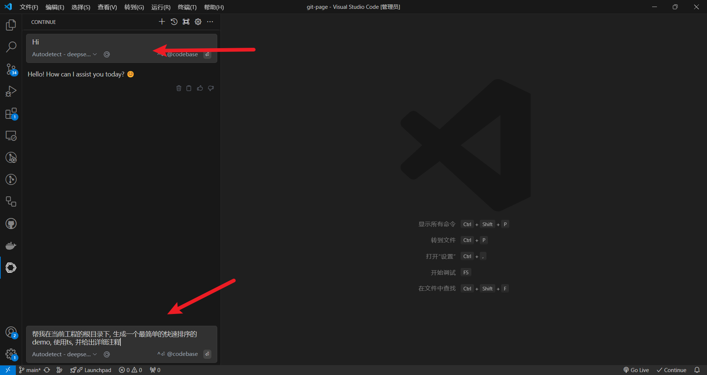
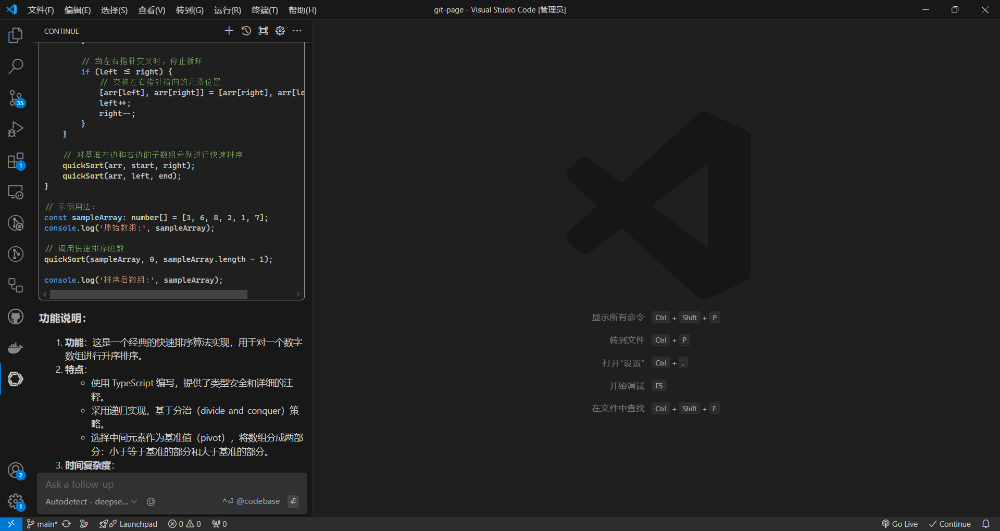
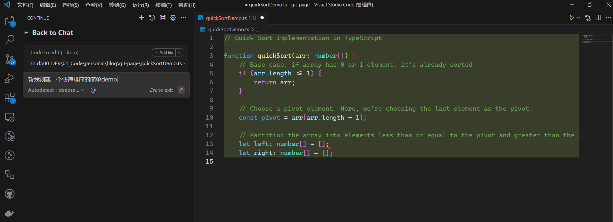

首先, 搜索并安装插件`continue` 

选择`ollama`作为模型提供者. 然后选择你本地部署的模型. 注意, 这里要让`ollama`跑起来, 光光使用`ollama serve`命令是不行的, 要使用`ollama run xxx`命令

然后就可以对话了  

在具体的工程文件中, 也可以使用`ctrl+I`来进行代码提示

整体使用来说, 比豆包的`Marscode AI`要快很多, 很适合个人电脑在写代码时调用闲置的显卡资源