主要参考来自官网:
> https://fastapi.tiangolo.com/

### 安装
首先是安装官网来安装:
 `  `  ` bash
pip install fastapi -i http://pypi.douban.com/simple/  pip -U --trusted-host pypi.douban.com 
 `  `  ` 

 `  `  ` bash
 pip install "uvicorn[standard]" -i http://pypi.douban.com/simple/  pip -U --trusted-host pypi.douban.com
 `  `  ` 
这里 "uvicorn[standard]" 的形式很奇怪, 不过的确就是这个包

初步认识, FastAPI只是一个API框架, uvicorn才是服务器(uvicorn是一个ASGI(异步服务器网关接口))

关于uvicorn的介绍
> https://www.uvicorn.org/#fastapi

 `  `  ` bash
 `  `  ` 

然后运行的时候, 就发生了这样老问题:
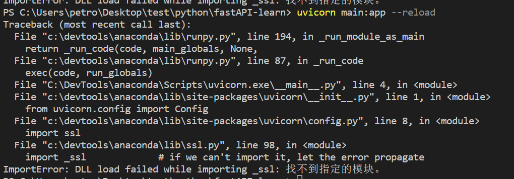

开始一通查帖子, 首先我不是环境变量的问题, 我早就配置好了


还有这2个帖子:
> https://blog.csdn.net/weixin_45255658/article/details/116058217
把Windows\System32文件夹下的libssl-1_1-x64.dll和libcrypto-1_1-x64.dll移除也没用
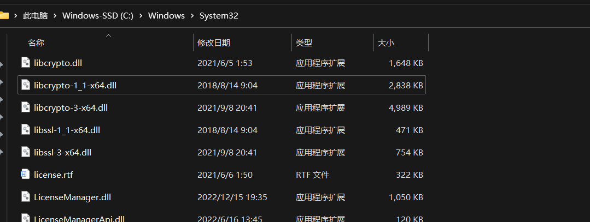
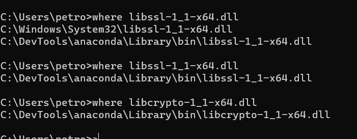

> https://blog.csdn.net/dailinqing1984/article/details/90579944


替换 _ssl.pyd的方法无效

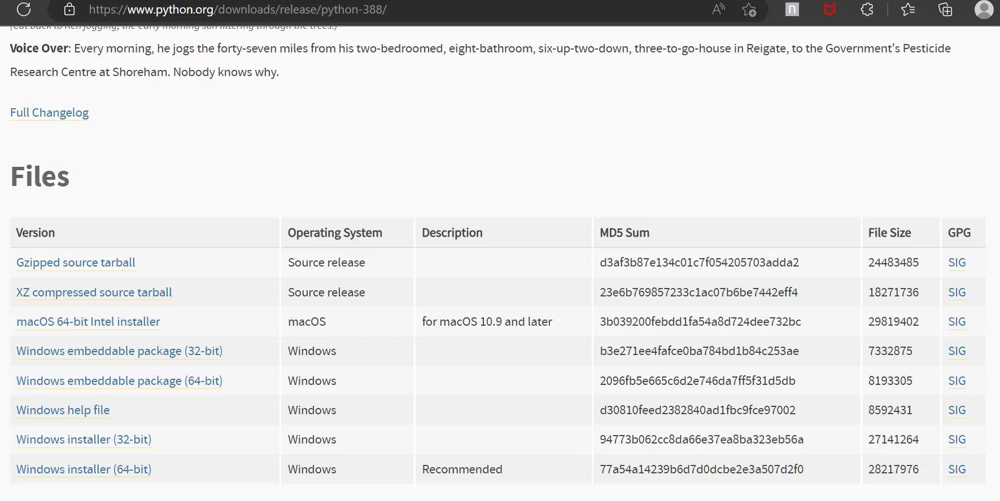

还查了这个帖子,也没用
> https://stackoverflow.com/questions/45954528/pip-is-configured-with-locations-that-require-tls-ssl-however-the-ssl-module-in/62264725#62264725
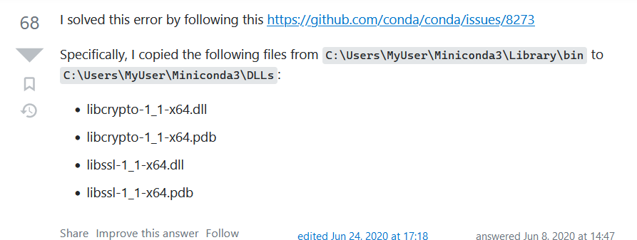

最后通过这个帖子的方法, 成功了
> https://blog.csdn.net/dally2/article/details/103917604
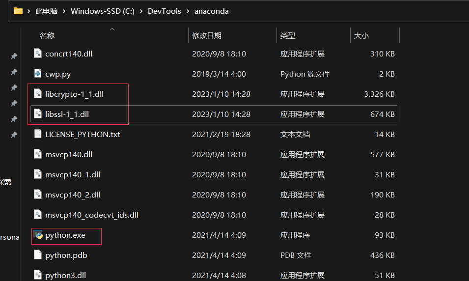
SSL模块载入成功. 之前出现TLS/SSL的问题应该也不会出现了
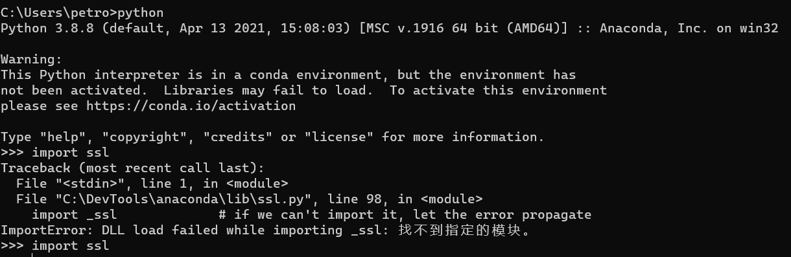

### 运行
运行官方给出的例子:
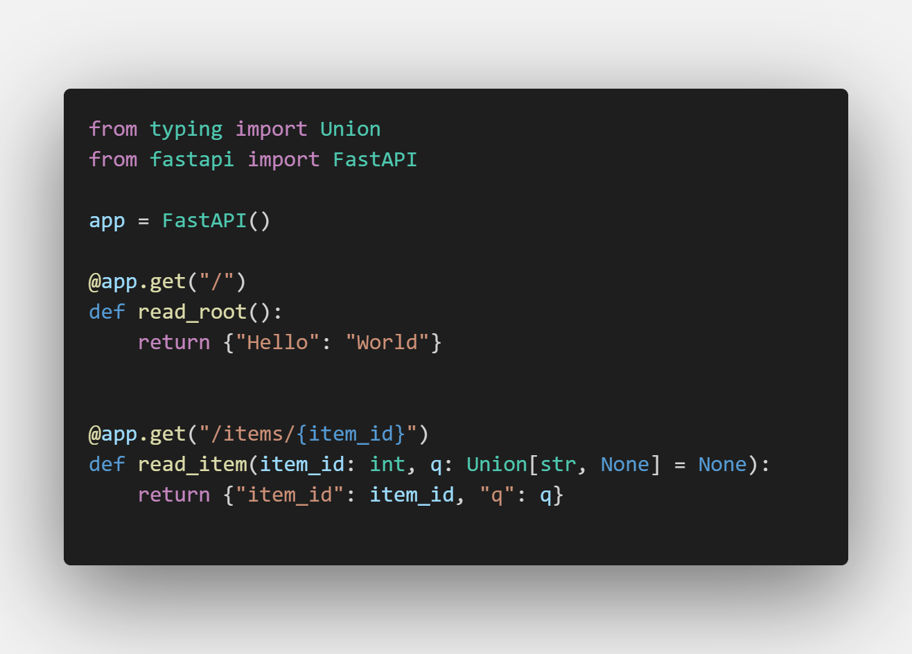
这里顺便安利一下polacode这个VSCODE扩展, 上图就是polacode生成的, vscode自带的代码高亮比markdown的更加丰富

启动uvicorn server,可以顺利运行了, 这里的 --reload是指监听代码变化自动刷新
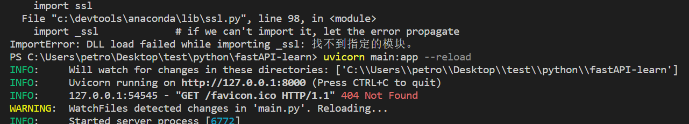

浏览器访问的结果:
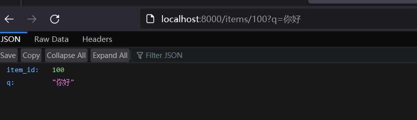  
由swagger生成的文档:
http://127.0.0.1:8000/docs
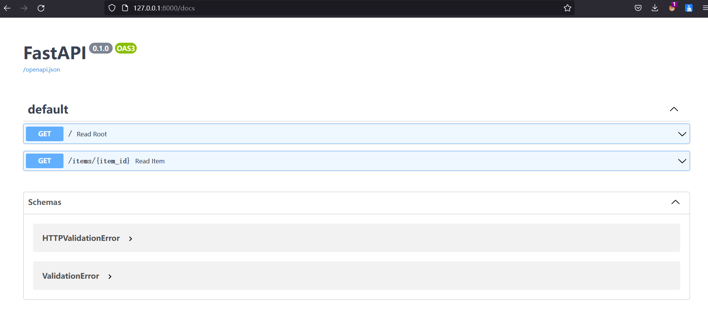
也可以选择由redoc生成的文档:
http://127.0.0.1:8000/redoc

因为我对python不是特别熟悉, 我此次的主要task是学习fastAPI的部署, 对于pydantic更是没用听说过, 在搜索中, 发现了这个集合. 之后再慢慢看.
> https://www.cnblogs.com/mazhiyong/p/12807660.html

### 部署, 使用Deta
Deta是一个可以用来白嫖的, 并且有点类似于托管(serverless)的云提供商, 也是FastAPI推荐的. 它提供的服务有fastAPI(python), 也有express(node)的, 也提供数据库甚至文件储存服务. 这里我只看了网络服务器的部分.  
首先是注册:
,
这里要注意, 国内邮箱似乎不行, 我163, yeah的都不行, 换成gmail秒收邮件.

1. 按照教程安装完本地cli后, 安装提示进行登录, 如果登录成功是 successful, 如果登录失败是error
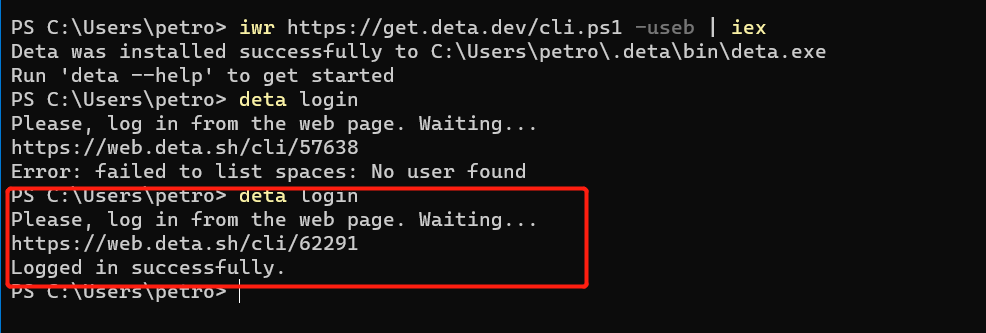
2. 使用 ` deta new ` 命令初始化本地仓库. 要注意, 必要要在 ` main.py ` 或者 ` index.js ` 的同级目录下
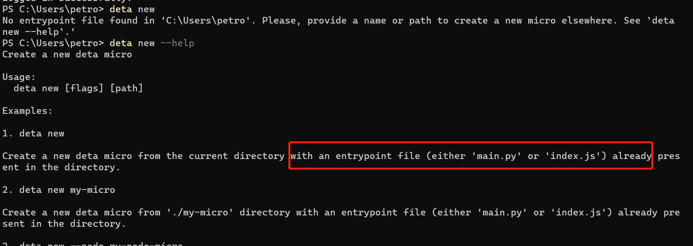
3. 如果和服务器通讯成功, 它会打印配置文件的一些信息, 并且按照依赖
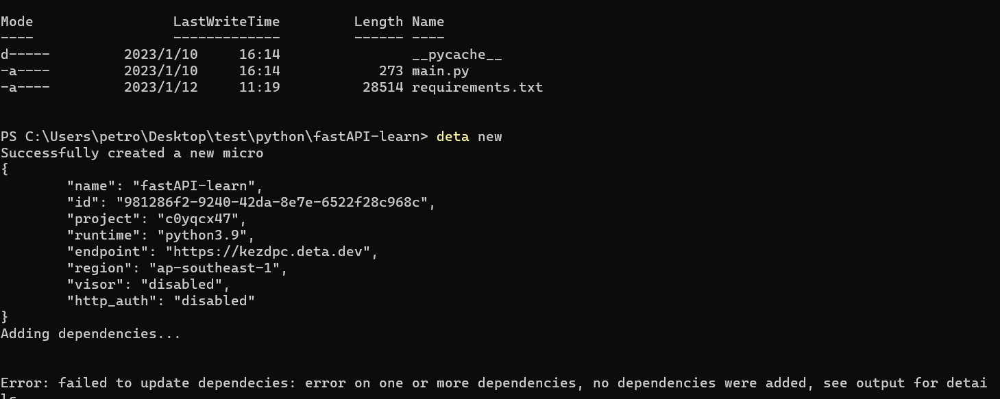
4. 要注意, 依赖不要乱写, 这是我在python中发现的问题, 因为我的python没有单独设置虚拟环境, 所以 ` pip freeze > requirements.txt ` 命令生成的requirements文件里依赖太多了, 会导致安装不成功, 就我们这个初学者例子, requirements里只要有一个 ` fastapi==0.89.0 ` 就可以了. (我这时候的版本是0.89.0)
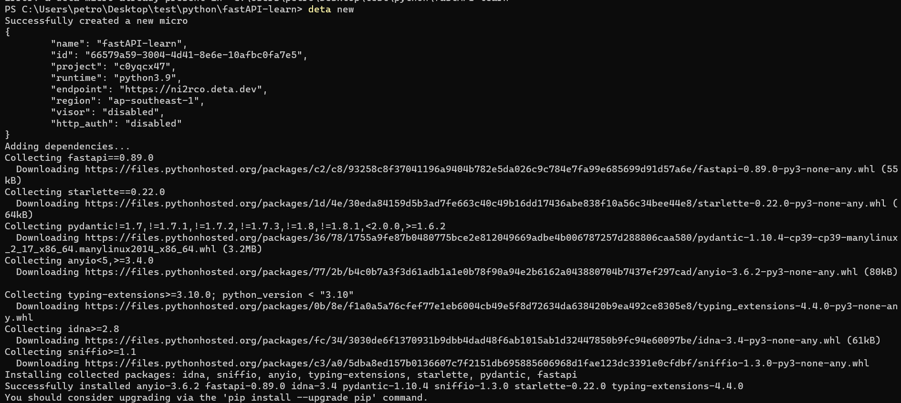
5. 在网页端登录, 会发现Mircos下有了这个工程 (这里依赖安装失败也会同步完成, 只是无法正常运行项目)
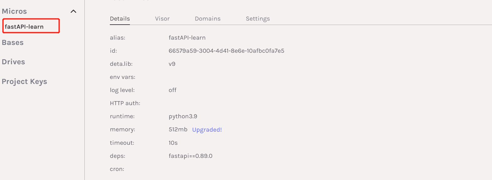
6. 用Deta提供的url来进行访问

7. 跑一跑别的
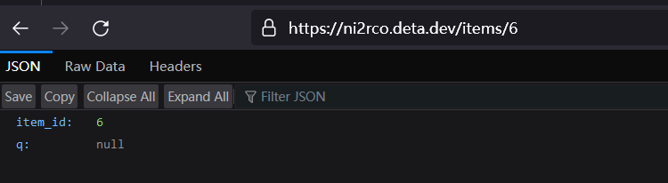
8. 看看Deta提供的监视功能, 也就是查看API的调用历史
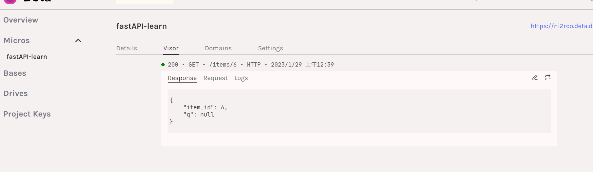这里要使用 ` deta visor enable ` 来开启监视功能
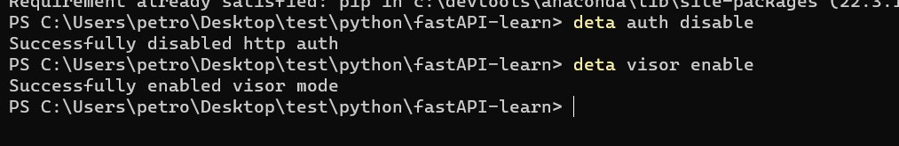此外这里还有一个http auth功能, 教程里初始化本地文件的时候, 这个auth是开启的, 开启了就无法让别人随意访问, 我这里实际操作的时候默认就是disable的, 可以通过 ` deta auth disable ` 来关闭


### 部署, 使用进程管理器(process manager)
原文教程地址: 
>https://fastapi.tiangolo.com/deployment/server-workers/

因为只有英文的, 所以看起来可能比较唬人, 其实只说了一点, 就是让你用 Gunicorn 来做进程管理(后文中它也说了, uvicorn也可以提供进程管理功能, 但是没有 Gunicorn 好)
安装Gunicorn
```bash
pip install "uvicorn[standard]" gunicorn -i http://pypi.douban.com/simple/  pip -U --trusted-host pypi.douban.com
```
通过Gunicorn来运行
```bash
gunicorn main:app --workers 4 --worker-class uvicorn.workers.UvicornWorker --bind 0.0.0.0:80
```

**这里windows下会出错**  
它会告诉你没有fcntl模块, 这是由于windows上其实gunicorn是不可用的  
参考这个帖子
> https://stackoverflow.com/a/25471508 

可以得知一个比较tricky的方法, 就是自己新建一个` fcntl.py `文件放在` site-packages `下,获取` site-packages `路径的方法如下
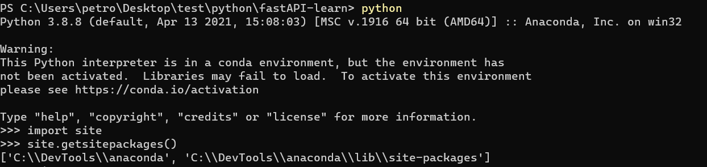
但是解决了这个问题后它会告诉你缺 pwd 模块, 而pwd模块是给unix系统提供秘密管理服务的, 所以只能放弃了. 目前我试下来使用waitress也是不行的, 虽然这个帖子里是成功的
> https://stackoverflow.com/a/73488736

可以比对一下, 我们一开始是这样运行的
```bash
 uvicorn main:app --reload
```

这里的参数, 也挺简单, 把官网的翻译一下
1. ` main:app ` 指定入口文件是main.py, 去找里面的app这个变量
2. ` --workers 4 `要启动4个工作线程, 也就是复制4份服务器
3. ` --worker-class uvicorn.workers.UvicornWorker` uvicorn提供的可以让 gunicorn 使用的工作类, 后半部分指定类名
4. ` --bind 0.0.0.0:80 `让进程管理器绑定监听的端口

文章最后提到了, 也可以用uvicorn自带的进程管理器
```bash
uvicorn main:app --host 0.0.0.0 --port 8080 --workers 4
```

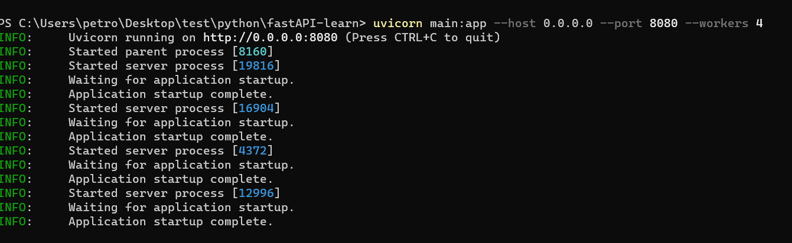
> https://stackoverflow.com/questions/62976648/architecture-flask-vs-fastapi

在这个帖子中可以看到, 即使不用gunicorn作为进程管理器, 用uvicorn自身来做worker service, 性能也是很优越的.
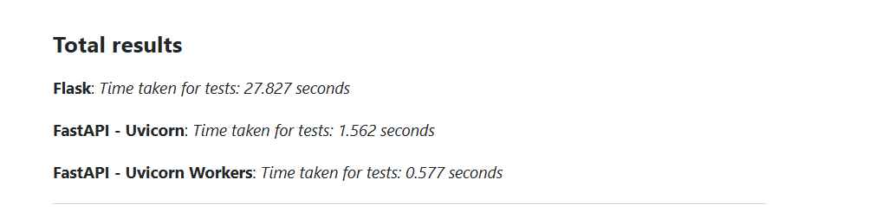