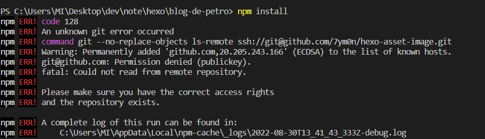
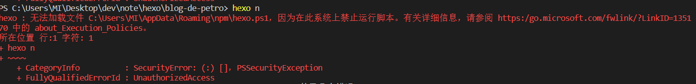
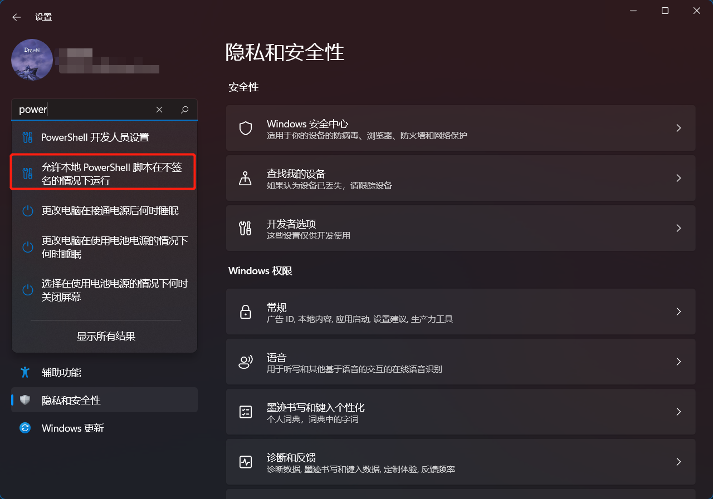

今天换了一台电脑来整hexo. 在安装环境时又发生了一些问题

npm install的时候,发生git的错误.
```bash
npm ERR! code 128
npm ERR! An unknown git error occurred
npm ERR! command git --no-replace-objects ls-remote ssh://git@github.com/7ym0n/hexo-asset-image.git
npm ERR! Warning: Permanently added 'github.com,20.205.243.166' (ECDSA) to the list of known hosts.
npm ERR! git@github.com: Permission denied (publickey).
npm ERR! fatal: Could not read from remote repository.
npm ERR!
npm ERR! Please make sure you have the correct access rights
npm ERR! and the repository exists.
```


原因是开了代理, 关了就可以了.

另外就是 执行
```bash
hexo n
```
的时候又出错了

```bash
hexo : 无法将“hexo”项识别为 cmdlet、函数、脚本文件或可运行程序的名称。请检查名称的拼写，如果包括路径，请确保路径正确，然后再试一次。
所在位置 行:1 字符: 1
+ hexo n
+ ~~~~
    + CategoryInfo          : ObjectNotFound: (hexo:String) [], CommandNotFoundException
    + FullyQualifiedErrorId : CommandNotFoundException
```



解决办法如下

在windows => setting => 找到powershell的这个配置 => 允许就可以
