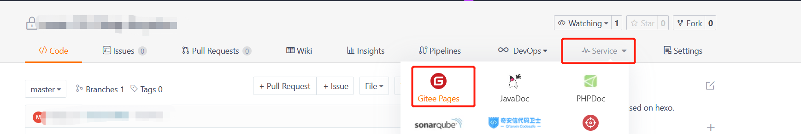
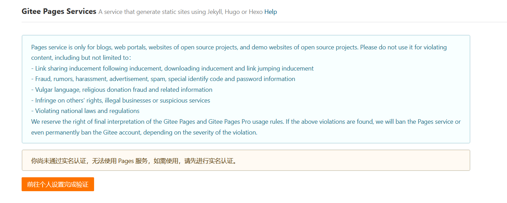
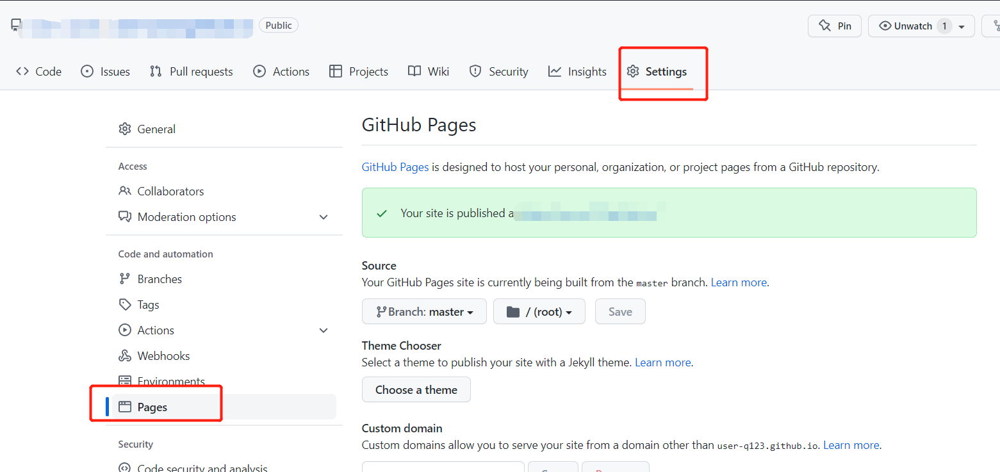
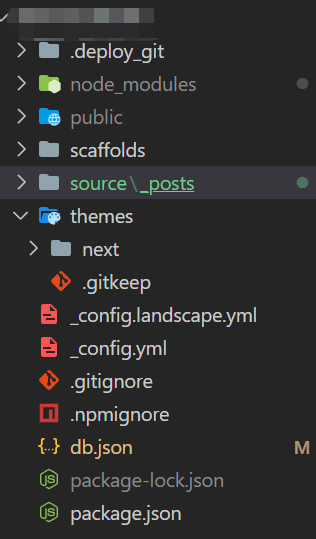
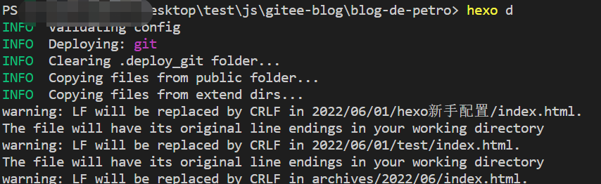
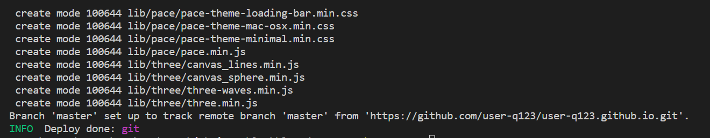

(可能是本贴对其他人有用的部分可能就在git配置那边了,其他的hexo相关教程其实挺多的, git/gitee的规约有效期参考这篇文章的发文时间)

---
这篇文章其实算是我跟着这个教程走了一遍. 当然这过程中也遇到了一些其他的问题. 原地址在这里:
> https://kaiter-plus.gitee.io/2020/03/07/How_To_Freely_Build_Blog/
## 1. 安装本地Hexo环境
npm镜像源的配置, 可有可无, 因为我挂着梯子, 所以不用淘宝的源也没什么关系.
```bash
npm install -g hexo
#这里稍微提一句, -g就是全局安装, 类似cnpm和ts的命令都是这样, 全局安装了在windows下就类似应用程序用名字就可以在控制台中使用了
```

然后是初始化工程:
```bash
hexo init blog      # 初始化创建，会在你所在位置创建 blog 文件夹
cd blog             # 进入 blog 目录
npm install         # 进一步安装hexo所需文件
```

这里可能会发现脚本无法运行的问题, 可以参考这个帖子管理windows的执行策略
> https://blog.csdn.net/weixin_43874301/article/details/111102493

或者用命令行
```bash
set-ExecutionPolicy RemoteSigned
```

然后是使用hexo的命令生成静态文件和启动服务
```bash
hexo clean          # 清除所有记录
hexo generate       # 生成静态网页, 静态资源在这一步的编译后会放在public下
hexo server -p 80   # 启动服务, -p 80 表示端口号为 80，默认不加端口号是 4000
```

然后就可以通过 [http://localhost:80](http://localhost:80) 来访问了

## 2. 安装Hexo主题
可以在官方主题商城里找: [https://hexo.io/themes/](https://hexo.io/themes/)

> 我也试了很多个主题, 包括one-page, Nlvi, yilia, yilia-plus, 3-hexo, matery, shoku, hermes,fluid等等  
里面也有挺多挺好的主题

对于这些我试过的 我评论一下:
- one-page: 很干净, 不过对字体的支持和代码的高亮, 我调了调还是有问题, 一开始选择的这个, 如果是用这个主题的话需要把 highlight.enable 和 prismjs.enable都设为 false. 因为这个主题自带了这2个组件.
- Nlvi: 看起来挺好的, 不过我怎么设置都会出问题
- yilia, yilia-plus: 有个头像侧边栏, 感觉不大好, yilia-plus的话, 作为熟悉设置还是不错的, 可能以后会换吧, 不过我暂时不用评论/RSS等功能
- 3-hexo: 也是侧边栏感觉不大好
- shoku: 太二次元了
- matery: 很庞大的一个主题, 做的很漂亮, 不过我先从简单的开始学起了
- fluid: 感觉还是不错的, 而且还在实时更新, 我还没用, 不过先用next了
- hermes: 在官网主题首页上就有, 我感觉应该还是不错的,不过先使用next试试了. 这个集成的功能很少, 不过很少意味着不大会报错

## 这一步也很重要, 现在新的主题基本都需要
```bash
# 如果出现类似eggjs的那种 <% xxx>的问题, 多半是这个插件没装上
npm i hexo-renderer-swig
```

主题的配置基本上是在 ***_config.yml***下配置的.
next的帮助页面在这里:
> http://theme-next.iissnan.com/theme-settings.html


另外 我在clone主题的时候, 发现了这个问题:
> error: RPC failed； curl 56 OpenSSL SSL_read: Connection was reset, errno 10054 
因为我之前git指令都用的好好的, 不知道为什么这里不行.
可能原因是我没有实现构建好git目录?
不过用下面的方法是可以解决问题的:
```bash
git config http.sslVerify "false"
# 如果输入上面命令提示报“ fatal: not in a git directory  ”，则输入如下命令：git init
# 之后就可以重新下载了
```

另外一个问题是: 
> OpenSSL SSL_read: Connection was reset, errno 10054
这个问题是由于. 在国内github容易上不去, 所以我们经常会挂着梯子, 把梯子开开关关就可以了.
## 3.安装hexo-asset-image 插件
```bash
npm install https://github.com/7ym0n/hexo-asset-image --save  #安装 hexo-asset-image 插件
```
我直接从github上克隆没什么问题, 用原帖子里的第一个仓库地址反而不行.

这个插件给我的直接感觉是: 在使用命令生成新的文章时, 会自动生成放图片的文件夹
```bash
hexo new test       # 生成新的网页
```

## 4.配置Git
这里就是坑开始的地方的. 我也不怎么好顺序说. 如果你看见了这个帖子, 那这一部分需要你对Git有基本的了解.

首先, 我们是想白嫖服务器的, 所以省力的选择+教程推荐的选择,是用 github或者是gitee.
为了让国人访问的方便, 我一开始选择了gitee做服务器, 包括我的这个hexo工程也是放在gitee上的.

第一点坑的是, 类似gitee/github, 他们的静态页面托管服务, 类似他们这2个服务中的 Pages/Gitee Pages功能, 和代码仓库有类似的地方却又不完全一样, 简单的说, 你首先要创建一个repository, 用于页面托管, 但是和代码仓库不一样, 还有额外要求
### gitee的Pages功能: 
1. 你得先创建一个repo
2. 如果你想要他变成public/启动它的Pages功能, 那你得首先随便上传些什么东西激活它, 这就比较麻烦, 因为静态页面托管服务其实我们以后里面只放hexo自动上传的东西, 不过可以通过上传了些再覆盖, 问题不大
3. gitee中, 只有把这个repo设置为了 Pages 才能进行静态页面托管, 具体的大家自己搜 gitee+pages功能吧.

4. 然后这个Gitee Pages功能是需要实名制的, 上传身份证啥的, 虽然这个比申请服务器和域名简单多了(申请域名要读保证书什么的比较麻烦).
但还是麻烦, 我就选择放弃了


### github的page功能
1. 你得创建一个符合命名规约的repo, 参见这个网站
> https://pages.github.com/
> https://docs.github.com/cn/pages/quickstart

2. 简而言之如果你符合命名规约了, 那这个repo就可以当网页服务器用了, 比gitee省事很多
3. 至于Github官网上推荐的 生成一个read.md啦 使用Jekyll啦 都可以忽略不计. 因为
    - 如果是用hexo, 那所有的markdown文件都会被转译成html, 加了也没用
    - Jekyll是用ruby命令的, 那还是js和npm来的方便, 毕竟你都用vscode了, 那我默认你会js
4. 仓库合理创建完毕

然后接下来坑的地方在于, 我的hexo工程代码是在gitee上的, 我想要发布的地址是在github上的.虽然多环境git config我之前也使用过, 不过这次还是翻车了. 翻车点如下:
1. 
``` bash
hexo deploy # 或者是hexo d
```
这个命令, 不是一个git命令, 所以之前的简单使用 git config user.username这个命令是没用的
必须使用 
```
git config --global  user.username 'xxxxx'
```
因为我猜, hexo是从 .deploy_git下进行配置的而不是从 我们熟悉的 .git目录下

这导致不配全局git的config就git会一直告诉你: 我不知道你的身份, 不论是使用https的push方式还是使用ssh的方式
我一开始觉得我配置了, 然后使用ssh的方式是不是就可以了. 和这个没有关系

2. 以上这个问题解决了后, 我们就可以在.git里配置到代码仓库的东西
然后.deploy_git的话, 那就只能是读全局的git配置了

3. 在**_config.yml**的deploy部分, repo属性也是有2种写法, 如果是git@github.com: xxx/xxxx的方式的话, 那是ssh的方式, 得在git仓库里添加ssh, 同时本地也得存在ssh的本地文件. 如果是https://github.com/xxxx的方式的话, 基本上会跳出来让你输用户名和密码, 就可以了

4. 让我头疼的是, 我一开始不想配global git config, 加之我之前工作的电脑有配好git的ssh过 (那个时候公司电脑用http拉git会失败, 但是ssh就可以), 所以我选择到我公司的电脑上去进行hexo deploy到github的操作. 
试了半天, 都是 connection reset. 非常郁闷, 后来迁移到自己电脑上, 一下子就成功了(第三步的内容).  
内心明白了, 公司电脑应该是block了 GitHub的push功能, 可能防止员工乱传代码.  
这一步的意义是: git的配置基本上就我们熟悉的哪些, 不会因为hexo的额外配置而出错, 如果出错, 那大概率是我们电脑的网络环境有问题


基本上就可以正常走完了

上传完到github的repo中, 就可以访问了, 更新速度挺快的, 完全没有git自己说的可能会出现的20分钟的延迟什么的

## 5.生产内容
用命令自动生成md文件和对应的图片文件夹
```bash
hexo n == hexo new
hexo g == hexo generate
hexo s == hexo server
hexo d == hexo deploy

hexo s -g #生成并本地预览
hexo d -g #生成并上传
```
按照Markdown规范来书写就可以