mockJs的本身使用十分简单, 这里拓展说一下项目结构上的事情.
mockjs的官网
> http://mockjs.com/examples.html#

### 1.安装
```bash
npm install mockjs --save
```

### 2.使用
先建一个mock的文件夹, 下面写js文件就可以, 因为index.js是默认入口, 再加上我这里要做的mock不多,所以只有一个文件, 如果要mock的接口多的话, 那可以分开来写多个文件
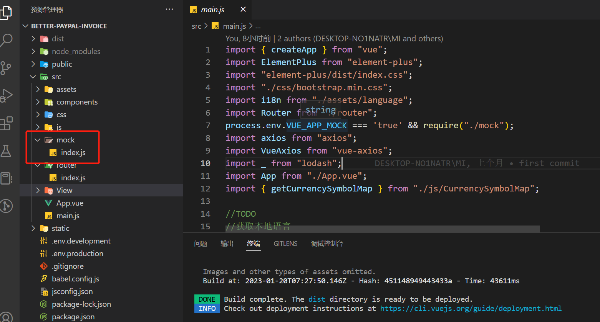


文件里面是这样的, 首先是require, 当然babel安装配置了也可以用import写法.  
setup是模拟延迟时间, 这对于模拟异步请求还是有些必要的, 这可以验证你异步的代码有没有写对  
然后直接使用 Mock.mock(), 就可以了, 也不需要export
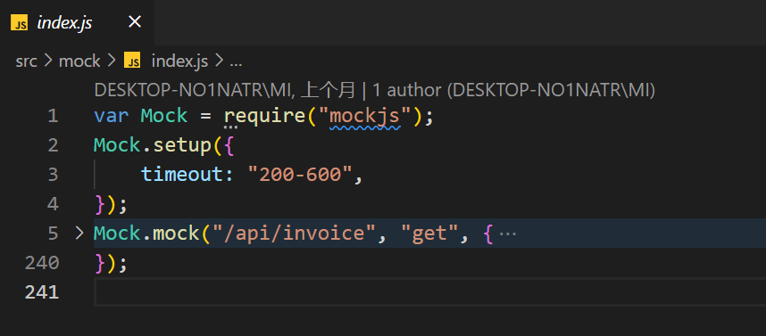 

然后axios调用的地方, 是这样的, 正常使用就可以
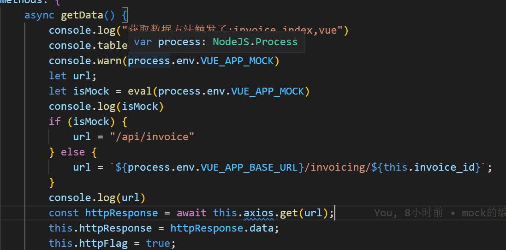
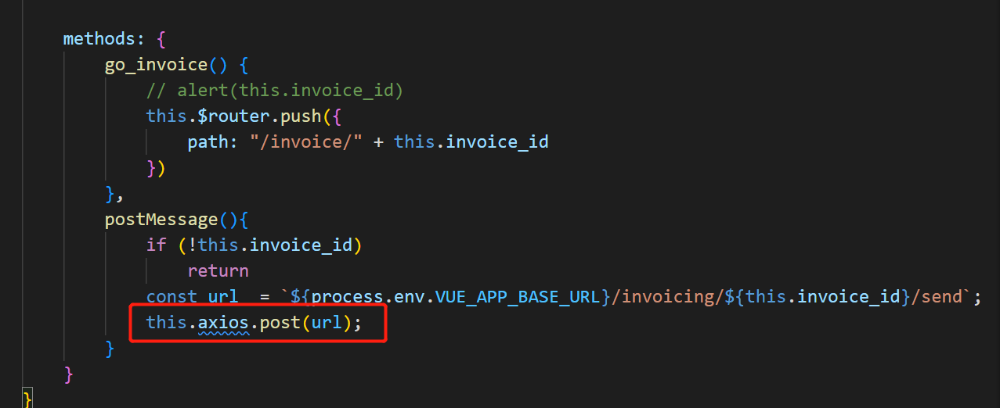

### 3.环境文件(VUE中的使用)
要添加2个文件, 用来填写生产环境和开发环境的各种配置信息(如果还有验证环境质量环境什么的可以再添加)
`.env.development`  `.env.production`

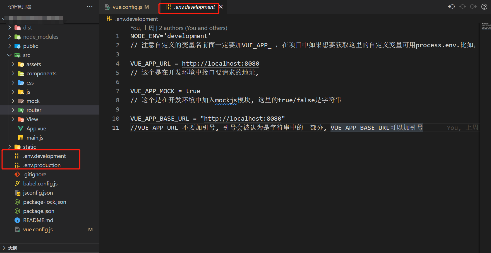
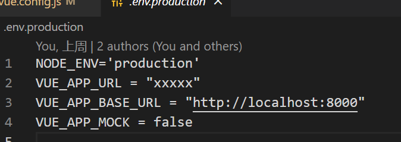
这里主要是配置了
1. 名字, 会在vue.config.js中用到.
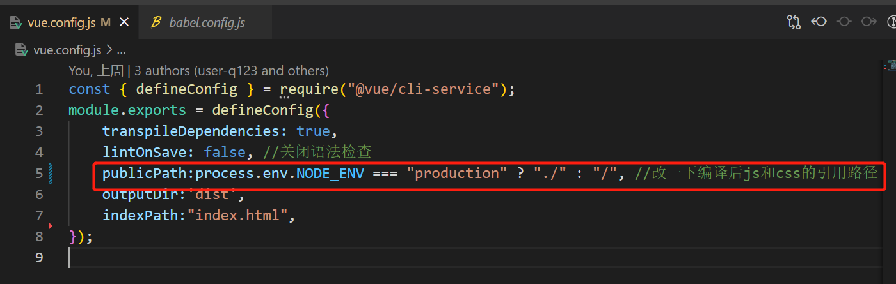
2. 各种url, 为了在本地和不同服务器间使用不同的具体url
3. 是否使用mock
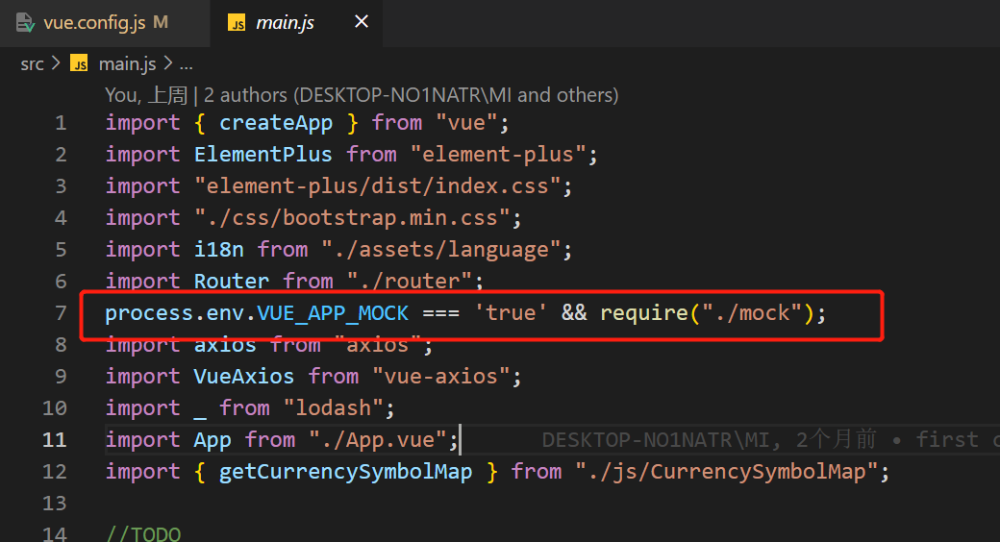
加上这句话, 打包的时候就简单了, 因为`npm run bulid`和`npm run serve`去读取的环境文件是不一样的, 就什么都不用改了, 注意这里是`VUE_APP_MOCK`这个属性是字符串, 所以这里有个坑, 就是在判断`true or false`的时候, `"false"`很容易被判断成true
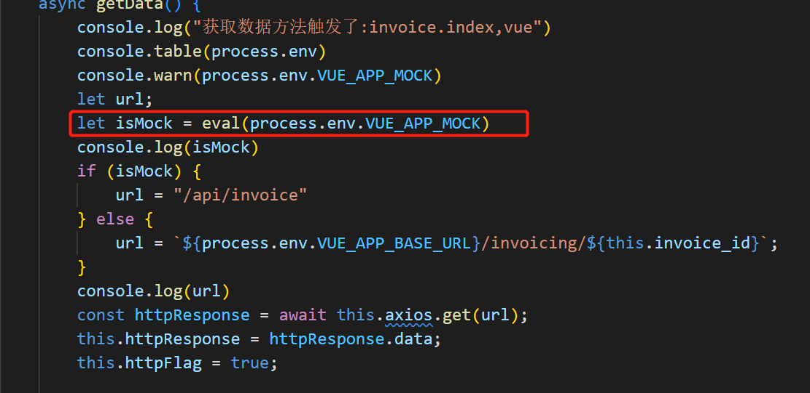
(我这里是因为前端先写了mock的请求地址, 和实际的后端的地址不一样, 所以误打误撞发现了这个问题, 一半情况都是拼接同一个url) 把字符串的false强转为布尔值是true...当时坑了我半天
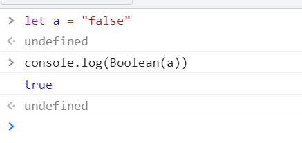


环境文件中的各种属性, 可以通过`process.env.`来获取.
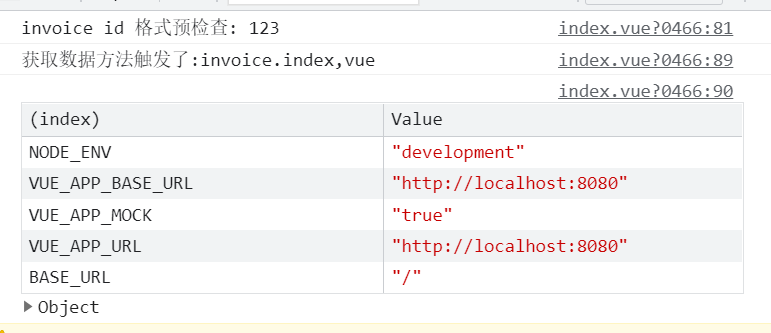