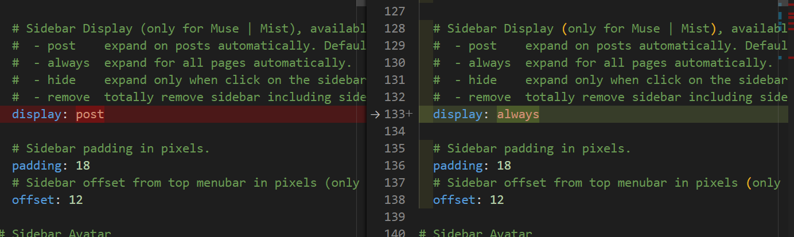
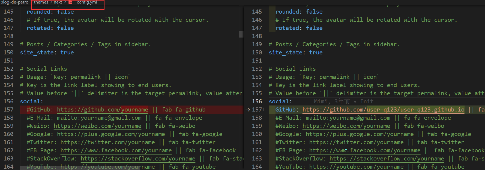
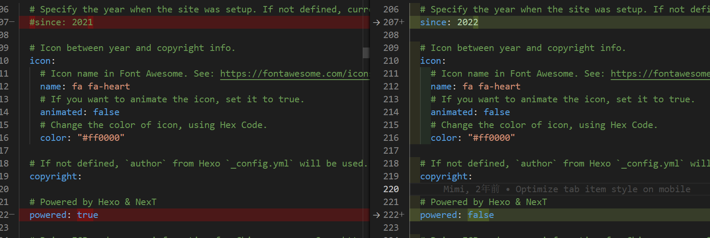
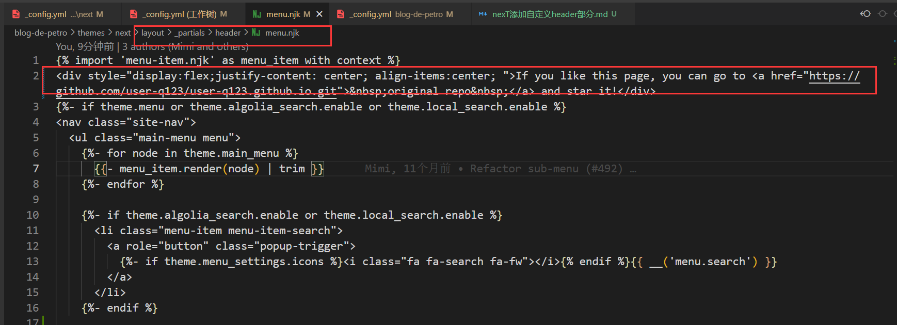
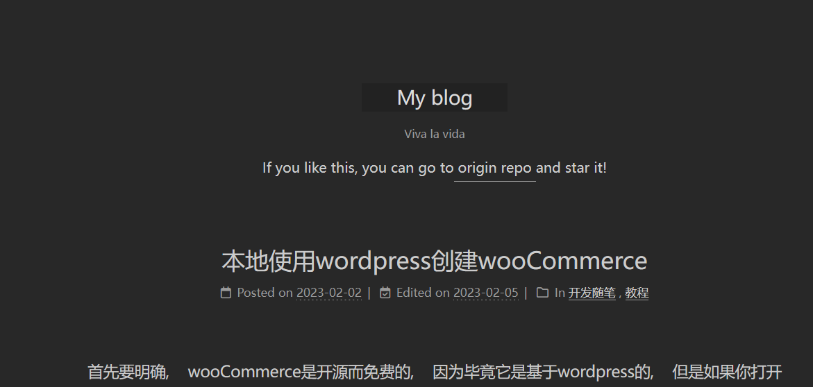

文章写的越来越多了, 是不是发给朋友看, 他们表示要给我的文章点歌赞又不知道在哪里, 今天折腾了一下.  
首选是把侧边栏的open变成always

然后添加GitHub的关联按钮

这里发现, 国内的Gitee还是不怎么受待见的, 这里 ` || `后的字符串是在fontawesome上在坐标, Gitee根本就没有.  
但是这样还是不怎么醒目, 本来想到把 **原文仓库地址**放到页脚上的, 但是我的贴子有些都很长, 估计能看到底的人不多 

折腾了半天, 终于发现了合位置, 需要修改NexT的模板文件  
在NexT的 ` _partials/header `下, 填上我们的原仓库link, 这样每个文章就都有了

```html
<div style="display:flex;justify-content: center; align-items:center; ">If you like this page, you can go to <a href="https://github.com/user-q123/user-q123.github.io.git">&nbsp;original repo&nbsp;</a> and star it!</div>
```
