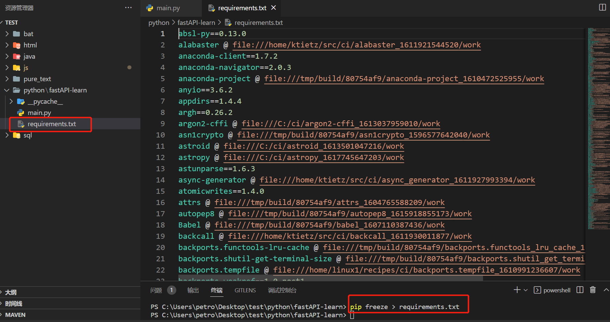

用pip安装包时, 时不时会发生这样的问题:
```bash
WARNING: pip is configured with locations that require TLS/SSL, however the ssl module in Python is not available.
```

网上固然有很多帖子,但是找起来不方便, 加上CSDN还不能复制, 也不是每台电脑上我都装了油猴. 自己整理一下

先这样
```bash
pip install fastapi --trusted-host pypi.tuna.tsinghua.edu.cn
```

要是不行就这样
```bash
pip install fastapi -i http://pypi.douban.com/simple/  pip -U --trusted-host pypi.douban.com
```

其他的方法比较麻烦

---
关于python的知识的一些拾遗:
1. 类型声明: 是在python 3.5版本中加入的
> https://zhuanlan.zhihu.com/p/485613803
可以如此声明形参与返回值:
```python
def add(x: int, y: int) -> int:
    result = x + y
    print(result)
    return result 
```
也可以在变量声明的时候声明类型:
```python
# 以下两行是完全等价的
age: int; age = 18
age: int = 18

```
2. 装饰器:
> https://blog.csdn.net/weixin_44992737/article/details/125868592

简单来说就是把一个函数, 这个函数本身(不是函数的返回值)作为参数传到另一个函数里去

3. requirements.txt

类似node中的package.json, java中的maven. 不过是把环境中的所有依赖, 不是项目中的所有依赖, 都放到里面. 会有很多无用的依赖, 如果没用配置虚拟环境的话.

使用方法:
```bash
pip install -r ./requirements.txt
pip freeze > requirements.txt
```
