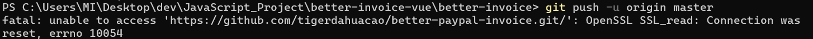
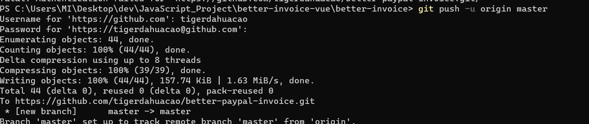
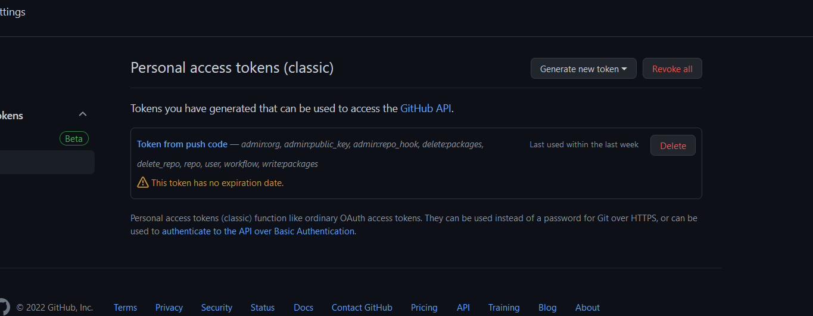
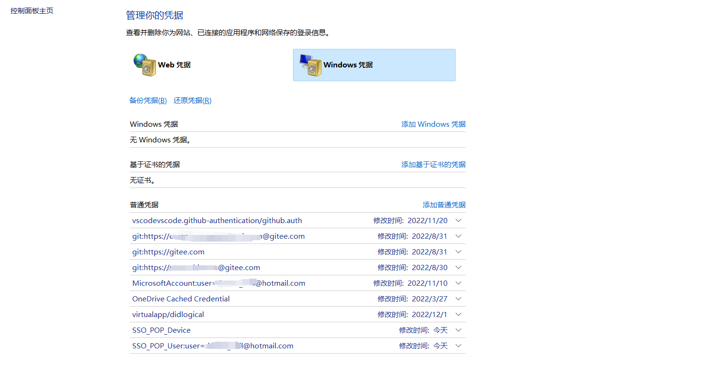

最近自己的电脑,又出现了Github代码上传不正确的情况
正常情况下, 如果没有使用store helper, 那是会弹框的, 类似这样(如果你使用了vscode插件的话)


而我今天,又不弹窗, 命令行中也是各种奇怪的错误.
先说不弹窗的问题, 用下面的命令来覆盖和初始化一下:
```bash
### 把credential helper关了
git config --system --unset credential.helper

###
关闭可能导致出现ssl认证错误的选项
git config --global --unset http.proxy
git config --global --unset https.proxy 
```

虽然之后但是我还是发生了ssl错误, 这应该是科学上网软件导致的


然后是出现了这个问题
```git
remote: Support for password authentication was removed on August 13, 2021.
```

我看了半天, 
> https://blog.csdn.net/FatalFlower/article/details/119717823
> https://blog.csdn.net/wm9028/article/details/121922713

都没成功, 因为我的这个github账号, 之前生成过token.
后来发现, 他们是对的... 不知道为什么, 我之前的那个token自己不见了, 我明明设置的no expiration date.

在password处输入新的token而不是登录密码后, 就可以了


最后还是要看一下, 到底有没有token啊


---
Vscode 在push代码时, 和在命令行不一样, 会报这样的错:
```
You don't have permissions to push to
```
这个时候, 还是查看一下windows凭据为好

可以把之前的删了