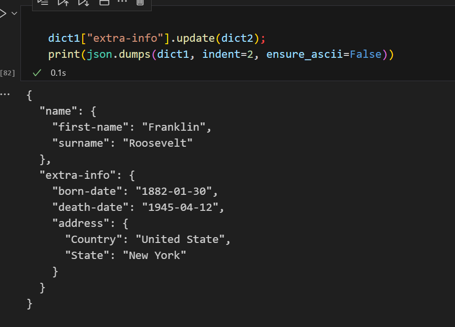

有的时候在怀疑, 复杂的python嵌套字典对象, 可以嵌套合并么?  
试了一下是可以的

```python
dict1={
    "name":{
        "first-name":"Franklin",
        "surname":"Roosevelt"
    },
    "extra-info":{
        "born-date":"1882-01-30",
        "death-date":"1945-04-12"
    }
}

dict2={
    "address":{
        "Country":"United State",
        "State":"New York"
    }
}
```


```python
dict1["extra-info"].update(dict2);
print(json.dumps(dict1, indent=2, ensure_ascii=False))
```


