### 腾讯云折腾日记1
首先是购买腾讯云, 
首先要注册账号, 期间会要求你实名制认证. 要和微信号绑定

实名制认证结束后, 就可以购买云服务器了. 我这里是买了一个最便宜的. 
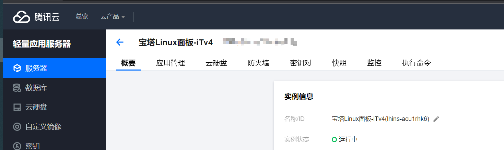
我这里还不知道镜像能不能换的,按理说应该可以换的吧,还没研究到

买完后, 一时蒙蔽. 介绍一下它的功能

首先是关于这个宝塔面板是什么,可以参考这个文章
> http://tencent.yundashi168.com/558.html


总而言之就是登录,然后这里是自己的服务器实例
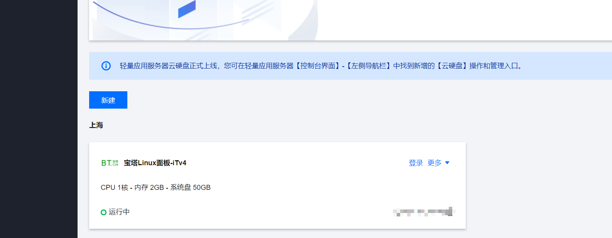

这里点登录的话,是登录到自己的root文件夹
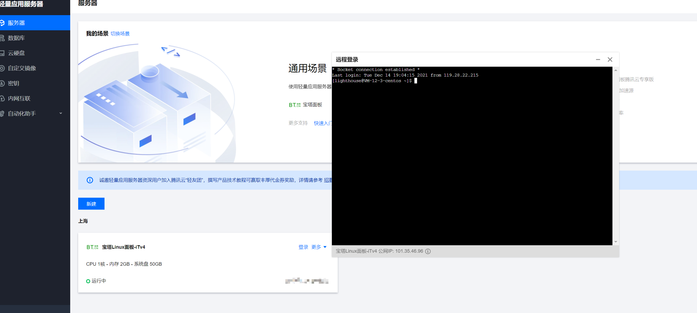

看起来什么都没有, cd .. 网上就能发现是一个Linux系统了

点击,更多-> 管理. 就到了服务器实例的具体管理界面
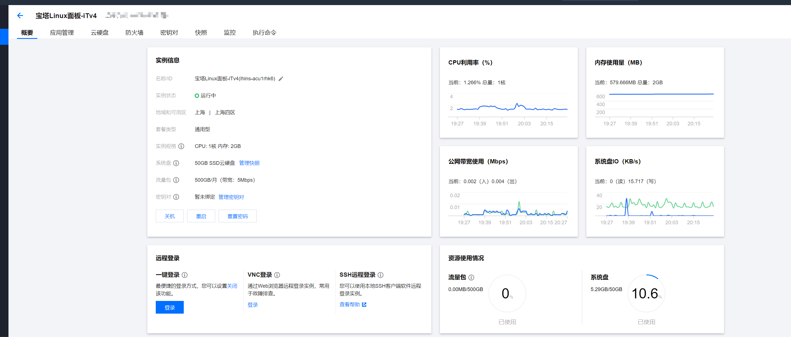

可以开关机, 看看内存分配什么的.
然后讲一下这里的主要功能.

- 1  
    一键登录
    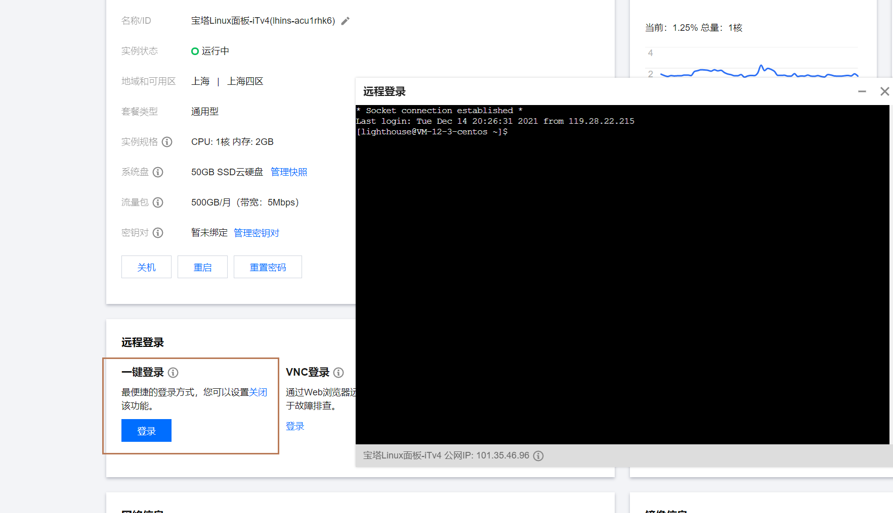
    其实还是用默认的窗口内悬浮工具登录
- 2 
    VNC登录
    相当于新开了一个tab页面，里面是命令行，没什么用，而且会卡。
    但是这里是要你输入用户名密码的，在<1>里不用，<1>里默认登录了
    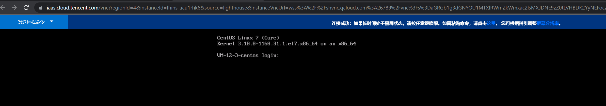
- 3 
    SSH登录
    使用putty. ssh默认是关闭的，很讨厌。查了攻略才搞定。
    攻略基本如下，在<1>里
    ```
    /etc/ssh/sshd_config #找到ssh文件

    vi sshd_config #修改config

    systemctl restart sshd #重启ssh服务，保险点也可以关机重启服务器
    ```
    这里复习一下vim的操作
    i进入插入模式，把注释打开后，esc退回命令模式，在命令模式中
    ```
    :wq
    ```
    保存并退出

    然后就可以使用putty登录了.
    我这里没用密钥，先用最简单的用户名密码配置
    用户名固定是：root，密码是你登录腾讯云的密码

然后在应用管理这个tab中
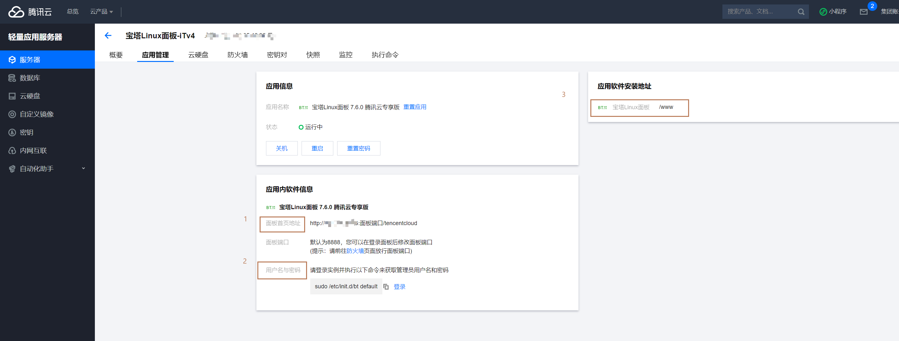
这个应用管理其实是宝塔面板的内容
1:是在浏览器中访问自己这个服务器实例的宝塔面板，这里这个8888是要手动打开添加的，默认没有的
2：是宝塔面板的登录信息，虽然进到宝塔面板后还需注册宝塔的账号（bt应该就是宝塔的意思）
3：是宝塔面板存在你这个linux服务器实例里的位置，在以后如果通过宝塔安装的php,node环境，都在这个文件内

在防火墙这个tab中
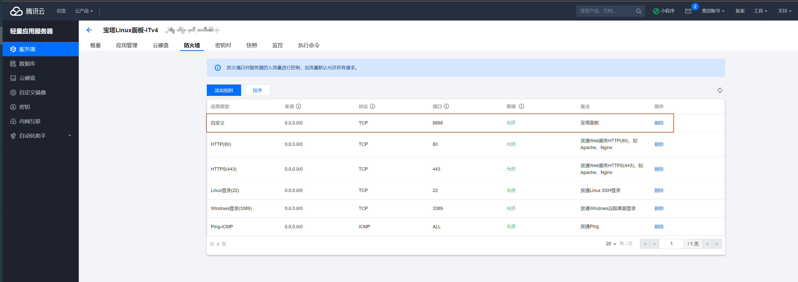
为了访问宝塔面板，需要添加8888端口，当然之后要是面板改了端口，那这里同步要修改

添加了之后，就可以访问宝塔面板了
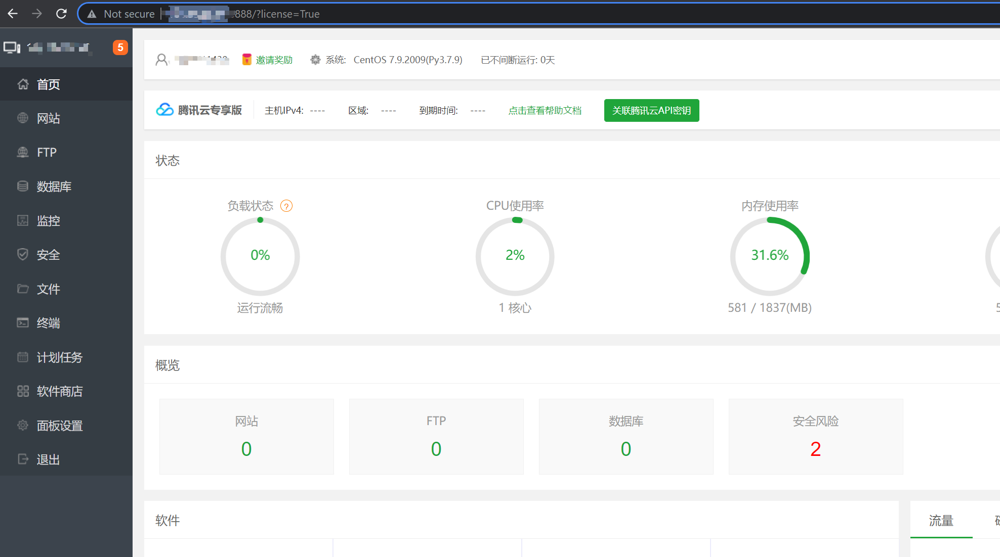

最后付一下putty和winscp的图
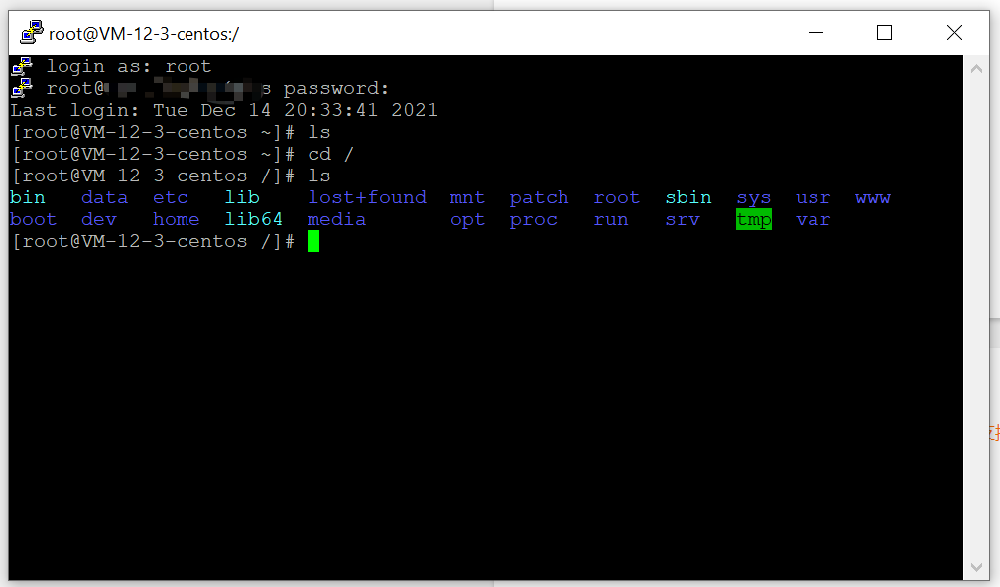
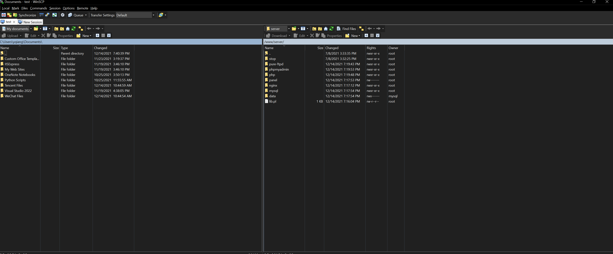

建站,域名,换一个镜像之类的,再慢慢折腾