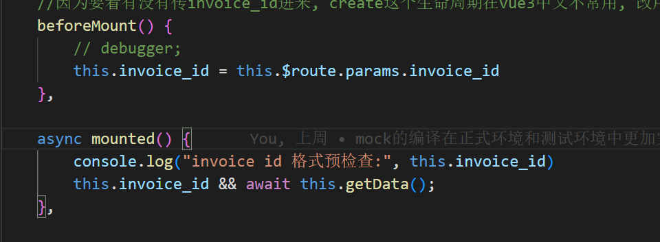

props传递Boolean类型数值时, 需要使用 v-bind
> https://blog.csdn.net/xiaoyuer_2020/article/details/106189559

---

props类型:
> https://blog.csdn.net/m0_67265919/article/details/123340113

一直报错 Component name "xxxxx" should always be multi-word.
因为让vue-cli一路默认的情况下,是没有.eslintrc.js这个文件的

解决方法是在 vue.config.js中加上
```js
lintOnSave:false  //关闭语法检查
```
加完之后是这样的:
```js
const { defineConfig } = require('@vue/cli-service')
module.exports = defineConfig({
  transpileDependencies: true,
  lintOnSave:false  //关闭语法检查
})
```
---

插槽slot的使用:
> https://zhuanlan.zhihu.com/p/114502325

---

ul去掉圆点的css样式:
```css
ul:{
    list-style:none;
}
```

---
使用vue-i18n时发生的警告:
> https://www.jianshu.com/p/6ab2191233be

---
获取VUE-router中的url参数:
> https://www.cnblogs.com/lyt0207/p/13528953.html
实际使用:
