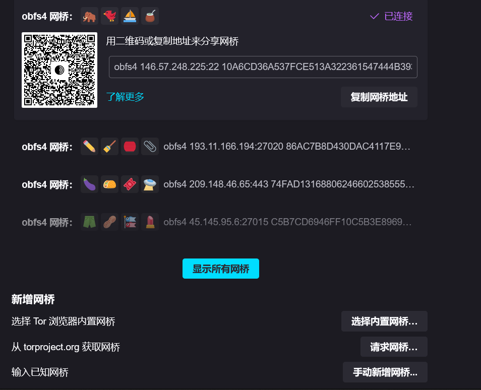
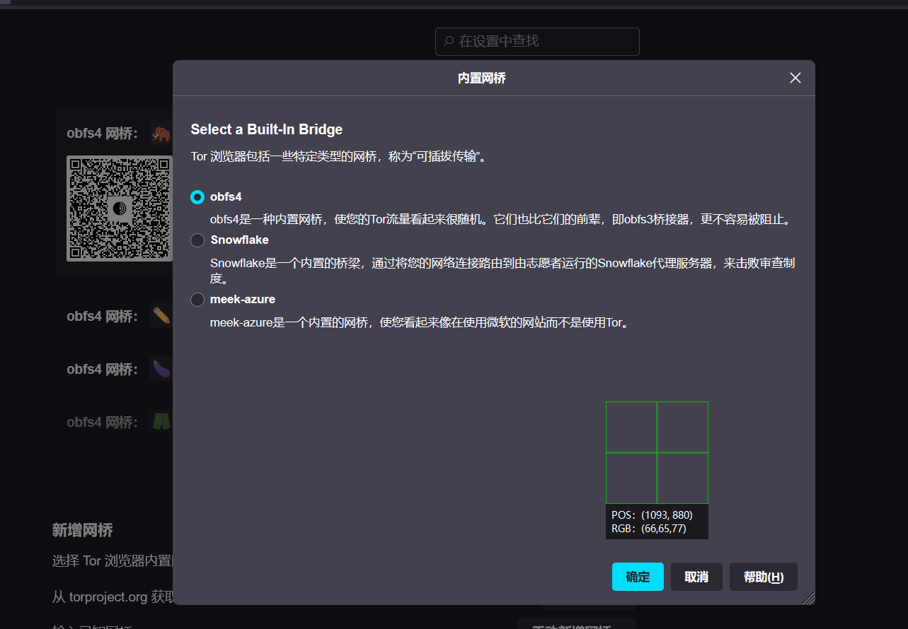
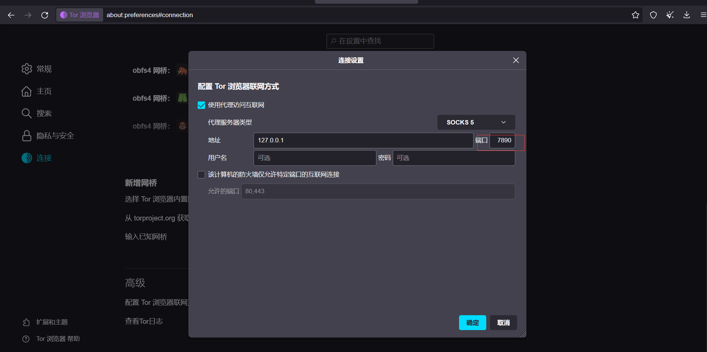
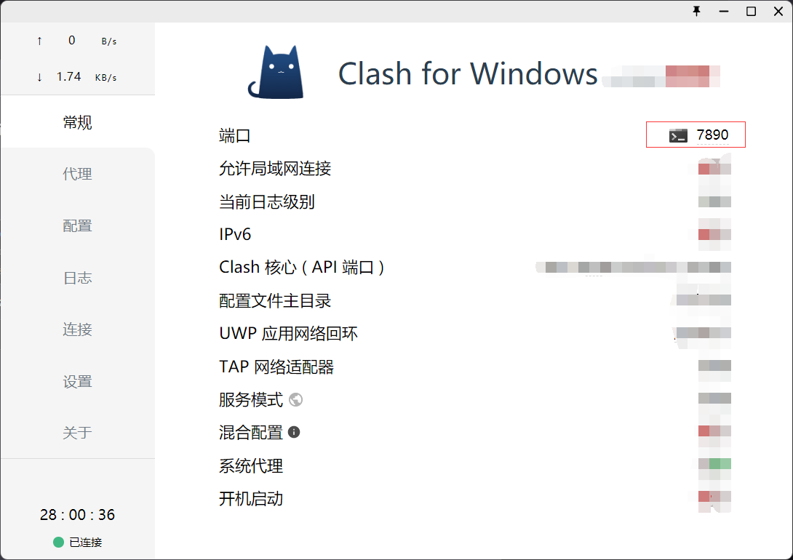
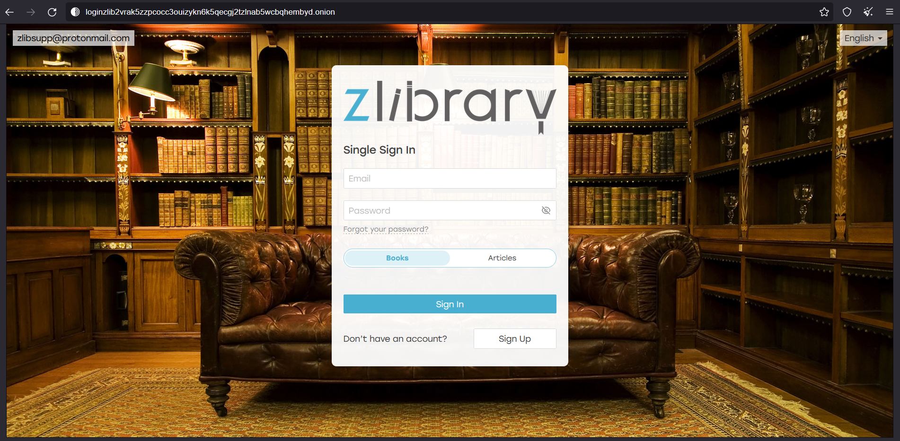
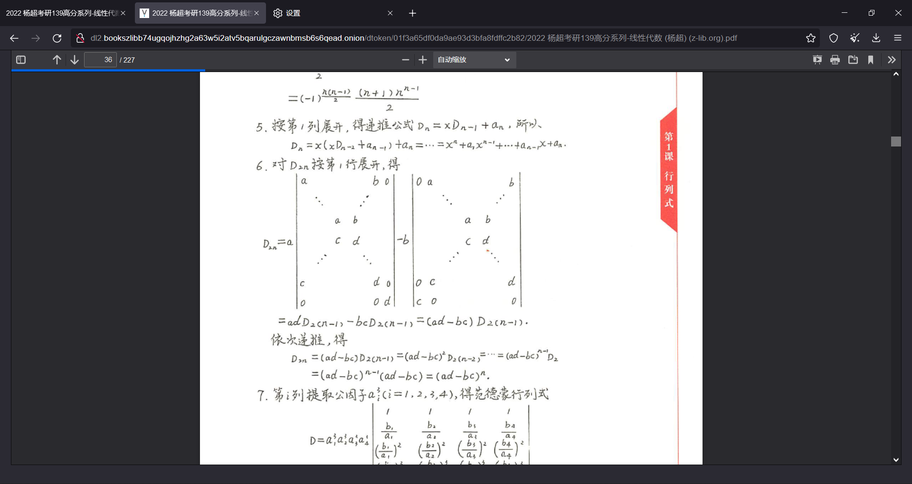

科学上网很多年了,不过事先申明一下,不是每个人都是反骨仔哈哈. 我是参加工作后, 从事安卓开发的工作, SDK实在下不下来(google被封的原因), 才开始每年都使用的.

但是我从来没接触过暗网,因为我不是特别会折腾的那种人.

但是最近zlibrary被封了, 实在是难定, 那些镜像站和zlibrary相比差太远了. 虽然有人给出了以下一些解决方案

- > https://libgena.ee
- > https://libgen.rocks
- > https://cdn1.booksdl.org
- > https://libgen.unblockit.nz
- > telegram方案 https://find.looks.wang/
- > https://1lib.ink/
- > https://zlib.ren/
- > https://1lib.ren/
- > https://zlib.ink/
- > https://en.booksee.org/  需国际网络
- > https://libcats.org/ 需国际网络
- > https://www.bookzz.ren/ 需国际网络
- > https://www.ooopn.com/tool/zlibrary/ 镜像集
- > http://pilimi.org/
- > https://aliyundrive.com/s/t8ry1r6ieuk
- > https://www.aliyundrive.com/s/78jWjEkyCV1

---
但是, 这些都不好使, 和zlibrary没法比(包括网传的zhelper,也已经停止服务了,怕被抓)

无意间看见说, zlibrary的tor链接还可以使用,就觉得很好奇, 了解了一下, 原来tor就是暗网.

关于tor网络的介绍:
>https://www.bilibili.com/video/BV1KZ4y1T7YE

那暗网或者说tor可以干什么呢?可以直接购买信用卡,别人的电话卡,买别人的数据...这些我早有耳闻,反正就是我把握不住的东西,目前还只是听说,以后有机会看看有点什么.

而我,只是一个复习线性代数忘记带书,想搞本电子书的善良青年.

**首先,要有一级代理,也就是科学上网**

第一,要能上暗网在表网络中的url: 
> https://www.torproject.org/zh-CN/
第二,在中国tor节点分配的网桥基本就没法用,速度太慢(白嫖的总共是慢的,因为我是要下载pdf的电子书,如果是仅仅浏览网页的话,自带的也能接受)

网桥是这些:

网上一直有教程告诉你,如果你所在的国家或者地区被网络审查了怎么怎么办, 官网(https://tb-manual.torproject.org/zh-CN/circumvention/)和其他的教程的办法是用更强的加密协议,也就是配置下面这张图

可能我的网络环境不大好,我实测还是连不上网桥.

**然后配置代理就可以了**

这里的端口在自己的科学上网代理软件中查看,比如我这里用的是clash, 默认就是7890

**然后就可以连上了**

zlibrary的tor链接如下:
> http://loginzlib2vrak5zzpcocc3ouizykn6k5qecgj2tzlnab5wcbqhembyd.onion/

至少在我写这个文章的时候,zlibrary还是可以访问的

访问资源也没有问题:

最后,忘记说了, 这个torproject也是有手机版的,
手机版的网桥连接就很快. 比电脑少去了不少折腾的步骤