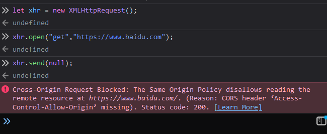
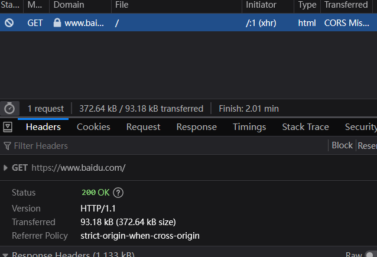

新增一个写的比我好的帖子
>https://zhuanlan.zhihu.com/p/132534931

> https://www.bilibili.com/video/BV1M84y1v7qH/

文字版:
概念:跨域问题的发生本质:当前页面所在的源,和请求的目标地址所在的源不同,浏览器就会把请求挂掉.(这里是请求,不是响应,就是说发都发不出去) 具体来说, 请求的协议,域名,端口这3个都会导致这个问题. 英语简称是 CORS.

跨域请求可能会额外触发OPTIONS请求(这个OPTIONS请求是浏览器层面的, 我们自己发的OPTIONS请求依然是当作非简单请求的), 通常是预检请求. 依据是否会触发OPTIONS, 把跨域请求分为简单请求和非简单请求. 预检请求不是我们能控制的, 是浏览器对于非简单跨域请求的一种探测行为

简单请求: 如果发起的请求中, 只有请求方法和目标地址, 那就是一个简单请求(比如下面的例子). 简单请求只有GET, HEAD, POST这3个方法, 并且不允许添加自定义头. 特别注意 content-Type：只限于三个值application/x-www-form-urlencoded、multipart/form-data、text/plain, 而我们常用的 application/json是不在其中的. 

这个帖子里说的很好
> https://www.bookstack.cn/read/javascript-tutorial/docs-bom-cors.md

简单请求用xhr的例子
```javascript
let xhr = new XMLHttpRequest();
xhr.responseType = "json";
xhr.open("get","https://www.baidu.com");
xhr.onreadyStatechange = function () {
    if(xhr.readyState === 4) {
        console.log(xhr.response)
    }
}
xhr.send(null); 
```
结果是跨域的

服务器可以正常返回, 但是浏览器会挂掉

对于简单请求, 只需要在服务端返回的HTTP头里, 返回
```json
 'access-control-allow-origin':"*"
```

非简单请求需要服务端配置的东西就比较多, 比如说, Access-Control-Allow-Methods这个字段就要明确指明, 我允许的是什么方法. 
access-control-max-age, 可以让一端时间内来自指定源的非简单请求不再发送预检请求

---
> https://www.bilibili.com/video/BV1Av4y1Q7UZ
偏技巧性的解决方案, jsonp

用原文作者的例子:
前台
```javascript
export function jsonpDemo1(){
    const script = document.createElement('script');
    script.src = "https://www.example.com/getUserInfo?functionName=jsonp&uid=123456";

    window.jsonp=function(data){
        console.log("in jsonp:",data);
    }

    document.body.append(script);
}
```
后台:
```javascript
const app = http.createServer((req,res)=>{
    const urlInfo = url.parse(req.url);
    const query = {};
    urlInfo.query && urlInfo.query?.split("&").forEach(str=>{
        const [k,v] = str.split('=');
        query[k] = v
    });
    /**
     * 这里解析query串的结果是
     *     query:{
     *        functionName:"jsonp",
     *        uid:"123456",
     *     }
     */
    
    console.log("query",query);

    const data = {
        uid:query.uid,
        a:1,
        b:2,
        c:3
    };

    res.writeHead(200,{
        'content-type':'text/javascript'
    })
    res.end(`${query.functionName}(${JSON.stringify(data)}`)

    //这里返回的结果是 jsonp({uid:"123456",a:1,b:2,c:3}), 有点类似于eval函数的意思
})

```
后台返回一个字符串: "jsonp({uid:"123456",a:1,b:2,c:3})", 而浏览器中, 因为字符串的"jsonp"对于浏览器而言, 是一个提前注册的函数jsonp(), 所以以字符串返回的response, 被当作函数运行了.  

这里需要注意的是, 利用script标签的话, 是只能发get请求的, 所以就不能用body发json一样的大体量数据了. 解决办法是可以用cookie传数据, 就变成了这样:
```javascript
export function jsonpDemo1(){
    const script = document.createElement('script');
    script.src = "https://www.example.com/getUserInfo?functionName=jsonp&uid=123456";
    script.crossOrigin = 'use-credentials'
    window.jsonp=function(data){
        console.log("in jsonp:",data);
    }

    document.body.append(script);
}
```
使用cookie是需要加上crossOrigin属性的, 但是加了这个属性, 是会发生CORS error的, 依然需要后段添加
```json
 'access-control-allow-origin':"*"
```
所以用cookie+jsonp, 其实是没什么意义的.

最后贴一个原作者的jsonp封装, 以防以后用得到:
```javascript
function jsonpRequest({ url, params }) {
    return new Promise((resolve, reject) => {
        //利用时间戳, 给每次请求生成不同的函数名
        const funName = `jsonp${Date.now()}`;

        if (params) {
            params = {
                ...params,
                fun: funName,
            };
        } else {
            params = {
                fun: funName,
            };
        }
        let query = [];
        for (const key in params) {
            query.push(`${key}=${params[key]}`);
        }

        const scriptElement = document.createElement("script");
        scriptElement.src = `${url}?${query.join("&")}`;

        //这里的形参data就是后台返回的值了
        window[funName] = function (data) {
            document.body?.removeChild(scriptElement);
            //把后台的返回值返回出去
            resolve(data);
        };
        document.body?.append(scriptElement);
    });
}

//如何使用
jsonpRequest({
    url:"https://www.example.com",
    params:{
        uid:12345,
        username:"Tony"
    }
}).then(data=>{
    console.log('jsonResponse',data);
})

//因为后台的函数名解析是动态的, 就这样使用就可以了
```