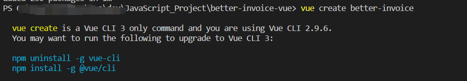
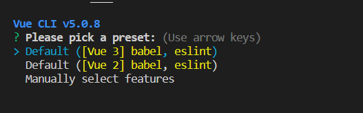

好久没用vue了, 最近复习一下如何使用vue创建项目

首先安装 vue cli

```bash
npm install -g @vue/cli
```

这里注意, vue 3.0是叫做 vue/cli vue 2.0是vue-cli
如果装了vue2.0 则创建的语句是不一样的 是类似下面的
```bash
vue init webpack vue-demo
```

这里还是说3.0的吧,如果安装了vue2.0, 那就先删除

```bash
npm uninstall -g vue-cli
npm install -g @vue/cli
```

#### 创建工程


如果这里想使用ts支持, 则需要选最后一个 Manually select features 
ts的支持在这里选择

可以参考这篇文章
> https://cloud.tencent.com/developer/article/1805296

然后是使用 element-plus
因为Vue3对应的element框架是element-plus, 引入的方式略有不同

```bash
npm install element-plus --save
```

```js
import { createApp } from "vue";
import ElementPlus from "element-plus";
import "element-plus/dist/index.css";

import App from "./App.vue";

createApp(App).use(ElementPlus).mount("#app");
```